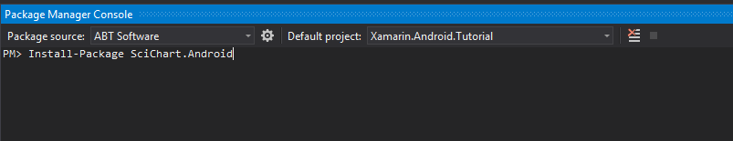

# Integrating SciChart libraries
In this article we are going to show different approaches off integrating SciChart library into your Android Application:
- **Native Android**
  - [Manually](#integrating-scichart-manually)
  - [Maven](#integrating-scichart-using-maven)
- **Xamarin.Android**
  - [NuGet](#integrating-scichart-using-nuget-package-manager)

# Integrating SciChart manually
After you have downloaded and unzipped the [SciChart Android Trial](https://www.scichart.com/downloads) package, you can find `SciChart Android AARs` in Lib folder. 

Now, let's add them as build dependencies. To do this we need to:
- open the "build.gradle" file for the project and declare a new repository in the "repositories" node inside the "allprojects" node, pointing to the location of SciChart Android libraries: 
[!code-gradle[LocalLibraries](../../samples/sandbox/settings.gradle#AddLibrariesFromLocalFolder)]

- open the "build.gradle" file for a module which SciChart is intended to be used within. Add SciChart Android libraries as module dependencies:    
[!code-gradle[MavenDependencies](../../samples/sandbox/app/build.gradle#DeclareSciChartLibariesAsLocalDependencies)]

# Integrating SciChart using Maven
The SciChart Android Maven repository URL is https://www.myget.org/F/abtsoftware/maven.Follow the steps below to configure your project to reference the SciChart Android libraries from Maven.

- Open the "build.gradle" file for the project and declare a new Maven repository in the "repositories" node. Use the URL from above:
[!code-gradle[MavenRepositories](../../samples/sandbox/settings.gradle#AddSciChartMavenRepositories)]

- Open the "build.gradle" file for a module which SciChart is intended to be used within. Add SciChart Android libraries as module dependencies:
[!code-gradle[MavenDependencies](../../samples/sandbox/app/build.gradle#DeclareSciChartLibariesAsMavenDependencies)]

# Integrating SciChart using NuGet Package Manager
**NuGet** is a package manager for Visual Studio and ***.NET***. It allows you to add a reference to a DLL and download it from the cloud.
There is no need to keep DLLs in version control or install them on local disk.
You can download them on-demand and link against them during your build process. 

In order to get SciChart libraries, you should connect to our [Private Feed](https://www.myget.org/gallery/abtsoftware). SciChart provides 2 feeds:
- **[SciChart Official Releases](https://www.myget.org/gallery/abtsoftware)** Feed URLs:
  - Visual Studio 2015+ - https://www.myget.org/F/abtsoftware/api/v3/index.json
  - Visual Studio 2012+ - https://www.myget.org/F/abtsoftware/api/v2
- **[SciChart Nightly Builds](https://www.myget.org/gallery/abtsoftware-bleeding-edge)** Feed URLs:
  - Visual Studio 2015+ - https://www.myget.org/F/abtsoftware-bleeding-edge/api/v3/index.json
  - Visual Studio 2012+ - https://www.myget.org/F/abtsoftware-bleeding-edge/api/v2

> [!NOTE]
> `*.nupkg` files can be unzipped if you rename them as zip. They contain the SciChart DLLs. So, even if you are not using NuGet, you can get our nightly builds by clicking the download button on the gallery page and unzipping the package.

After adding the desired feed from the above in Visual Studio select View -> Other Windows -> Package Manager Console, then Type `Install-package SciChart.Android` in the console and click Enter. This will isntall the latest build of SciChart.Android. 

That's it. You are good to go.
