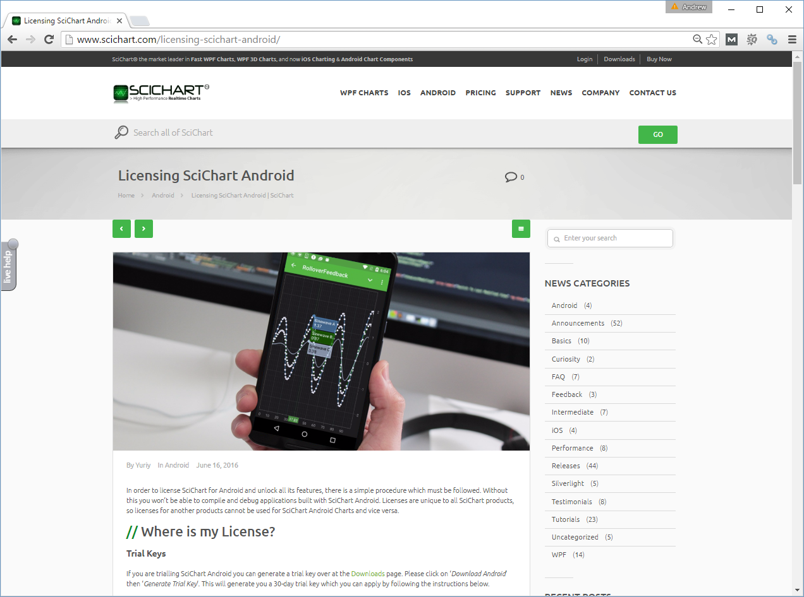

# SciChart Android Licensing

## Trial License
SciChart Android comes with a fully-functional 30-day trial. You will need to set a trial license key that you can get from our website in order to use the charts. **The trial is a fully featured 30-day trial with no limitation in functionality**. The trial SciChart Android control displays a watermark “Powered by SciChart” but this is not shown in the full licensed version of SciChart.

At the end of your 30-day trial, applications you have built with SciChart will cease to work and you will not be able to keep working on them. If you need further time to evaluate, just ask.

Once you purchase licenses, the license is perpetual with optional renewal to keep up to date (get support and get later builds).

## Activating a Purchased License
Purchased SciChart Android license keys can be found at your [SciChart Account Page](https://www.scichart.com/profile/).

Full instructions on how to apply a license key can be found on the web at https://www.scichart.com/licensing-scichart-android.

If your license has been applied correctly, you should be able to run your application on devices and without seeing the "Powered by SciChart" watermark.

# Troubleshooting Licensing & Activation
If you have trouble with licensing or activation, please [contact us](https://www.scichart.com/contact-us/) and we will do our best to help. We aim to answer all support incidents within 1 business day.