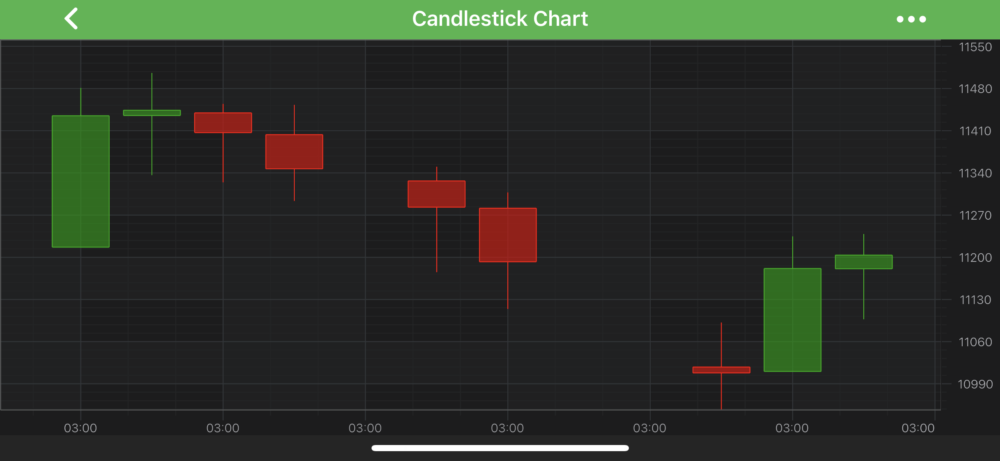

## 2D Chart Types

All 2D Chart types in SciChart Android provided by the **RenderableSeries API**.

The <xref:com.scichart.charting.visuals.renderableSeries.IRenderableSeries> in SciChart are visual representations of **X,Y Numeric** or **Date** data. Some RenderableSeries render simple `X, Y` values (2D points in space), while some render additional information (such as `X, Y0, Y1` values, or `X, Y, Z` values).

All **RenderableSeries** are inherited from <xref:com.scichart.charting.visuals.renderableSeries.BaseRenderableSeries> and are added to the <xref:com.scichart.charting.model.RenderableSeriesCollection> which is stored in [renderableSeries](xref:com.scichart.charting.visuals.ISciChartSurface.getRenderableSeries()) property. This collection supports multiple **RenderableSeries** of different types. Each RenderableSeries is rendered to the screen, displaying the data from an associated <xref:com.scichart.charting3d.model.dataSeries.IDataSeries3D>.

The list of **RenderableSeries** provided out of the box is available below:
- [The Line Series Type](xref:chart2d.renderableSeries.LineSeries)
- [The Spline Line Series Type](xref:chart2d.renderableSeries.SplineLineSeries)
- [The Scatter Series Type](xref:chart2d.renderableSeries.ScatterSeries)
- [The Mountain (Area) Series Type](xref:chart2d.renderableSeries.MountainSeries)
- [The Spline Mountain (Area) Series Type](xref:chart2d.renderableSeries.SplineMountainSeries)
- [The Band Series Type](xref:chart2d.renderableSeries.BandSeries)
- [The Spline Band Series Type](xref:chart2d.renderableSeries.SplineBandSeries)
- [The Fan Chart Type](xref:chart2d.renderableSeries.FanChart)
- [The Bubble Series Type](xref:chart2d.renderableSeries.BubbleSeries)
- [The Column Series Type](xref:chart2d.renderableSeries.ColumnSeries)
- [The Impulse (Stem) Series Type](xref:chart2d.renderableSeries.ImpulseSeries)
- [The Error Bars Series Type](xref:chart2d.renderableSeries.ErrorBarsSeries)
- [The OHLC Series Type](xref:chart2d.renderableSeries.OHLCSeries)
- [The Candlestick Series Type](xref:chart2d.renderableSeries.CandlestickSeries)
- [The Uniform Heatmap Series Type](xref:chart2d.renderableSeries.UniformHeatmapSeries)
- [The Stacked Column Series Type](xref:chart2d.renderableSeries.StackedColumnSeries)
- [The Stacked Mountain Series Type](xref:chart2d.renderableSeries.StackedMountainSeries)
- [The Pie Chart Type](xref:chart2d.renderableSeries.PieChart)
- [The Donut Chart Type](xref:chart2d.renderableSeries.DonutChart)
- [The Custom RenderableSeries](xref:chart2d.renderableSeries.CustomRenderableSeriesAPI)

Read on to learn more about the features, that all [RenderableSeries have in common](#common-renderableseries-features). For specific features of any RenderableSeries please refer to a corresponding article on this series type.

> [!NOTE]
> For more information about which DataSeries are used for which RenderableSeries, see the [DataSeries Types](xref:chart2d.DataSeriesAPIs) page.

## Common RenderableSeries Features
As mentioned above - all 2D series types in SciChart Android conforms to the <xref:com.scichart.charting.visuals.renderableSeries.IRenderableSeries> protocol. One of the main features of RenderableSeries API is its **extensibility**. New series types can be created via the [Custom RenderableSeries API](xref:chart2d.renderableSeries.CustomRenderableSeriesAPI). The list of other features shared by all the series types can be found below:

| **IRenderableSeries property**                             | **Description**                                                            |
| ------------------------------------------------------------- | -------------------------------------------------------------------------- |
| [dataSeries](xref:com.scichart.charting.visuals.renderableSeries.IRenderableSeries.setDataSeries(com.scichart.charting.model.dataSeries.IDataSeries))                             | A DataSeries is the data-source for a RenderableSeries. Please see the [DataSeries API](xref:chart2d.DataSeriesAPIs) section for a complete walkthrough of the DataSeries API. |
| [isVisible](xref:com.scichart.charting.visuals.renderableSeries.IRenderableSeriesCore.setIsVisible(boolean))                          | Allows to hide or show a series.                                           |
| [isSelected](xref:com.scichart.charting.visuals.renderableSeries.IRenderableSeriesCore.setIsSelected(boolean))                         | A series can be made Selected to be drawn on the top of other RenderableSeries. Also, the series can alter its appearance in response to changes in the selection state. Please refer to the [SeriesSelectionModifier](xref:chartModifierAPIs.InteractivitySeriesSelectionModifier) article for more details. |
| [pointMarker](xref:com.scichart.charting.visuals.renderableSeries.IRenderableSeries.setPointMarker(com.scichart.charting.visuals.pointmarkers.IPointMarker))                            | This feature lets you set an optional marker on data points, e.g. Ellipse, Square, Triangle or a custom shape. Its usage is described minutely in the [PointMarker API](xref:chart2d.PointMarkerAPI) article. |
| [resamplingMode](xref:com.scichart.charting.visuals.renderableSeries.IRenderableSeries.setResamplingMode(com.scichart.data.numerics.ResamplingMode))                         | Allows to choose a particular **ResamplingMode** for a series, which specifies a way to reduce the DataSeries for drawing. For more details, see the [Data Resampling](xref:chart2d.DataResampling) article. |
| [paletteProvider](xref:com.scichart.charting.visuals.renderableSeries.IRenderableSeries.setPaletteProvider(com.scichart.charting.visuals.renderableSeries.paletteProviders.IPaletteProvider))                        | The PaletteProvider API allows changing the color of a series on a per-point basis. Please see the [PaletteProvider API](xref:chart2d.PaletteProviderAPI) article for more information. |
| [strokeStyle](xref:com.scichart.charting.visuals.renderableSeries.IRenderableSeries.setStrokeStyle(com.scichart.drawing.common.PenStyle))                            | Allows to assign an <xref:com.scichart.drawing.common.PenStyle> object to determine how the series' outline should be drawn. Please refer to the [Styling and Theming](xref:stylingAndTheming.StylingAndTheming) section for more details. |
| [seriesInfoProvider](xref:com.scichart.charting.visuals.renderableSeries.IRenderableSeries.setSeriesInfoProvider(com.scichart.charting.visuals.renderableSeries.hitTest.ISeriesInfoProvider))                     | Allows to customize the result of inspection of a series by [Chart Modifiers](Chart Modifier APIs.html). Also can be used to specify how modifiers tooltips have to appear for this series. Please refer to the [Cursors and Tooltips](xref:chartModifierAPIs.InteractivityTooltipsCustomization) section for more info. |
| [selectedSeriesStyle](xref:com.scichart.charting.visuals.renderableSeries.IRenderableSeriesCore.setSelectedSeriesStyle(com.scichart.charting.visuals.renderableSeries.IStyle))                | Allows to change the appearance of a series when its selection status changes. Please refer to the [SeriesSelectionModifier](xref:chartModifierAPIs.InteractivitySeriesSelectionModifier) article to learn more about this. |
| [xAxisId](xref:com.scichart.charting.visuals.renderableSeries.IRenderableSeries.setXAxisId(java.lang.String))                                | In case of multi axis, allows to attach a series to a specific **X Axis**. |
| [yAxisId](xref:com.scichart.charting.visuals.renderableSeries.IRenderableSeries.setYAxisId(java.lang.String))                                | In case of multi axis, allows to attach a series to a specific **Y Axis**. |
| **BaseRenderableSeries property**                          |                                                                            |
| [zeroLineY](xref:com.scichart.charting.visuals.renderableSeries.BaseRenderableSeries.setZeroLineY(double))                           | Specifies the minimum Y value which is considered as an up value. Any part of a series which contains values that are above this value will be drawn upwards. Any part of the series with values below it will be drawn downwards. |
| [drawNaNAs](xref:com.scichart.charting.visuals.renderableSeries.BaseRenderableSeries.setDrawNaNAs(com.scichart.charting.visuals.renderableSeries.LineDrawMode))                           | Specifies how data points with **NaN** Y values are rendered within a given series type. In SciChart, **NaN values** is treated as a special value which designates an empty point. It is rendered as a gap within a series. For some chart types, though, the ends of the gap can be connected with a line. See the next paragraph for more details. |
| **IRenderableSeries Event Listeners**                         |                                                                            |
| <xref:com.scichart.charting.visuals.renderableSeries.IRenderableSeriesCore.addIsVisibleChangeListener(com.scichart.charting.visuals.renderableSeries.RenderableSeriesChangeListener)>     | Allows to attach a <xref:com.scichart.charting.visuals.renderableSeries.RenderableSeriesChangeListener> to a series which will be called when its **visibility** changes. This can occur when the [isVisible](xref:com.scichart.charting.visuals.renderableSeries.IRenderableSeriesCore.setIsVisible(boolean)) property changes. |
| <xref:com.scichart.charting.visuals.renderableSeries.IRenderableSeriesCore.removeIsVisibleChangeListener(com.scichart.charting.visuals.renderableSeries.RenderableSeriesChangeListener)>  | Allows to unsubscribe from the series **visibility** changes.              |
| <xref:com.scichart.charting.visuals.renderableSeries.IRenderableSeriesCore.addIsSelectedChangeListener(com.scichart.charting.visuals.renderableSeries.RenderableSeriesChangeListener)>    | Allows to attach a <xref:com.scichart.charting.visuals.renderableSeries.RenderableSeriesChangeListener> to a series which will be called when it becomes **selected/deselected**. This can occur when the [isSelected](xref:com.scichart.charting.visuals.renderableSeries.IRenderableSeriesCore.setIsSelected(boolean)) property changes. |
| <xref:com.scichart.charting.visuals.renderableSeries.IRenderableSeriesCore.removeIsSelectedChangeListener(com.scichart.charting.visuals.renderableSeries.RenderableSeriesChangeListener)> | Allows to unsubscribe from the series **selected/deselected** changes.     |

For more comprehensive walkthrough into any feature or specifics of any series type please refer to articles on that series type. The list of the ***series types available*** out of the box can be found at the beginning of this article.

## Adding a Gap onto a RenderableSeries
There is a special value reserved for this purpose in SciChart - `NaN`. If the Y value of a data point is equal to the `NaN` value, a series will render an empty space at this place, equal to the width of a single series bar:

Some chart types allow to configure how gaps appear on a series via the [drawNaNAs](xref:com.scichart.charting.visuals.renderableSeries.BaseRenderableSeries.setDrawNaNAs(com.scichart.charting.visuals.renderableSeries.LineDrawMode)) property, e.g.:
- [The Line Series Type](xref:chart2d.renderableSeries.LineSeries)
- [The Spline Line Series Type](xref:chart2d.renderableSeries.SplineLineSeries)
- [The Mountain (Area) Series Type](xref:chart2d.renderableSeries.MountainSeries)
- [The Spline Mountain (Area) Series Type](xref:chart2d.renderableSeries.SplineMountainSeries)
- [The Band Series Type](xref:chart2d.renderableSeries.BandSeries)
- [The Spline Band Series Type](xref:chart2d.renderableSeries.SplineBandSeries)

Please see the <xref:com.scichart.charting.visuals.renderableSeries.LineDrawMode> enumeration for more info.

