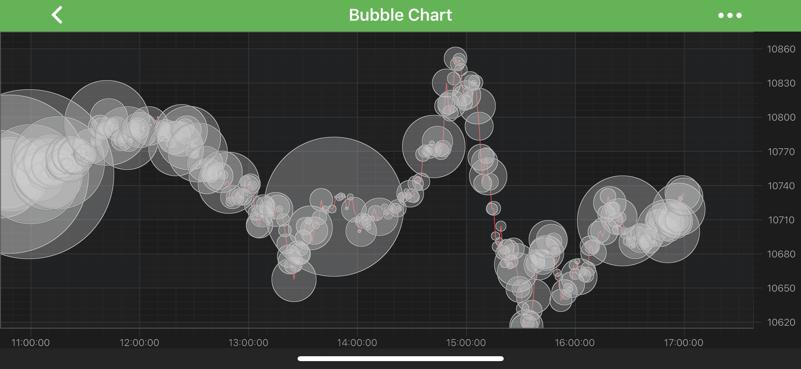

# The Bubble Series Type
Bubble Chart is provided by the <xref:com.scichart.charting.visuals.renderableSeries.FastBubbleRenderableSeries> class. It accepts data (`X, Y, Z`) from a <xref:com.scichart.charting.model.dataSeries.XyzDataSeries> and renders a **bubble** at each `[X, Y]` with `Z` bubble scale.

> [!NOTE] 
> For more info about <xref:com.scichart.charting.model.dataSeries.XyzDataSeries>, as well as other DataSeries types in SciChart, see the [DataSeries API](xref:chart2d.DataSeriesAPIs) article.

> [!NOTE] 
> Examples for the **Bubble Series** can be found in the [SciChart Android Examples Suite](https://www.scichart.com/examples/android-chart/) as well as on [GitHub](https://github.com/ABTSoftware/SciChart.Android.Examples):
> - [Native Example](https://www.scichart.com/example/android-chart/android-bubble-chart-demo/)
> - [Xamarin Example](https://www.scichart.com/example/xamarin-chart/xamarin-chart-bubble-chart-example/)

The <xref:com.scichart.charting.visuals.renderableSeries.FastBubbleRenderableSeries> class allows to specify BubbleBrush and Stroke via the following properties:
- [bubbleBrushStyle](xref:com.scichart.charting.visuals.renderableSeries.FastBubbleRenderableSeries.setBubbleBrushStyle(com.scichart.drawing.common.BrushStyle))
- [strokeStyle](xref:com.scichart.charting.visuals.renderableSeries.BaseRenderableSeries.setStrokeStyle(com.scichart.drawing.common.PenStyle))

> [!NOTE]
> To learn more about **Pens** and **Brushes** and how to utilize them, please refer to the [PenStyle, BrushStyle and FontStyle](xref:stylingAndTheming.PenStyleBrushStyleAndFontStyle) article.

Also, you can control bubbles scaling using the following properties:
- [zScaleFactor](xref:com.scichart.charting.visuals.renderableSeries.FastBubbleRenderableSeries.setZScaleFactor(double))
- [autoZRange](xref:com.scichart.charting.visuals.renderableSeries.FastBubbleRenderableSeries.setAutoZRange(boolean))

> [!NOTE]
> In multi axis scenarios, a series has to be assigned to **particular X and Y axes**. This can be done passing the axes IDs to the [xAxisId](xref:com.scichart.charting.visuals.renderableSeries.IRenderableSeries.setXAxisId(java.lang.String)), [yAxisId](xref:com.scichart.charting.visuals.renderableSeries.IRenderableSeries.setYAxisId(java.lang.String)) properties.

## Create a Bubble Series
To create a **Bubble Series**, use the following code:

# [Java](#tab/java)
[!code-java[BubbleSeries](../../../samples/sandbox/app/src/main/java/com/scichart/docsandbox/examples/java/series2d/BubbleSeries2D.java#Example)]
# [Java with Builders API](#tab/javaBuilder)
[!code-java[BubbleSeries](../../../samples/sandbox/app/src/main/java/com/scichart/docsandbox/examples/javaBuilder/series2d/BubbleSeries2D.java#Example)]
# [Kotlin](#tab/kotlin)
[!code-swift[BubbleSeries](../../../samples/sandbox/app/src/main/java/com/scichart/docsandbox/examples/kotlin/series2d/BubbleSeries2D.kt#Example)]
***

## Bubble Series Features
Bubble Series also has some features similar to other series, such as:
- [Render a Gap](#render-a-gap-in-a-bubble-series);
- [Draw Series with Different Colors](#paint-bubbles-with-different-colors).

#### Render a Gap in a Bubble Series
It's possible to render a Gap in **Bubble series**, by passing a data point with a `NaN` as the `Y` value. Please refer to the [RenderableSeries APIs](xref:chart2d.2DChartTypes#adding-a-gap-onto-a-renderableseries) article for more details.

#### Paint Bubbles with Different Colors
In SciChart, you can draw each bubble of the **Bubble Series** with different colors using the [PaletteProvider API](xref:chart2d.PaletteProviderAPI). 
To Use palette provider for Bubbles - a custom <xref:com.scichart.charting.visuals.renderableSeries.paletteProviders.IFillPaletteProvider> (or <xref:com.scichart.charting.visuals.renderableSeries.paletteProviders.IStrokePaletteProvider>) has to be provided to the [paletteProvider](xref:com.scichart.charting.visuals.renderableSeries.IRenderableSeries.setPaletteProvider(com.scichart.charting.visuals.renderableSeries.paletteProviders.IPaletteProvider)) property. Please refer to the [PaletteProvider API](xref:chart2d.PaletteProviderAPI) article for more info.
