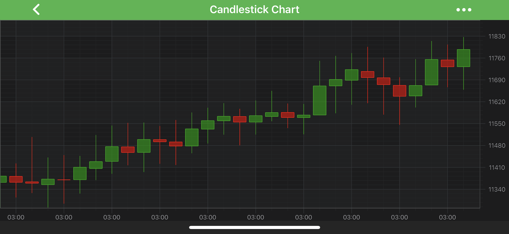

# The Candlestick Series type
The **Candlestick charts** are provided by the <xref:com.scichart.charting.visuals.renderableSeries.FastCandlestickRenderableSeries> type. This accepts data (`X, Open, High, Low, Close`) from a <xref:com.scichart.charting.model.dataSeries.OhlcDataSeries> and renders candlesticks at each `X-Value` coordinate.

> [!NOTE] 
> For more info about <xref:com.scichart.charting.model.dataSeries.OhlcDataSeries>, as well as other DataSeries types in SciChart, see the [DataSeries API](xref:chart2d.DataSeriesAPIs) article.

> [!NOTE] 
> Examples of the **Candlestick Series** can be found in the [SciChart Android Examples Suite](https://www.scichart.com/examples/android-chart/) as well as on [GitHub](https://github.com/ABTSoftware/SciChart.Android.Examples):
> - [Native Example](https://www.scichart.com/example/android-candlestick-chart-example/)
> - [Xamarin Example](https://www.scichart.com/example/xamarin-chart-candlestick-chart-example/)

The <xref:com.scichart.charting.visuals.renderableSeries.FastCandlestickRenderableSeries> is very much alike the <xref:com.scichart.charting.visuals.renderableSeries.FastOhlcRenderableSeries> class. It allows to specify **FillUp** and **FillDown** brushes, **StrokeUp** and **StrokeDown** pens via the following properties:
- [fillUpBrushStyle](xref:com.scichart.charting.visuals.renderableSeries.FastCandlestickRenderableSeries.setFillUpBrushStyle(com.scichart.drawing.common.BrushStyle))
- [fillDownBrushStyle](xref:com.scichart.charting.visuals.renderableSeries.FastCandlestickRenderableSeries.setFillDownBrushStyle(com.scichart.drawing.common.BrushStyle))
- [strokeUpStyle](xref:com.scichart.charting.visuals.renderableSeries.OhlcRenderableSeriesBase.setStrokeUpStyle(com.scichart.drawing.common.PenStyle))
- [strokeDownStyle](xref:com.scichart.charting.visuals.renderableSeries.OhlcRenderableSeriesBase.setStrokeDownStyle(com.scichart.drawing.common.PenStyle))

**StrokeUp** and **FillUp** styles are applied to bars with **Close >= Open**, and **StrokeDown** and **FillDown** to those that have **Close < Open** respectively. 

> [!NOTE] 
> To learn more about **Pens** and **Brushes** and how to utilize them, please refer to the [PenStyle, BrushStyle and FontStyle](xref:stylingAndTheming.PenStyleBrushStyleAndFontStyle) article.

Also, the [dataPointWidth](xref:com.scichart.charting.visuals.renderableSeries.OhlcRenderableSeriesBase.setDataPointWidth(double)) specifies how much space a single bar occupies, varying from 0 to 1 (when columns are conjoined). 

> [!NOTE] 
> In multi axis scenarios, a series has to be assigned to **particular X and Y axes**. This can be done by passing the axes IDs to the [xAxisId](xref:com.scichart.charting.visuals.renderableSeries.IRenderableSeries.setXAxisId(java.lang.String)), [yAxisId](xref:com.scichart.charting.visuals.renderableSeries.IRenderableSeries.setYAxisId(java.lang.String)) properties.

## Create a Candlestick Series
To create a **Candlestick Series**, use the following code:

# [Java](#tab/java)
[!code-java[CandlestickSeries](../../../samples/sandbox/app/src/main/java/com/scichart/docsandbox/examples/java/series2d/CandlestickSeries2D.java#Example)]
# [Java with Builders API](#tab/javaBuilder)
[!code-java[CandlestickSeries](../../../samples/sandbox/app/src/main/java/com/scichart/docsandbox/examples/javaBuilder/series2d/CandlestickSeries2D.java#Example)]
# [Kotlin](#tab/kotlin)
[!code-swift[CandlestickSeries](../../../samples/sandbox/app/src/main/java/com/scichart/docsandbox/examples/kotlin/series2d/CandlestickSeries2D.kt#Example)]
***

## Candlestick Series Features
Candlestick Series also has some features similar to other series, such as:
- [Render a Gap](#render-a-gap-in-a-candlestick-series);
- [Draw Series With Different Colors](#specify-color-for-individual-candlesticks).

#### Render a Gap in a Candlestick Series
It's possible to render a Gap in **Candlestick series**, by passing a data point with a `NaN` as the `Open, High, Low, Close` values. Please refer to the [RenderableSeries APIs](xref:chart2d.2DChartTypes#adding-a-gap-onto-a-renderableseries) article for more details.

#### Specify Color for Individual Candlesticks
In SciChart, you can draw each bar of the **Candlestick Series** with different colors using the [PaletteProvider API](xref:chart2d.PaletteProviderAPI). 
To Use palette provider for Candlestick Series - a custom <xref:com.scichart.charting.visuals.renderableSeries.paletteProviders.IFillPaletteProvider> (or <xref:com.scichart.charting.visuals.renderableSeries.paletteProviders.IStrokePaletteProvider>) has to be provided to the [paletteProvider](xref:com.scichart.charting.visuals.renderableSeries.IRenderableSeries.setPaletteProvider(com.scichart.charting.visuals.renderableSeries.paletteProviders.IPaletteProvider)) property. Please refer to the [PaletteProvider API](xref:chart2d.PaletteProviderAPI) article for more info.
