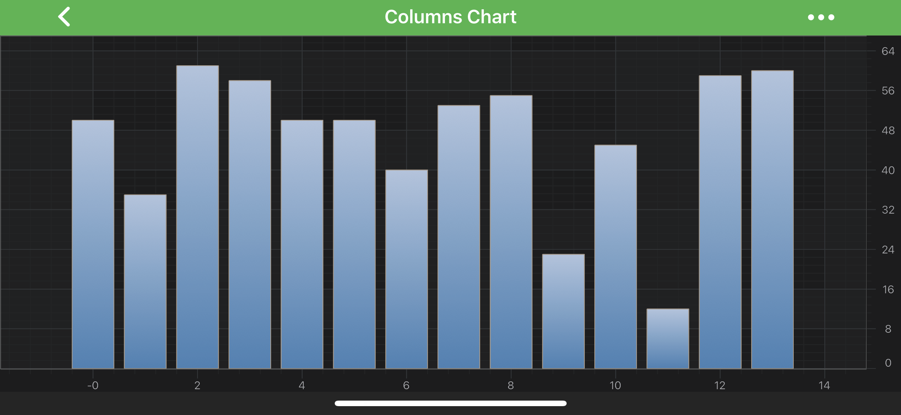
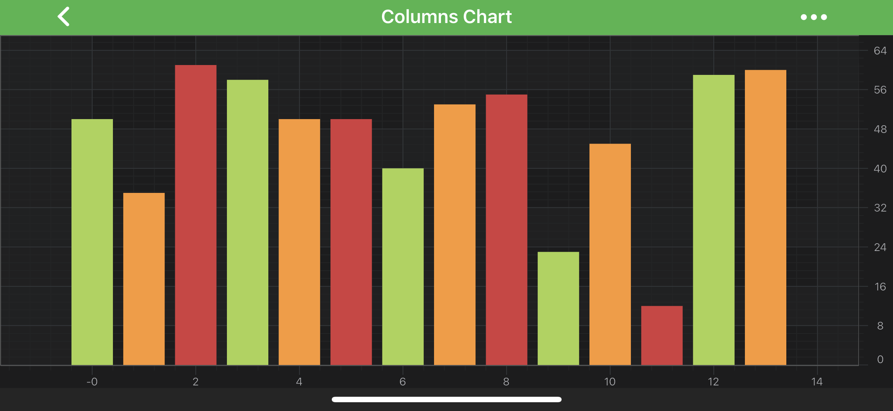

# The Column Series Type
Column Chart is provided by the <xref:com.scichart.charting.visuals.renderableSeries.FastColumnRenderableSeries> class. It accepts data (`X, Y`) from a <xref:com.scichart.charting.model.dataSeries.XyDataSeries> and renders a **column** at each `[X, Y]` value.

> [!NOTE] 
> Examples for the **Column Series** can be found in the [SciChart Android Examples Suite](https://www.scichart.com/examples/android-chart/) as well as on [GitHub](https://github.com/ABTSoftware/SciChart.Android.Examples):
> - [Native Example](https://www.scichart.com/example/android-chart/android-column-chart-example/)

The <xref:com.scichart.charting.visuals.renderableSeries.FastColumnRenderableSeries> class allows to specify **Fill** brush, **Stroke** pen and relative **DataPointWidth** which will be applied to every column. You can also choose the <xref:com.scichart.drawing.common.TextureMappingMode> for Fill brush which defines how columns are filled when a gradient is used. The **DataPointWidth** specifies how much space a single column occupies, varying from 0 to 1 (when columns are conjoined). 

> [!NOTE] 
> To learn more about **Pens** and **Brushes** and how to utilize them, please refer to the [PenStyle, BrushStyle and FontStyle](xref:stylingAndTheming.PenStyleBrushStyleAndFontStyle) article.

Also, it is possible to define the **ZeroLineY** baseline position via the [zeroLineY](xref:com.scichart.charting.visuals.renderableSeries.BaseRenderableSeries.setZeroLineY(double)) property. All data points that have Y value less than **ZeroLineY** will appear downward, else - upward.

All those values can be assigned via the corresponding properties:
- [fillBrushStyle](xref:com.scichart.charting.visuals.renderableSeries.BaseColumnRenderableSeries.setFillBrushStyle(com.scichart.drawing.common.BrushStyle))
- [fillBrushMappingMode](xref:com.scichart.charting.visuals.renderableSeries.BaseColumnRenderableSeries.setFillBrushMappingMode(com.scichart.drawing.common.TextureMappingMode))
- [strokeStyle](xref:com.scichart.charting.visuals.renderableSeries.BaseRenderableSeries.setStrokeStyle(com.scichart.drawing.common.PenStyle))
- [dataPointWidth](xref:com.scichart.charting.visuals.renderableSeries.BaseColumnRenderableSeries.setDataPointWidth(double))
- [zeroLineY](xref:com.scichart.charting.visuals.renderableSeries.BaseRenderableSeries.setZeroLineY(double))

> [!NOTE] 
> In multi axis scenarios, a series has to be assigned to **particular X and Y axes**. This can be done passing the axes IDs to the [xAxisId](xref:com.scichart.charting.visuals.renderableSeries.IRenderableSeries.setXAxisId(java.lang.String)), [yAxisId](xref:com.scichart.charting.visuals.renderableSeries.IRenderableSeries.setYAxisId(java.lang.String)) properties.

## Create a Column Series

To create a **Column Series**, use the following code:

# [Java](#tab/java)
[!code-java[ColumnSeries](../../../samples/sandbox/app/src/main/java/com/scichart/docsandbox/examples/java/series2d/ColumnSeries2D.java#Example)]
# [Java with Builders API](#tab/javaBuilder)
[!code-java[ColumnSeries](../../../samples/sandbox/app/src/main/java/com/scichart/docsandbox/examples/javaBuilder/series2d/ColumnSeries2D.java#Example)]
# [Kotlin](#tab/kotlin)
[!code-swift[ColumnSeries](../../../samples/sandbox/app/src/main/java/com/scichart/docsandbox/examples/kotlin/series2d/ColumnSeries2D.kt#Example)]
***

## Column Series Features
Column Series also has some features similar to other series, such as:
- [Render a Gap](#render-a-gap-in-a-column-series);
- [Draw Series with Different Colors](#paint-column-area-parts-with-different-colors).

#### Render a Gap in a Column Series
It's possible to render a Gap in **Column series**, by passing a data point with a `NaN` as the `Y` value. Please refer to the [RenderableSeries APIs](xref:chart2d.2DChartTypes#adding-a-gap-onto-a-renderableseries) article for more details.

#### Paint Column Area Parts With Different Colors

In SciChart, you can draw each column of the **Column Series** with different colors using the [PaletteProvider API](xref:chart2d.PaletteProviderAPI). 
To use palette provider for Columns - a custom <xref:com.scichart.charting.visuals.renderableSeries.paletteProviders.IFillPaletteProvider> (or <xref:com.scichart.charting.visuals.renderableSeries.paletteProviders.IStrokePaletteProvider>) has to be provided to the [paletteProvider](xref:com.scichart.charting.visuals.renderableSeries.IRenderableSeries.setPaletteProvider(com.scichart.charting.visuals.renderableSeries.paletteProviders.IPaletteProvider)) property. 

Please see the code snippet from our [Column Chart Example](https://www.scichart.com/example/android-chart/android-column-chart-example/). For more information - please refer to the [PaletteProvider API](xref:chart2d.PaletteProviderAPI) article.
