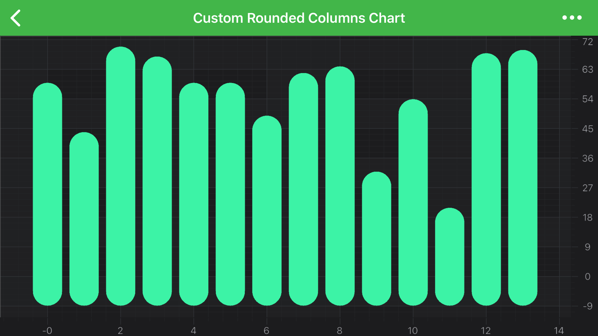

# Custom RenderableSeries API
If the **built-in** chart types in SciChart are not enough, you can create your own **RenderableSeries**. Custom RenderableSeries should extend <xref:com.scichart.charting.visuals.renderableSeries.BaseRenderableSeries> if you want to provide some **custom data**, or one of predefined base classes if you want to display data from **one of default** <xref:com.scichart.charting.model.dataSeries.IDataSeries> implementations.

| **Base class for Custom RenderableSeries** | **When to use**                                                                      |
| ------------------------------------------ | ------------------------------------------------------------------------------------ |
| <xref:com.scichart.charting.visuals.renderableSeries.XyRenderableSeriesBase>                | If you want to use <xref:com.scichart.charting.model.dataSeries.XyDataSeries> as data source for custom RenderableSeries      |
| <xref:com.scichart.charting.visuals.renderableSeries.XyyRenderableSeriesBase>               | If you want to use <xref:com.scichart.charting.model.dataSeries.XyyDataSeries> as data source for custom RenderableSeries     |
| <xref:com.scichart.charting.visuals.renderableSeries.HlRenderableSeriesBase>                | If you want to use <xref:com.scichart.charting.model.dataSeries.HlDataSeries> as data source for custom RenderableSeries      |
| <xref:com.scichart.charting.visuals.renderableSeries.OhlcRenderableSeriesBase>              | If you want to use <xref:com.scichart.charting.model.dataSeries.OhlcDataSeries> as data source for custom RenderableSeries    |
| <xref:com.scichart.charting.visuals.renderableSeries.XyzRenderableSeriesBase>               | If you want to use <xref:com.scichart.charting.model.dataSeries.XyzDataSeries> as data source for custom RenderableSeries     |
| <xref:com.scichart.charting.visuals.renderableSeries.BaseRenderableSeries>                  | If default <xref:com.scichart.charting.model.dataSeries.IDataSeries> implementations aren't suitable for data which should be displayed and you want to create **custom DataSeries** type |

## Creating your Own Series
For example, let's try to create a **RenderableSeries**, which draws [PointMarker](xref:chart2d.PointMarkerAPI) at specified `[x, y]` coordinates. Since, <xref:com.scichart.charting.model.dataSeries.XyDataSeries> is enough to define [x, y] data we will extend <xref:com.scichart.charting.visuals.renderableSeries.XyRenderableSeriesBase>:

# [Java](#tab/java)
[!code-java[CreateCustomSeries](../../../samples/sandbox/app/src/main/java/com/scichart/docsandbox/examples/java/series2d/CustomSeries2D.java#CreateCustomSeries)]
# [Java with Builders API](#tab/javaBuilder)
[!code-java[CreateCustomSeries](../../../samples/sandbox/app/src/main/java/com/scichart/docsandbox/examples/javaBuilder/series2d/CustomSeries2D.java#CreateCustomSeries)]
# [Kotlin](#tab/kotlin)
[!code-swift[CreateCustomSeries](../../../samples/sandbox/app/src/main/java/com/scichart/docsandbox/examples/kotlin/series2d/CustomSeries2D.kt#CreateCustomSeries)]
***

As showed in the code above, the main method, which has to be implemented is the `internalDraw`, which allows you to perform any **custom drawings** you want. The <xref:com.scichart.drawing.common.IRenderContext2D> and <xref:com.scichart.drawing.common.IAssetManager2D> are passed into it, which should be used to draw to the screen and which are the parts of the graphics context for this render pass.

<!-- TODO -->
<!-- > **_NOTE:_** For a full walk-through on utilizing Immediate Mode RenderContext API, please see the [RenderContext API](rendercontext-api.html) article. -->

## The current Data to Draw - ISeriesRenderPassData protocol
The data to draw is contained in the <xref:com.scichart.charting.visuals.renderableSeries.data.ISeriesRenderPassData> passed in to the `internalDraw` method. Using the **RenderPassData** object you can access the **data values** and **coordinates** to draw, the **xPointRange** (the indices of the data to draw, inclusive), the **X and Y Coordinate Calculators**, that transforms data to pixel coordinates. All the above accessed through the following properties:
- <xref:com.scichart.charting.visuals.renderableSeries.data.XyRenderPassData.yValues> (other **RenderPassData** types might have other properties)
- <xref:com.scichart.charting.visuals.renderableSeries.data.XyRenderPassData.yCoords> (other **RenderPassData** types might have other properties)
- <xref:com.scichart.charting.visuals.renderableSeries.data.SeriesRenderPassData.xPointRange>
- <xref:com.scichart.charting.visuals.renderableSeries.data.ISeriesRenderPassData.getXCoordinateCalculator()>
- <xref:com.scichart.charting.visuals.renderableSeries.data.ISeriesRenderPassData.getYCoordinateCalculator()>

Depending on **DataSeries** type you can have a different <xref:com.scichart.charting.visuals.renderableSeries.data.ISeriesRenderPassData> type and different ways to access the data to draw.

| **Series RenderPassData Type**    | **DataSeries type used**                                                                    |
| --------------------------------- | ------------------------------------------------------------------------------------------- |
| <xref:com.scichart.charting.visuals.renderableSeries.data.XyRenderPassData>             | If you want to use <xref:com.scichart.charting.model.dataSeries.XyDataSeries> as data source for custom RenderableSeries             |
| <xref:com.scichart.charting.visuals.renderableSeries.data.XyyRenderPassData>            | If you want to use <xref:com.scichart.charting.model.dataSeries.XyyDataSeries> as data source for custom RenderableSeries            |
| <xref:com.scichart.charting.visuals.renderableSeries.data.XyzRenderPassData>            | If you want to use <xref:com.scichart.charting.model.dataSeries.XyzDataSeries> as data source for custom RenderableSeries            |
| <xref:com.scichart.charting.visuals.renderableSeries.data.OhlcRenderPassData>           | If you want to use <xref:com.scichart.charting.model.dataSeries.OhlcDataSeries> as data source for custom RenderableSeries           |
| <xref:com.scichart.charting.visuals.renderableSeries.data.HlRenderPassData>             | If you want to use <xref:com.scichart.charting.model.dataSeries.HlDataSeries> as data source for custom RenderableSeries             |
| <xref:com.scichart.charting.visuals.renderableSeries.data.UniformHeatmapRenderPassData> | If you want to use <xref:com.scichart.charting.model.dataSeries.UniformHeatmapDataSeries> as data source for custom RenderableSeries |

The types above could be extended to add some additional information which is required for rendering, e.g. <xref:com.scichart.charting.visuals.renderableSeries.data.ColumnRenderPassData> extends <xref:com.scichart.charting.visuals.renderableSeries.data.XyRenderPassData> and adds fields for caching of **column width** in pixels and coordinate of **zero line**.

## Example: RoundedColumnRenderableSeries
We have an example which shows how to create a rounded column series with this **powerful API**.

> [!NOTE]
> The full **Rounded Column Chart** example can be found in the [SciChart Android Examples Suite](https://www.scichart.com/examples/Android-chart/) as well as on [GitHub](https://github.com/ABTSoftware/SciChart.Android.Examples):
> - [Native Example](https://www.scichart.com/example/Android-chart-custom-series-rounded-column/)
> - [Xamarin Example](https://www.scichart.com/example/xamarin-custom-series-rounded-column-example/)
