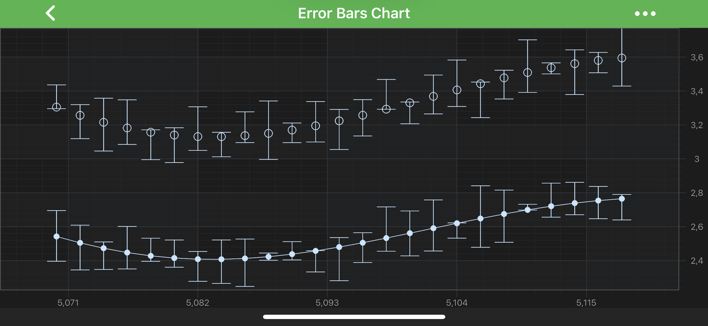
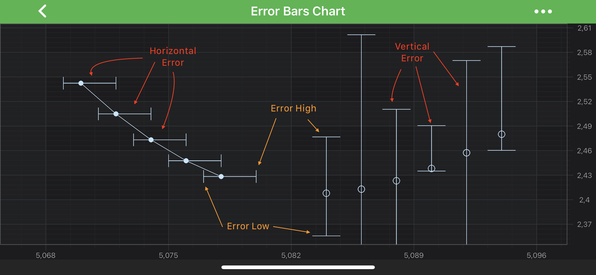

# The Error Bars Type
In SciChart, Error Bar Series is represented by the <xref:com.scichart.charting.visuals.renderableSeries.FastErrorBarsRenderableSeries> and <xref:com.scichart.charting.visuals.renderableSeries.FastFixedErrorBarsRenderableSeries> types. Those accepts (`X, Y, ErrorHigh, ErrorLow`) data from a <xref:com.scichart.charting.model.dataSeries.HlDataSeries> and (`X, Y`) data from <xref:com.scichart.charting.model.dataSeries.XyDataSeries> respectively. Then it renders error bars above and below the **Y-value**.

> [!NOTE] 
> For more info about <xref:com.scichart.charting.model.dataSeries.HlDataSeries> or <xref:com.scichart.charting.model.dataSeries.XyDataSeries>, as well as other DataSeries types in SciChart, see the [DataSeries API](xref:chart2d.DataSeriesAPIs) article.

> [!NOTE] 
> Examples for the **Error Bars Series** can be found in the [SciChart Android Examples Suite](https://www.scichart.com/examples/android-chart/) as well as on [GitHub](https://github.com/ABTSoftware/SciChart.Android.Examples):
> - [Native Example](https://www.scichart.com/example/android-chart/android-chart-example-error-bars/)
> - [Xamarin Example](https://www.scichart.com/example/xamarin-chart/xamarin-chart-error-bars-chart-example/)

**Error Bar Series** allow to render error bars for every data point. There are few main properties which allow to control how Error Bars are rendered:
- [errorDirection](xref:com.scichart.charting.visuals.renderableSeries.FastErrorBarsRenderableSeries.setErrorDirection(com.scichart.charting.visuals.renderableSeries.ErrorDirection)) - allows rendering either Vertical or Horizontal error via the <xref:com.scichart.charting.visuals.renderableSeries.ErrorDirection> enumeration.
- [errorMode](xref:com.scichart.charting.visuals.renderableSeries.FastErrorBarsRenderableSeries.setErrorMode(com.scichart.charting.visuals.renderableSeries.ErrorMode)) - choose which error to show - **High**, **Low** or **Both** - via the <xref:com.scichart.charting.visuals.renderableSeries.ErrorMode> enumeration.
- [errorType](xref:com.scichart.charting.visuals.renderableSeries.FastErrorBarsRenderableSeries.setErrorType(com.scichart.charting.visuals.renderableSeries.ErrorType)) - specifies whether error value is <xref:com.scichart.charting.visuals.renderableSeries.ErrorType.Relative> (a fraction between 0 and 1) or <xref:com.scichart.charting.visuals.renderableSeries.ErrorType.Absolute>.
- [dataPointWidth](xref:com.scichart.charting.visuals.renderableSeries.FastErrorBarsRenderableSeries.setDataPointWidth(double)) - used to determine how much space a single bar occupies. This value can vary from 0 to 1 (when bars are conjoined)

In addition to the above **Error Bars** can be colored differently by providing desired **pens** to the [strokeLowStyle](xref:com.scichart.charting.visuals.renderableSeries.FastErrorBarsRenderableSeries.setStrokeLowStyle(com.scichart.drawing.common.PenStyle)) and [strokeHighStyle](xref:com.scichart.charting.visuals.renderableSeries.FastErrorBarsRenderableSeries.setStrokeHighStyle(com.scichart.drawing.common.PenStyle)) properties.

> [!NOTE]
> To learn more about **Pens** and **Brushes** and how to utilize them, please refer to the [PenStyle, BrushStyle and FontStyle](xref:stylingAndTheming.PenStyleBrushStyleAndFontStyle) article.

All of the above properties are available on both - <xref:com.scichart.charting.visuals.renderableSeries.FastErrorBarsRenderableSeries> and <xref:com.scichart.charting.visuals.renderableSeries.FastFixedErrorBarsRenderableSeries> types.

> [!NOTE] 
> In multi axis scenarios, a series has to be assigned to **particular X and Y axes**. This can be done passing the axes IDs to the [xAxisId](xref:com.scichart.charting.visuals.renderableSeries.IRenderableSeries.setXAxisId(java.lang.String)), [yAxisId](xref:com.scichart.charting.visuals.renderableSeries.IRenderableSeries.setYAxisId(java.lang.String)) properties.

## Create an Error Bars Series

> [!NOTE] 
> This series type can be used in tandem with other series types, such as <xref:com.scichart.charting.visuals.renderableSeries.XyScatterRenderableSeries>. Error Bars Series can **share a DataSeries** with other series, to avoid data duplication.

To Create **Error Bars** Series, use the following code:

# [Java](#tab/java)
[!code-java[ErrorBarSeries](../../../samples/sandbox/app/src/main/java/com/scichart/docsandbox/examples/java/series2d/ErrorBarSeries2D.java#Example)]
# [Java with Builders API](#tab/javaBuilder)
[!code-java[ErrorBarSeries](../../../samples/sandbox/app/src/main/java/com/scichart/docsandbox/examples/javaBuilder/series2d/ErrorBarSeries2D.java#Example)]
# [Kotlin](#tab/kotlin)
[!code-swift[ErrorBarSeries](../../../samples/sandbox/app/src/main/java/com/scichart/docsandbox/examples/kotlin/series2d/ErrorBarSeries2D.kt#Example)]
***

## Render a Gap in a ErrorBars Series
It's possible to render a Gap in **ErrorBars series**, by passing a data point with a `NaN` as the `Y` value. Please refer to the [RenderableSeries APIs](xref:chart2d.2DChartTypes#adding-a-gap-onto-a-renderableseries) article for more details.
