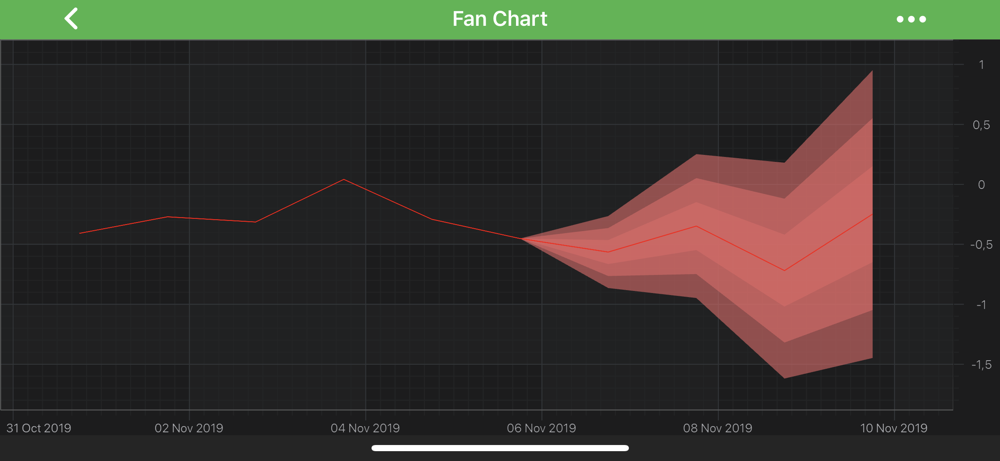

# The Fan Chart Type
Fan Chart is provided by using multiple [Band Series](xref:chart2d.renderableSeries.BandSeries) on the same chart.

> [!NOTE] 
> Examples for the **Fan Chart** can be found in the [SciChart Android Examples Suite](https://www.scichart.com/examples/android-chart/) as well as on [GitHub](https://github.com/ABTSoftware/SciChart.Android.Examples):
> - [Native Example](https://www.scichart.com/example/android-chart-example-fan-chart/)

Full example is available in our Example Suite under **Create a Multi-Series Chart -> [Android Fan Chart](https://www.scichart.com/example/android-chart-example-fan-chart/)**.
