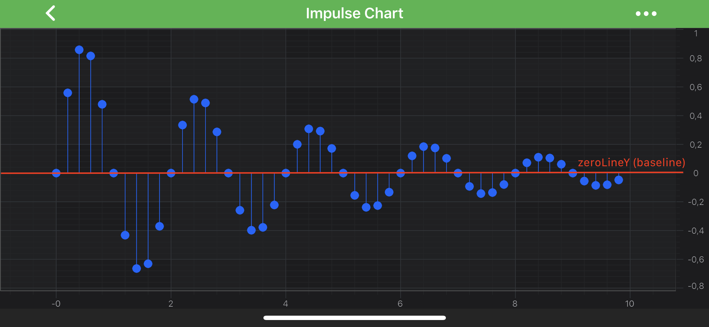
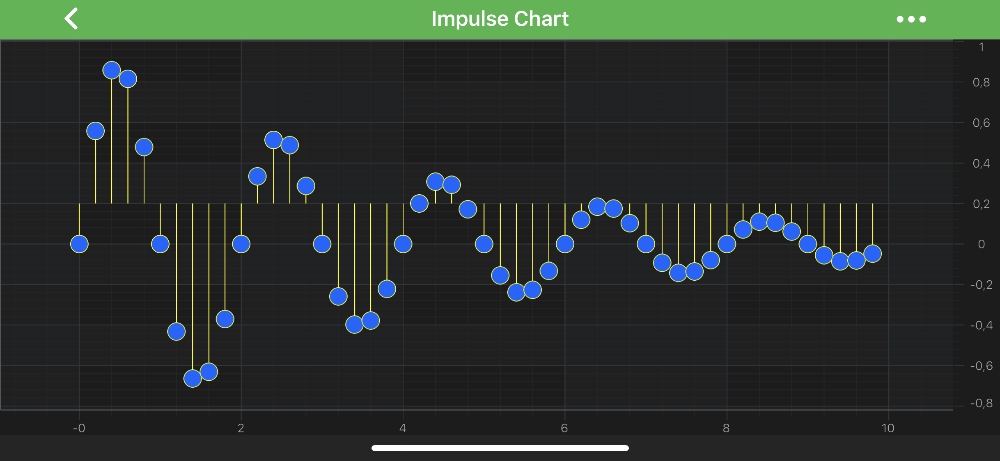

# The Impulse (Stem) Series Type
Impulse Charts are provided by the <xref:com.scichart.charting.visuals.renderableSeries.FastImpulseRenderableSeries> class and is a hybrid of [Column Series](xref:chart2d.renderableSeries.ColumnSeries) and [Scatter Series](xref:chart2d.renderableSeries.ScatterSeries). It accepts data (`X, Y`) from a <xref:com.scichart.charting.model.dataSeries.XyDataSeries> and draws a single line from **zeroLineY** to the `[X, Y]` value with an optional <xref:com.scichart.charting.visuals.pointmarkers.IPointMarker>.

> [!NOTE] 
> Examples for the **Impulse Series** can be found in the [SciChart Android Examples Suite](https://www.scichart.com/examples/android-chart/) as well as on [GitHub](https://github.com/ABTSoftware/SciChart.Android.Examples):
> - [Native Example](https://www.scichart.com/example/android-impulse-stem-chart-example/)
> - [Xamarin Example](https://www.scichart.com/example/xamarin-chart-impulse-stem-chart-example/)

Like the <xref:com.scichart.charting.visuals.renderableSeries.XyScatterRenderableSeries> type, <xref:com.scichart.charting.visuals.renderableSeries.FastImpulseRenderableSeries> requires a shape to be specified for the **Point Markers**. There are several shapes available out of the box, as well as it is possible to define custom shapes of the Point Markers. 

> [!NOTE] 
> For the detailed description of **Point Markers**, please see the [PointMarkers API](xref:chart2d.PointMarkerAPI) article.

Similarly to the <xref:com.scichart.charting.visuals.renderableSeries.FastColumnRenderableSeries> type, it is possible to specify the **baseline** position for series' bars via the [zeroLineY](xref:com.scichart.charting.visuals.renderableSeries.BaseRenderableSeries.setZeroLineY(double)) property. All data points that have Y value less than **ZeroLineY (baseline)** will be drawn downwards, else - upwards:

Finally, the stem color can be changed via the [strokeStyle](xref:com.scichart.charting.visuals.renderableSeries.BaseRenderableSeries.setStrokeStyle(com.scichart.drawing.common.PenStyle)) property.

> [!NOTE] 
> To learn more about **Pens** and **Brushes** and how to utilize them, please refer to the [PenStyle, BrushStyle and FontStyle](xref:stylingAndTheming.PenStyleBrushStyleAndFontStyle) article.

> [!NOTE] 
> In multi axis scenarios, a series has to be assigned to **particular X and Y axes**. This can be done passing the axes IDs to the [xAxisId](xref:com.scichart.charting.visuals.renderableSeries.IRenderableSeries.setXAxisId(java.lang.String)), [yAxisId](xref:com.scichart.charting.visuals.renderableSeries.IRenderableSeries.setYAxisId(java.lang.String)) properties.

## Create an Impulse Series
To create an **Impulse Series**, use the following code:

# [Java](#tab/java)
[!code-java[ImpulseSeries](../../../samples/sandbox/app/src/main/java/com/scichart/docsandbox/examples/java/series2d/ImpulseSeries2D.java#Example)]
# [Java with Builders API](#tab/javaBuilder)
[!code-java[ImpulseSeries](../../../samples/sandbox/app/src/main/java/com/scichart/docsandbox/examples/javaBuilder/series2d/ImpulseSeries2D.java#Example)]
# [Kotlin](#tab/kotlin)
[!code-swift[ImpulseSeries](../../../samples/sandbox/app/src/main/java/com/scichart/docsandbox/examples/kotlin/series2d/ImpulseSeries2D.kt#Example)]
***

The result should be:

## Impulse Series Features
Impulse Series also has some features similar to other series, such as:
- [Render a Gap](#render-a-gap-in-a-impulse-series);
- [Draw Series With Different Colors](#specify-color-for-individual-bars).

#### Render a Gap in a Impulse Series
It's possible to render a Gap in an **Impulse series**, by passing a data point with a `NaN` as the `Y` value. Please refer to the [RenderableSeries APIs](xref:chart2d.2DChartTypes#adding-a-gap-onto-a-renderableseries) article for more details.

#### Specify Color for Individual Bars
In SciChart, you can draw each bar of the **Impulse Series** with different colors using the [PaletteProvider API](xref:chart2d.PaletteProviderAPI). 
To Use palette provider for Impulse Series - a custom <xref:com.scichart.charting.visuals.renderableSeries.paletteProviders.IFillPaletteProvider> (or <xref:com.scichart.charting.visuals.renderableSeries.paletteProviders.IStrokePaletteProvider>) has to be provided to the [paletteProvider](xref:com.scichart.charting.visuals.renderableSeries.IRenderableSeries.setPaletteProvider(com.scichart.charting.visuals.renderableSeries.paletteProviders.IPaletteProvider)) property. Please refer to the [PaletteProvider API](xref:chart2d.PaletteProviderAPI) article for more info.
