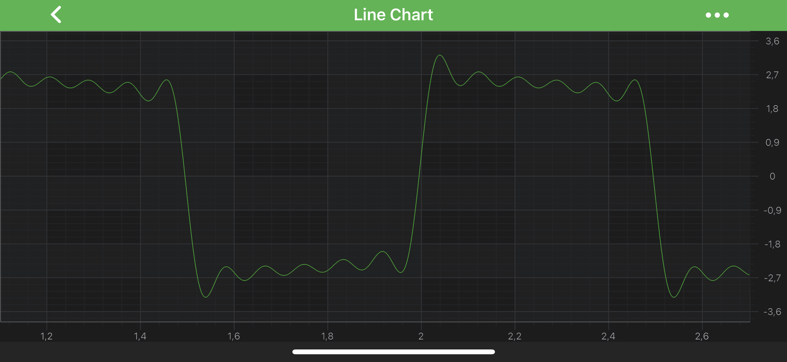
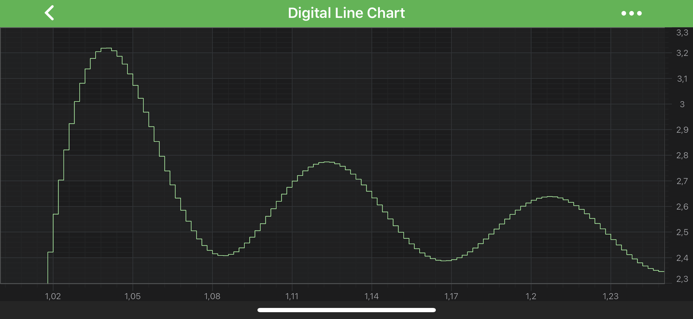
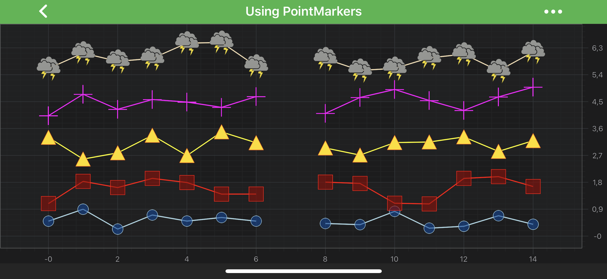

## The Line Series Type

Line Series can be created using the <xref:com.scichart.charting.visuals.renderableSeries.FastLineRenderableSeries> type.

> [!NOTE]
> Examples of the **Line Series** can be found in the [SciChart Android Examples Suite](https://www.scichart.com/examples/android-chart/) as well as on [GitHub](https://github.com/ABTSoftware/SciChart.Android.Examples)
> - [Native Example](https://www.scichart.com/example/android-chart/android-line-chart-example/)
> - [Xamarin Example](https://www.scichart.com/example/xamarin-chart/xamarin-chart-line-chart-example/)

### Digital (Step) Line Series
<xref:com.scichart.charting.visuals.renderableSeries.FastLineRenderableSeries> can be configured to draw as **Digital (Step) Line**. It is achieved via the 
[isDigitalLine](xref:com.scichart.charting.visuals.renderableSeries.FastLineRenderableSeries.setIsDigitalLine(boolean)) property.

# [Java](#tab/java)
[!code-java[LineSeries](../../../samples/sandbox/app/src/main/java/com/scichart/docsandbox/examples/java/series2d/LineSeries2D.java#Example)]
# [Java with Builders API](#tab/javaBuilder)
[!code-java[LineSeries](../../../samples/sandbox/app/src/main/java/com/scichart/docsandbox/examples/javaBuilder/series2d/LineSeries2D.java#Example)]
# [Kotlin](#tab/kotlin)
[!code-swift[LineSeries](../../../samples/sandbox/app/src/main/java/com/scichart/docsandbox/examples/kotlin/series2d/LineSeries2D.kt#Example)]
***

In the code above, a **Line Series** instance is created. It is assigned to draw the data that is provided by the <xref:com.scichart.charting.model.dataSeries.IDataSeries> assigned to it. The line is drawn with a **Pen** provided by the <xref:com.scichart.drawing.common.PenStyle> instance. Finally, the **Line Series** is added to the [renderableSeries](xref:com.scichart.charting.visuals.ISciChartSurface.getRenderableSeries()) property.

## Line Series Features
Line Series also has some features similar to other series, such as:
- [Render a Gap](#render-a-gap-in-a-line-series)
- [Draw Point Markers](#add-point-markers-onto-a-line-series)
- [Draw Series With Different Colors](#paint-line-segments-with-different-colors)

#### Render a Gap in a Line Series
It is possible to show a gap in a **Line Series** by passing a data point with a `NaN` as the Y value. Please refer to the [RenderableSeries APIs](xref:chart2d.2DChartTypes#adding-a-gap-onto-a-renderableseries) article for more details. The <xref:com.scichart.charting.visuals.renderableSeries.FastLineRenderableSeries>, however, allows to specify how a gap should appear. You can treat `NAN` values as **gaps** or close the line. That's defined by the [drawNaNAs](xref:com.scichart.charting.visuals.renderableSeries.BaseRenderableSeries.setDrawNaNAs(com.scichart.charting.visuals.renderableSeries.LineDrawMode)) property (Please see <xref:com.scichart.charting.visuals.renderableSeries.LineDrawMode> enumeration).

#### Add Point Markers onto a Line Series
Every data point of a **Line Series** can be marked with a <xref:com.scichart.charting.visuals.pointmarkers.IPointMarker>. To add Point Markers to the Line Series, use the following code:

To learn more about **Point Markers**, please refer to the [PointMarkers API](xref:chart2d.PointMarkerAPI) article.

> [!NOTE]
> This feature can be used to create a [Scatter Series](xref:chart2d.renderableSeries.ScatterSeries), if [strokeStyle](xref:com.scichart.charting.visuals.renderableSeries.IRenderableSeries.setStrokeStyle(com.scichart.drawing.common.PenStyle)) contains a **transparent Pen**.

#### Paint Line Segments With Different Colors
In SciChart, you can draw line segments with different colors using the [PaletteProvider API](xref:chart2d.PaletteProviderAPI). 
To Use palette provider for **Line Series** - a custom <xref:com.scichart.charting.visuals.renderableSeries.paletteProviders.IPaletteProvider> has to be provided to the [paletteProvider](xref:com.scichart.charting.visuals.renderableSeries.IRenderableSeries.setPaletteProvider(com.scichart.charting.visuals.renderableSeries.paletteProviders.IPaletteProvider)) property. For more information - please refer to the [PaletteProvider API](xref:chart2d.PaletteProviderAPI) article.
