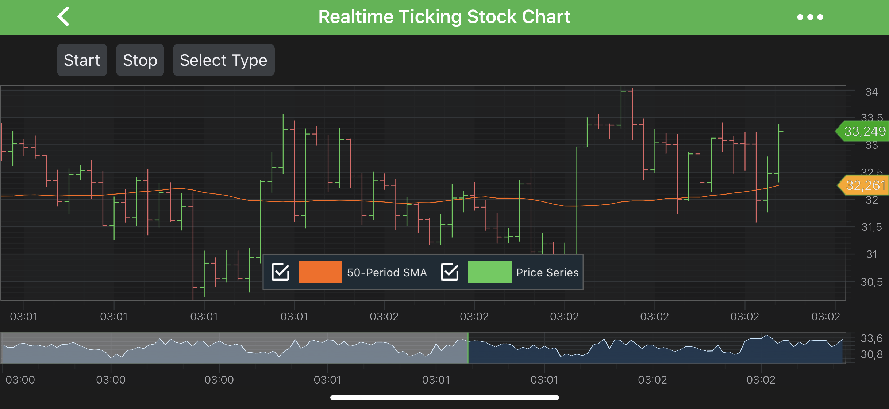
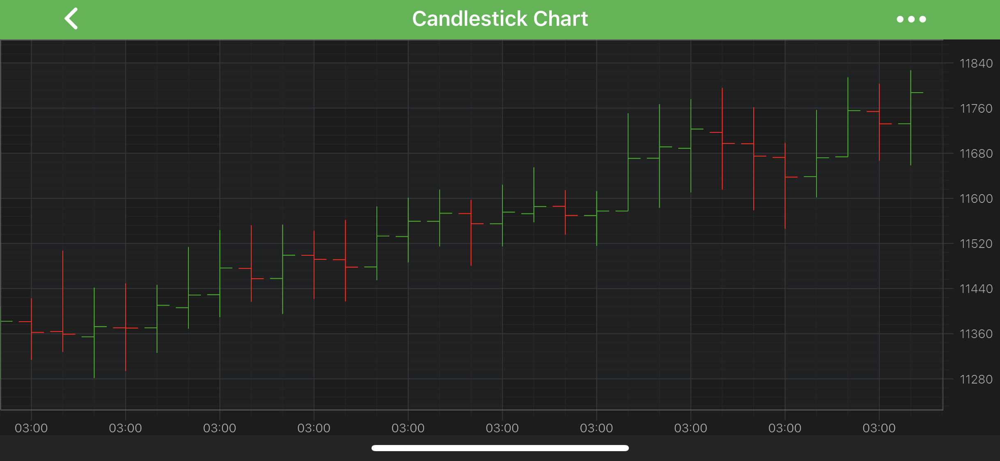

# The OHLC Series Type
The **OHLC series** are provided by the <xref:com.scichart.charting.visuals.renderableSeries.FastOhlcRenderableSeries> type. This accepts data (`X, Open, High, Low, Close`) from a <xref:com.scichart.charting.model.dataSeries.OhlcDataSeries> and renders OHLC bar at each `X-Value` coordinate.

> [!NOTE] 
> For more info about <xref:com.scichart.charting.model.dataSeries.OhlcDataSeries>, as well as other DataSeries types in SciChart, see the [DataSeries API](xref:chart2d.DataSeriesAPIs) article.

> [!NOTE]
> Examples of the **OHLC Series** can be found in the [SciChart Android Examples Suite](https://www.scichart.com/examples/android-chart/) as well as on [GitHub](https://github.com/ABTSoftware/SciChart.Android.Examples):
> - [Native Example](https://www.scichart.com/example/android-realtime-ticking-stock-charts/)
> - [Xamarin Example](https://www.scichart.com/example/xamarin-chart-realtime-ticking-stock-charts-example/)

The <xref:com.scichart.charting.visuals.renderableSeries.FastOhlcRenderableSeries> is very much alike the <xref:com.scichart.charting.visuals.renderableSeries.FastCandlestickRenderableSeries> class. It allows to specify **StrokeUp** and **StrokeDown** pens as well as relative **DataPointWidth**, which will be applied to every bar. Mentioned settings can be accessed via the following properties:
- [strokeUpStyle](xref:com.scichart.charting.visuals.renderableSeries.OhlcRenderableSeriesBase.setStrokeUpStyle(com.scichart.drawing.common.PenStyle)) - applied to bars when **Close <= Open**. 
- [strokeDownStyle](xref:com.scichart.charting.visuals.renderableSeries.OhlcRenderableSeriesBase.setStrokeDownStyle(com.scichart.drawing.common.PenStyle)) - applied to bars when **Close > Open**.
- [dataPointWidth](xref:com.scichart.charting.visuals.renderableSeries.OhlcRenderableSeriesBase.setDataPointWidth(double)) - specifies how much space a single bar occupies, varying from 0 to 1 (when columns are conjoined). 

> [!NOTE] 
> To learn more about **Pens** and **Brushes** and how to utilize them, please refer to the [PenStyle, BrushStyle and FontStyle](xref:stylingAndTheming.PenStyleBrushStyleAndFontStyle) article.

> [!NOTE] 
> In multi axis scenarios, a series has to be assigned to **particular X and Y axes**. This can be done passing the axes IDs to the [xAxisId](xref:com.scichart.charting.visuals.renderableSeries.IRenderableSeries.setXAxisId(java.lang.String)), [yAxisId](xref:com.scichart.charting.visuals.renderableSeries.IRenderableSeries.setYAxisId(java.lang.String)) properties.

## Create an OHLC Series

To create an **OHLC Series**, use the following code:

# [Java](#tab/java)
[!code-java[OhlcSeries](../../../samples/sandbox/app/src/main/java/com/scichart/docsandbox/examples/java/series2d/OhlcSeries2D.java#Example)]
# [Java with Builders API](#tab/javaBuilder)
[!code-java[OhlcSeries](../../../samples/sandbox/app/src/main/java/com/scichart/docsandbox/examples/javaBuilder/series2d/OhlcSeries2D.java#Example)]
# [Kotlin](#tab/kotlin)
[!code-swift[OhlcSeries](../../../samples/sandbox/app/src/main/java/com/scichart/docsandbox/examples/kotlin/series2d/OhlcSeries2D.kt#Example)]
***

## OHLC Series Features
OHLC Series also has some features similar to other series, such as:
- [Render a Gap](#render-a-gap-in-an-ohlc-series).
- [Draw Series With Different Colors](#specify-color-for-individual-bars)

#### Render a Gap in an OHLC Series
It's possible to render a Gap in **OHLC series**, by passing a data point with a `NaN` as the `Open, High, Low, Close` values. Please refer to the [RenderableSeries APIs](xref:chart2d.2DChartTypes#adding-a-gap-onto-a-renderableseries) article for more details.

#### Specify Color for Individual Bars
In SciChart, you can draw each bar of the **OHLC Series** with different colors using the [PaletteProvider API](xref:chart2d.PaletteProviderAPI). 
To Use palette provider for OHLC Series - a custom <xref:com.scichart.charting.visuals.renderableSeries.paletteProviders.IStrokePaletteProvider> has to be provided to the [paletteProvider](xref:com.scichart.charting.visuals.renderableSeries.IRenderableSeries.setPaletteProvider(com.scichart.charting.visuals.renderableSeries.paletteProviders.IPaletteProvider)) property. Please refer to the [PaletteProvider API](xref:chart2d.PaletteProviderAPI) article for more info.
