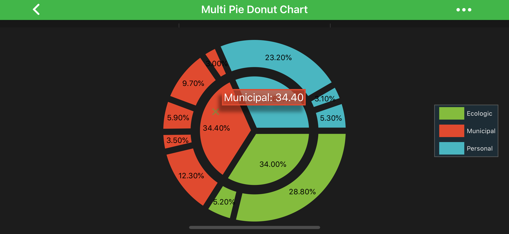

# The Pie Chart Type
In SciChart, the **Pie Chart** type is represented by the <xref:com.scichart.charting.visuals.SciPieChartSurface> class.

The <xref:com.scichart.charting.visuals.renderableSeries.PieRenderableSeries> represents data in a form of a circle divided into triangular wedges, called segments. 
A <xref:com.scichart.charting.visuals.renderableSeries.PieSegment> represents a percentage that corresponds to a particular value. 
This value appears drawn on every segment and can be set in code. 

> [!NOTE] 
> Examples of the **Pie Chart** can be found in the [SciChart Android Examples Suite](https://www.scichart.com/examples/android-chart/) as well as on [GitHub](https://github.com/ABTSoftware/SciChart.Android.Examples):
> - [Native Example](https://www.scichart.com/example/android-chart-pie-chart-example/)
> - [Xamarin Example](https://www.scichart.com/example/xamarin-chart-pie-chart-example/)

The <xref:com.scichart.charting.visuals.renderableSeries.IPieSegment> allows you to specify different styles to control rendering of the segments, e.g.:
- [fillStyle](xref:com.scichart.charting.visuals.renderableSeries.IPieSegment.setFillStyle(com.scichart.drawing.common.BrushStyle))
- [strokeStyle](xref:com.scichart.charting.visuals.renderableSeries.IPieSegment.setStrokeStyle(com.scichart.drawing.common.PenStyle))
- [titleStyle](xref:com.scichart.charting.visuals.renderableSeries.IPieSegment.setTitleStyle(com.scichart.drawing.common.FontStyle))
- [selectedSegmentStyle](xref:com.scichart.charting.visuals.renderableSeries.IPieSegment.setSelectedSegmentStyle(com.scichart.charting.visuals.renderableSeries.IStyle))

> [!NOTE] 
> To learn more about **Pens** and **Brushes** and how to utilize them, please refer to the [PenStyle, BrushStyle and FontStyle](xref:stylingAndTheming.PenStyleBrushStyleAndFontStyle) article.

Also, you can control whether to draw labels on segments or not via the [drawLabels](xref:com.scichart.charting.visuals.renderableSeries.PieDonutRenderableSeriesBase.setDrawLabels(boolean)) property.

## Create a Pie Chart
To create a **Pie Chart**, you have to provide a <xref:com.scichart.charting.model.PieRenderableSeriesCollection> and assign it to [renderableSeries](xref:com.scichart.charting.visuals.SciPieChartSurface.setRenderableSeries(com.scichart.charting.model.PieRenderableSeriesCollection)) property. 
The data source is a collection of objects that conforms to the <xref:com.scichart.charting.visuals.renderableSeries.IPieRenderableSeries> protocol, which contains a list of <xref:com.scichart.charting.visuals.renderableSeries.PieSegment> instances to draw. 

# [Java](#tab/java)
[!code-java[CreatePieChart](../../../samples/sandbox/app/src/main/java/com/scichart/docsandbox/examples/java/series2d/PieChart2D.java#CreatePieChart)]
# [Java with Builders API](#tab/javaBuilder)
[!code-java[CreatePieChart](../../../samples/sandbox/app/src/main/java/com/scichart/docsandbox/examples/javaBuilder/series2d/PieChart2D.java#CreatePieChart)]
# [Kotlin](#tab/kotlin)
[!code-swift[CreatePieChart](../../../samples/sandbox/app/src/main/java/com/scichart/docsandbox/examples/kotlin/series2d/PieChart2D.kt#CreatePieChart)]
***

## SciPieChartSurface Modifiers
The <xref:com.scichart.charting.visuals.SciPieChartSurface> supports modifiers like [legend](#pie-chart-legend), [selection](#pie-chart-selection), and [tooltip](#pie-chart-tooltip).

**Legend** and **Selection** modifiers are synced if both are added. A <xref:com.scichart.charting.visuals.renderableSeries.PieSegment> can be selected by clicking on either of them (via the [Selection Modifier](#pie-chart-selection)) or the corresponding item in the [Legend](#pie-chart-legend). 
This action provides visual feedback on the chart and the Legend.

#### Pie Chart Legend
To add the <xref:com.scichart.charting.modifiers.PieChartLegendModifier>, use the following code:

# [Java](#tab/java)
[!code-java[CreatePieChartLegend](../../../samples/sandbox/app/src/main/java/com/scichart/docsandbox/examples/java/series2d/PieChart2D.java#CreatePieChartLegend)]
# [Java with Builders API](#tab/javaBuilder)
[!code-java[CreatePieChartLegend](../../../samples/sandbox/app/src/main/java/com/scichart/docsandbox/examples/javaBuilder/series2d/PieChart2D.java#CreatePieChartLegend)]
# [Kotlin](#tab/kotlin)
[!code-swift[CreatePieChartLegend](../../../samples/sandbox/app/src/main/java/com/scichart/docsandbox/examples/kotlin/series2d/PieChart2D.kt#CreatePieChartLegend)]
***

> [!NOTE] 
> <xref:com.scichart.charting.modifiers.PieChartLegendModifier> works similar to <xref:com.scichart.charting.modifiers.LegendModifier> and has a similar API. To learn more, please visit the [LegendModifier usage](xref:chartModifierAPIs.LegendModifier) article.

#### Pie Chart Selection
To add the <xref:com.scichart.charting.modifiers.PieSegmentSelectionModifier>, please use the following code:

# [Java](#tab/java)
[!code-java[AddPieChartSelection](../../../samples/sandbox/app/src/main/java/com/scichart/docsandbox/examples/java/series2d/PieChart2D.java#AddPieChartSelection)]
# [Java with Builders API](#tab/javaBuilder)
[!code-java[AddPieChartSelection](../../../samples/sandbox/app/src/main/java/com/scichart/docsandbox/examples/javaBuilder/series2d/PieChart2D.java#AddPieChartSelection)]
# [Kotlin](#tab/kotlin)
[!code-swift[AddPieChartSelection](../../../samples/sandbox/app/src/main/java/com/scichart/docsandbox/examples/kotlin/series2d/PieChart2D.kt#AddPieChartSelection)]
***

> [!NOTE] 
> <xref:com.scichart.charting.modifiers.PieSegmentSelectionModifier> works similar to <xref:com.scichart.charting.modifiers.SeriesSelectionModifier> and has a similar API. To learn more, please visit the [SeriesSelectionModifier usage](xref:chartModifierAPIs.InteractivitySeriesSelectionModifier) article.

#### Pie Chart Tooltip

The <xref:com.scichart.charting.modifiers.PieChartTooltipModifier> allows inspecting [segmentCollection](xref:com.scichart.charting.visuals.renderableSeries.PieDonutRenderableSeriesBase.getSegmentsCollection()) at a touch point. To add the <xref:com.scichart.charting.modifiers.PieChartTooltipModifier>, use the following code:

# [Java](#tab/java)
[!code-java[AddPieChartTooltip](../../../samples/sandbox/app/src/main/java/com/scichart/docsandbox/examples/java/series2d/PieChart2D.java#AddPieChartTooltip)]
# [Java with Builders API](#tab/javaBuilder)
[!code-java[AddPieChartTooltip](../../../samples/sandbox/app/src/main/java/com/scichart/docsandbox/examples/javaBuilder/series2d/PieChart2D.java#AddPieChartTooltip)]
# [Kotlin](#tab/kotlin)
[!code-swift[AddPieChartTooltip](../../../samples/sandbox/app/src/main/java/com/scichart/docsandbox/examples/kotlin/series2d/PieChart2D.kt#AddPieChartTooltip)]
***

> [!NOTE] 
> <xref:com.scichart.charting.modifiers.PieChartTooltipModifier> works similar to <xref:com.scichart.charting.modifiers.TooltipModifier> and has a similar API. To learn more, please visit [TooltipModifier Usage](xref:chartModifierAPIs.InteractivityTooltipModifier) article.

## Pie Segment Label Formatter
By default, the Pie Segment Label displays a relative percentage calculated on values of all segments in [segmentCollection](xref:com.scichart.charting.visuals.renderableSeries.PieDonutRenderableSeriesBase.getSegmentsCollection()). This behavior can be controlled and to do so you’ll need to subclass <xref:com.scichart.charting.visuals.renderableSeries.PieSegmentLabelFormatterBase> and provide your custom data in <xref:com.scichart.charting.visuals.renderableSeries.IPieSegmentLabelFormatter.formatLabel(com.scichart.charting.visuals.renderableSeries.IPieSegment)> method. As an example, let's create a label that displays a segment absolute value. Assume, we create a donutSeries and add four segments with values 40, 10, 20, and 15. Here is the code sample, how to do this:

# [Java](#tab/java)
[!code-java[CreateCustomPieSegmentLabelFormatter](../../../samples/sandbox/app/src/main/java/com/scichart/docsandbox/examples/java/series2d/PieChart2D.java#CreateCustomPieSegmentLabelFormatter)]
[!code-java[UseCustomPieSegmentLabelFormatter](../../../samples/sandbox/app/src/main/java/com/scichart/docsandbox/examples/java/series2d/PieChart2D.java#UseCustomPieSegmentLabelFormatter)]
# [Java with Builders API](#tab/javaBuilder)
[!code-java[CreateCustomPieSegmentLabelFormatter](../../../samples/sandbox/app/src/main/java/com/scichart/docsandbox/examples/javaBuilder/series2d/PieChart2D.java#CreateCustomPieSegmentLabelFormatter)]
[!code-java[UseCustomPieSegmentLabelFormatter](../../../samples/sandbox/app/src/main/java/com/scichart/docsandbox/examples/javaBuilder/series2d/PieChart2D.java#UseCustomPieSegmentLabelFormatter)]
# [Kotlin](#tab/kotlin)
[!code-swift[CreateCustomPieSegmentLabelFormatter](../../../samples/sandbox/app/src/main/java/com/scichart/docsandbox/examples/kotlin/series2d/PieChart2D.kt#CreateCustomPieSegmentLabelFormatter)]
[!code-swift[UseCustomPieSegmentLabelFormatter](../../../samples/sandbox/app/src/main/java/com/scichart/docsandbox/examples/kotlin/series2d/PieChart2D.kt#UseCustomPieSegmentLabelFormatter)]
***

This produces the following output:

## Multi Pie Donut Chart
In SciChart you can have both [Pie Chart](xref:com.scichart.charting.visuals.renderableSeries.PieRenderableSeries) and [Donut Chart](xref:com.scichart.charting.visuals.renderableSeries.DonutRenderableSeries) placed inside the <xref:com.scichart.charting.visuals.SciPieChartSurface> at the same time.

> [!NOTE] 
> Examples of the **Multi Pie Donut Chart** can be found in the [SciChart Android Examples Suite](https://www.scichart.com/examples/android-chart/) as well as on [GitHub](https://github.com/ABTSoftware/SciChart.Android.Examples).
> - [Native Example](https://www.scichart.com/example/android-chart-nested-chart-example/)
> - [Xamarin Example](https://www.scichart.com/example/xamarin-chart-nested-pie-chart-example/)
