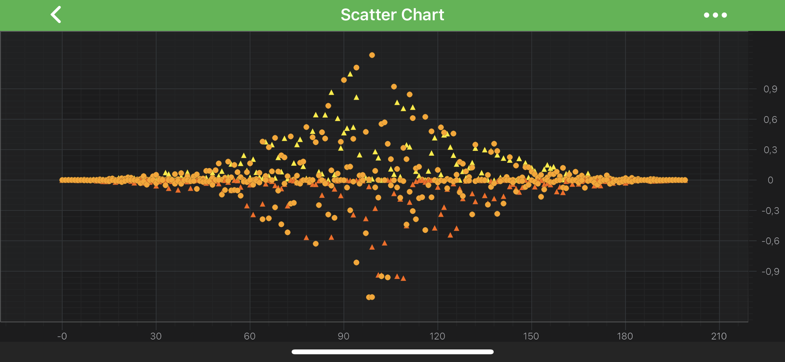

# The Scatter Series Type
**Scatter Series** can be created using the <xref:com.scichart.charting.visuals.renderableSeries.XyScatterRenderableSeries> type.

> [!NOTE] 
> Examples for the **Scatter Series** can be found in the [SciChart Android Examples Suite](https://www.scichart.com/examples/android-chart/) as well as on [GitHub](https://github.com/ABTSoftware/SciChart.Android.Examples):
> - [Native Example](https://www.scichart.com/example/android-scatter-chart-example/)
> - [Xamarin Example](https://www.scichart.com/example/xamarin-chart-scatter-chart-example/)

The Scatter Series requires a shape to be specified for **Point Markers**. SciChart provides several shapes out of the box:
- <xref:com.scichart.charting.visuals.pointmarkers.CrossPointMarker>; 
- <xref:com.scichart.charting.visuals.pointmarkers.EllipsePointMarker>; 
- <xref:com.scichart.charting.visuals.pointmarkers.SquarePointMarker>;
- <xref:com.scichart.charting.visuals.pointmarkers.TrianglePointMarker>;
- <xref:com.scichart.charting.visuals.pointmarkers.SpritePointMarker>.

It is also possible to define custom shapes of the Point Markers. Please refer to the [PointMarkers API](xref:chart2d.PointMarkerAPI) article to learn more. You can also override colors of the **Point Markers** individually using [PaletteProvider API](xref:chart2d.PaletteProviderAPI).

> [!NOTE] 
> In multi axis scenarios, a series has to be assigned to **particular X and Y axes**. This can be done passing the axes IDs to the [xAxisId](xref:com.scichart.charting.visuals.renderableSeries.IRenderableSeries.setXAxisId(java.lang.String)), [yAxisId](xref:com.scichart.charting.visuals.renderableSeries.IRenderableSeries.setYAxisId(java.lang.String)) properties.

## Create a Scatter Series
To create a <xref:com.scichart.charting.visuals.renderableSeries.XyScatterRenderableSeries>, use the following code:

# [Java](#tab/java)
[!code-java[ScatterSeries](../../../samples/sandbox/app/src/main/java/com/scichart/docsandbox/examples/java/series2d/ScatterSeries2D.java#Example)]
# [Java with Builders API](#tab/javaBuilder)
[!code-java[ScatterSeries](../../../samples/sandbox/app/src/main/java/com/scichart/docsandbox/examples/javaBuilder/series2d/ScatterSeries2D.java#Example)]
# [Kotlin](#tab/kotlin)
[!code-swift[ScatterSeries](../../../samples/sandbox/app/src/main/java/com/scichart/docsandbox/examples/kotlin/series2d/ScatterSeries2D.kt#Example)]
***

In the code above, a **Scatter Series** instance is created. It is assigned to draw the data that is provided by the <xref:com.scichart.charting.model.dataSeries.IDataSeries> assigned to it. The Scatters are drawn with a **PointMarker** provided by the <xref:com.scichart.charting.visuals.pointmarkers.EllipsePointMarker> instance. Finally, the **Scatter Series** is added to the [renderableSeries](xref:com.scichart.charting.visuals.ISciChartSurface.getRenderableSeries()) property.

## Scatter Series Features
Scatter Series also has some features similar to other series, such as:
- [Render a Gap](#render-a-gap-in-a-scatter-series).
- [Draw Series With Different Colors](#paint-scatters-with-different-colors).

#### Render a Gap in a Scatter Series
It's possible to render a Gap in **Scatter series**, by passing a data point with a `NaN` as the `Y` value. Please refer to the [RenderableSeries APIs](xref:chart2d.2DChartTypes#adding-a-gap-onto-a-renderableseries) article for more details.

#### Paint Scatters With Different Colors
In SciChart, you can draw each scatter of the **Scatter Series** with different colors using the [PaletteProvider API](xref:chart2d.PaletteProviderAPI). 
To Use palette provider for scatters - a custom <xref:com.scichart.charting.visuals.renderableSeries.paletteProviders.IPointMarkerPaletteProvider> has to be provided to the [paletteProvider](xref:com.scichart.charting.visuals.renderableSeries.IRenderableSeries.setPaletteProvider(com.scichart.charting.visuals.renderableSeries.paletteProviders.IPaletteProvider)) property. Please refer to the [PaletteProvider API](xref:chart2d.PaletteProviderAPI) article for more info.
