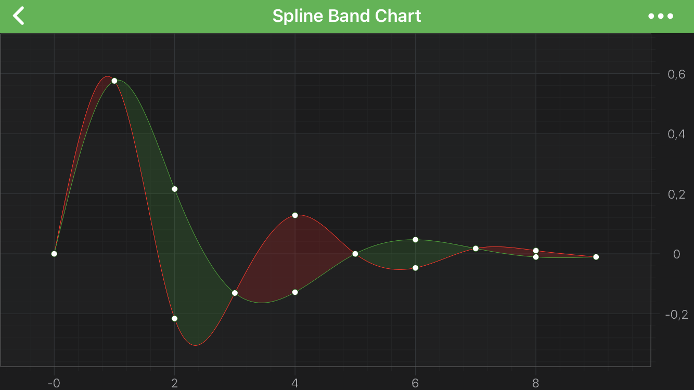

# The Spline Band Series Type
**Spline Band Series** are provided by the <xref:com.scichart.charting.visuals.renderableSeries.SplineBandRenderableSeries> type. This accepts data (`X, Y, Y1`) from a <xref:com.scichart.charting.model.dataSeries.XyyDataSeries> and renders two lines with a polygon, which changes color depending on whether `Y > Y1` or vice versa.

> [!NOTE] 
> For more info about <xref:com.scichart.charting.model.dataSeries.XyyDataSeries>, as well as other DataSeries types in SciChart, see the [DataSeries API](xref:chart2d.DataSeriesAPIs) article.

The **Spline Band Series** can be used to render profit & loss (green / red above or below a zero line), shaded areas of interest, technical indicators such as MACD and Ichimoku, or to simply shade an area above or below a threshold.

> [!NOTE]
> Examples for the **Spline Band Series** can be found in the [SciChart Android Examples Suite](https://www.scichart.com/examples/android-chart/) as well as on [GitHub](https://github.com/ABTSoftware/SciChart.Android.Examples):
> - [Native Example](https://www.scichart.com/example/android-spline-band-chart/)
> - [Xamarin Example](https://www.scichart.com/example/xamarin-spline-band-chart/)

The <xref:com.scichart.charting.visuals.renderableSeries.SplineBandRenderableSeries> class allows to specify **Fill**, **FillY1** brushes and **Stroke**, **StrokeY1** pens via the following properties:
- [fillBrushStyle](xref:com.scichart.charting.visuals.renderableSeries.BaseBandRenderableSeries.setFillBrushStyle(com.scichart.drawing.common.BrushStyle))
- [fillY1BrushStyle](xref:com.scichart.charting.visuals.renderableSeries.BaseBandRenderableSeries.setFillY1BrushStyle(com.scichart.drawing.common.BrushStyle))
- [strokeStyle](xref:com.scichart.charting.visuals.renderableSeries.BaseRenderableSeries.setStrokeStyle(com.scichart.drawing.common.PenStyle))
- [strokeY1Style](xref:com.scichart.charting.visuals.renderableSeries.BaseBandRenderableSeries.setStrokeY1Style(com.scichart.drawing.common.PenStyle))

> [!NOTE] 
> To learn more about **Pens** and **Brushes** and how to utilize them, please refer to the [PenStyle, BrushStyle and FontStyle](xref:stylingAndTheming.PenStyleBrushStyleAndFontStyle) article.

> [!NOTE] 
> In multi axis scenarios, a series has to be assigned to **particular X and Y axes**. This can be done passing the axes IDs to the [xAxisId](xref:com.scichart.charting.visuals.renderableSeries.IRenderableSeries.setXAxisId(java.lang.String)), [yAxisId](xref:com.scichart.charting.visuals.renderableSeries.IRenderableSeries.setYAxisId(java.lang.String)) properties.

## Create a Spline Band Series
To create a **Spline Band Series**, use the following code:

# [Java](#tab/java)
[!code-java[SplineBandSeries](../../../samples/sandbox/app/src/main/java/com/scichart/docsandbox/examples/java/series2d/SplineBandSeries2D.java#Example)]
# [Java with Builders API](#tab/javaBuilder)
[!code-java[SplineBandSeries](../../../samples/sandbox/app/src/main/java/com/scichart/docsandbox/examples/javaBuilder/series2d/SplineBandSeries2D.java#Example)]
# [Kotlin](#tab/kotlin)
[!code-swift[BandSeries](../../../samples/sandbox/app/src/main/java/com/scichart/docsandbox/examples/kotlin/series2d/SplineBandSeries2D.kt#Example)]
***

## Spline Band Series Features
Spline Band Series also has some features similar to other series, such as:
- [Render a Gap](#render-a-gap-in-a-spline-band-series)
- [Draw Point Markers](#add-point-markers-onto-a-spline-band-series)
- [Draw Series with Different Colors](#paint-spline-band-area-parts-with-different-colors)

#### Render a Gap in a Spline Band Series
It's possible to render a Gap in **Spline Band series**, by passing a data point with a `NaN` as the `Y and Y1` value. Please refer to the [RenderableSeries APIs](xref:chart2d.2DChartTypes#adding-a-gap-onto-a-renderableseries) article for more details. The <xref:com.scichart.charting.visuals.renderableSeries.SplineBandRenderableSeries>, however, allows to specify how a gap should appear. You can treat `NAN` values as **gaps** or close the line. That's defined by the [drawNaNAs](xref:com.scichart.charting.visuals.renderableSeries.BaseRenderableSeries.setDrawNaNAs(com.scichart.charting.visuals.renderableSeries.LineDrawMode)) property (Please see <xref:com.scichart.charting.visuals.renderableSeries.LineDrawMode> enumeration).

> [!NOTE] 
> Please note, even though Gaps via NaN values in spline series is supported, ClosedGaps feature, which is available in [regular (non-spline)](xref:chart2d.renderableSeries.BandSeries) series, aren't supported with splines.

#### Add Point Markers onto a Spline Band Series
Every data point of a **Spline Band Series** can be marked with a <xref:com.scichart.charting.visuals.pointmarkers.IPointMarker>. To add Point Markers to a **Spline Band Series** use the [pointMarker](xref:com.scichart.charting.visuals.renderableSeries.IRenderableSeries.setPointMarker(com.scichart.charting.visuals.pointmarkers.IPointMarker)) property. For more information and code examples, please refer to the [PointMarkers API](xref:chart2d.PointMarkerAPI) article.

#### Paint Spline Band Area Parts with Different Colors
In SciChart, you can draw **Spline Band Series** segments with different colors using the [PaletteProvider API](xref:chart2d.PaletteProviderAPI). 
To Use palette provider for Spline Band Series - a custom <xref:com.scichart.charting.visuals.renderableSeries.paletteProviders.IFillPaletteProvider> (or <xref:com.scichart.charting.visuals.renderableSeries.paletteProviders.IStrokePaletteProvider>) has to be provided to the [paletteProvider](xref:com.scichart.charting.visuals.renderableSeries.IRenderableSeries.setPaletteProvider(com.scichart.charting.visuals.renderableSeries.paletteProviders.IPaletteProvider)) property. Please refer to the [PaletteProvider API](xref:chart2d.PaletteProviderAPI) article for more info.
