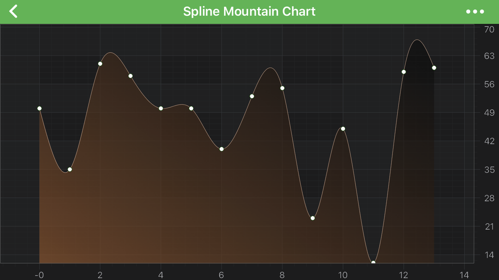

# The Spline Mountain (Area) Series Type
**Spline Mountain (Area) Series** can be created using the <xref:com.scichart.charting.visuals.renderableSeries.SplineMountainRenderableSeries> type.

> [!NOTE] 
> Examples of the **Spline Mountain Series** can be found in the [SciChart Android Examples Suite](https://www.scichart.com/examples/android-chart/) as well as on [GitHub](https://github.com/ABTSoftware/SciChart.Android.Examples):
> - [Native Example](https://www.scichart.com/example/android-chart/android-spline-mountain-chart-example/)
> - [Xamarin Example](https://www.scichart.com/example/xamarin-chart/xamarin-spline-mountain-chart-example/)

The <xref:com.scichart.charting.visuals.renderableSeries.SplineMountainRenderableSeries> class allows to specify **Stroke** pen and **Area** brush. Those values can be assigned through the corresponding properties - [strokeStyle](xref:com.scichart.charting.visuals.renderableSeries.BaseRenderableSeries.setStrokeStyle(com.scichart.drawing.common.PenStyle)) and [areaStyle](xref:com.scichart.charting.visuals.renderableSeries.BaseMountainRenderableSeries.setAreaStyle(com.scichart.drawing.common.BrushStyle)) accordingly.

> [!NOTE] 
> To learn more about **Pens** and **Brushes** and how to utilize them, please refer to the [PenStyle, BrushStyle and FontStyle](xref:stylingAndTheming.PenStyleBrushStyleAndFontStyle) article.

It is possible to define the **ZeroLineY** baseline position for a Spline Mountain Series via the [zeroLineY](xref:com.scichart.charting.visuals.renderableSeries.BaseRenderableSeries.setZeroLineY(double)) property. All data points that have Y value less than **ZeroLineY** will appear downward, else - upward.

> [!NOTE] 
> In multi axis scenarios, a series has to be assigned to a **particular X and Y axes**. This can be done by passing the axes IDs to the [xAxisId](xref:com.scichart.charting.visuals.renderableSeries.IRenderableSeries.setXAxisId(java.lang.String)), [yAxisId](xref:com.scichart.charting.visuals.renderableSeries.IRenderableSeries.setYAxisId(java.lang.String)) properties.

## Create a Spline Mountain Series
To create a **Spline Mountain Series**, use the following code:

# [Java](#tab/java)
[!code-java[SplineMountain](../../../samples/sandbox/app/src/main/java/com/scichart/docsandbox/examples/java/series2d/SplineMountainSeries2D.java#Example)]
# [Java with Builders API](#tab/javaBuilder)
[!code-java[SplineMountain](../../../samples/sandbox/app/src/main/java/com/scichart/docsandbox/examples/javaBuilder/series2d/SplineMountainSeries2D.java#Example)]
# [Kotlin](#tab/kotlin)
[!code-swift[SplineMountain](../../../samples/sandbox/app/src/main/java/com/scichart/docsandbox/examples/kotlin/series2d/SplineMountainSeries2D.kt#Example)]
***

## Spline Mountain Series Features
Spline Mountain Series also has some features similar to other series, such as:
- [Render a Gap](#render-a-gap-in-a-spline-mountain-series);
- [Draw Point Markers](#add-point-markers-onto-a-spline-mountain-series);
- [Draw Series with Different Colors](#paint-area-parts-with-different-colors).

#### Render a Gap in a Spline Mountain Series
It's possible to render a Gap in **Spline Mountain series**, by passing a data point with a `NaN` as the Y value. Please refer to the [RenderableSeries APIs](xref:chart2d.2DChartTypes#adding-a-gap-onto-a-renderableseries) article for more details. The <xref:com.scichart.charting.visuals.renderableSeries.SplineMountainRenderableSeries>, itself, allows to specify how a gap would appear. You can treat `NAN` values as a **gap** or a **close the line**. That appearance is defined by the [drawNaNAs](xref:com.scichart.charting.visuals.renderableSeries.BaseRenderableSeries.setDrawNaNAs(com.scichart.charting.visuals.renderableSeries.LineDrawMode)) property (Please see <xref:com.scichart.charting.visuals.renderableSeries.LineDrawMode> enumeration).

> [!NOTE] 
> Please note, even though Gaps via NaN values in spline series is supported, ClosedGaps feature, which is available in [regular (non-spline)](xref:chart2d.renderableSeries.MountainSeries) series, aren't supported with splines.

#### Add Point Markers onto a Spline Mountain Series
Every data point of a **Mountain Series** can be marked with a <xref:com.scichart.charting.visuals.pointmarkers.IPointMarker>. To add Point Markers to a **Spline Mountain Series** use the [pointMarker](xref:com.scichart.charting.visuals.renderableSeries.IRenderableSeries.setPointMarker(com.scichart.charting.visuals.pointmarkers.IPointMarker)) property. For more information and code examples, please refer to the [PointMarkers API](xref:chart2d.PointMarkerAPI) article.

#### Paint Area Parts with Different Colors
In SciChart, you can draw Area Parts of the **Spline Mountain Series** with different colors using the [PaletteProvider API](xref:chart2d.PaletteProviderAPI). 
To Use palette provider for Spline Mountain Area - a custom <xref:com.scichart.charting.visuals.renderableSeries.paletteProviders.IFillPaletteProvider> (or <xref:com.scichart.charting.visuals.renderableSeries.paletteProviders.IStrokePaletteProvider>) has to be provided to the [paletteProvider](xref:com.scichart.charting.visuals.renderableSeries.IRenderableSeries.setPaletteProvider(com.scichart.charting.visuals.renderableSeries.paletteProviders.IPaletteProvider)) property. Please refer to the [PaletteProvider API](xref:chart2d.PaletteProviderAPI) article for more info.
