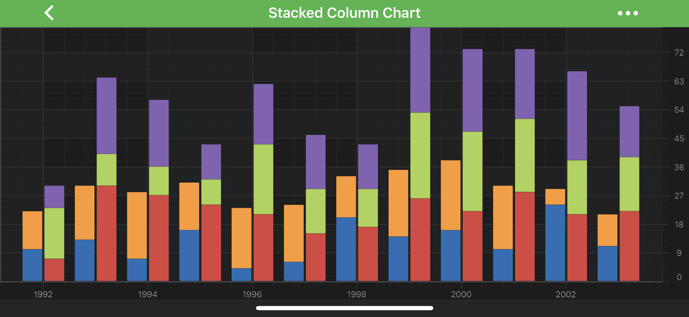
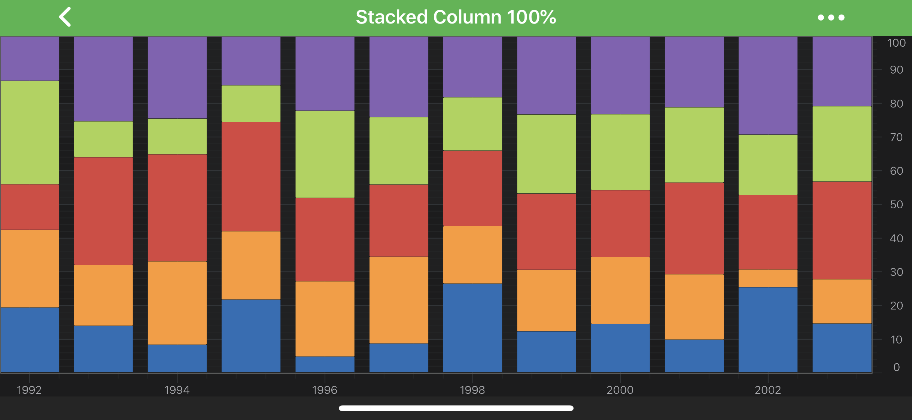

# The Stacked Column Series Type
The **Stacked Column** series can be created by using <xref:com.scichart.charting.visuals.renderableSeries.StackedColumnRenderableSeries> and one of the provided collections, which are used to stack columns **Horizontally** or **Vertically**.
Stacked Column series shares most of its properties with the regular **[Column Series](xref:chart2d.renderableSeries.ColumnSeries)**, in addition the columns are automatically vertically **stacked** (the Y-Values are aggregated) or horizontally **grouped**.

There are 2 available collections to work with <xref:com.scichart.charting.visuals.renderableSeries.StackedColumnRenderableSeries>:
- <xref:com.scichart.charting.visuals.renderableSeries.VerticallyStackedColumnsCollection> - allows to stack columns vertically;
- <xref:com.scichart.charting.visuals.renderableSeries.HorizontallyStackedColumnsCollection> - allows to stack (group) columns horizontally.

> [!NOTE] 
> In multi axis scenarios, a series has to be assigned to **particular X and Y axes**. This can be done by passing the axes IDs to the [xAxisId](xref:com.scichart.charting.visuals.renderableSeries.IRenderableSeries.setXAxisId(java.lang.String)), [yAxisId](xref:com.scichart.charting.visuals.renderableSeries.IRenderableSeries.setYAxisId(java.lang.String)) properties.

> [!NOTE] 
> Examples of the **Stacked Column Series** can be found in the [SciChart Android Examples Suite](https://www.scichart.com/examples/android-chart/) as well as on [GitHub](https://github.com/ABTSoftware/SciChart.Android.Examples):
> - [Native Example](https://www.scichart.com/example/android-chart/android-chart-stacked-column-chart-example/)
> - [Xamarin Example](https://www.scichart.com/example/xamarin-chart/xamarin-stacked-column-chart-example/)

## How the Stacking Works for Column Series
For **Stacked Column Series**, it's possible to perform either [Vertical](#vertical-stacking) or [Horizontal](#horizontal-stacking-grouping) stacking, or even **both** at the same time.

#### Vertical Stacking
Vertical Stacking of <xref:com.scichart.charting.visuals.renderableSeries.IStackedColumnRenderableSeries> is handled by special renderableSeries - <xref:com.scichart.charting.visuals.renderableSeries.VerticallyStackedColumnsCollection>.

Basically, it's a simple <xref:com.scichart.core.observable.ObservableCollection> of **Stacked Column Series**, where the order of items in it determines how series should be stacked and drawn - the first item will be drawn as regular column series and the rest will be stacked on top of each other. 

If you want to have several sets of **Stacked Column Series** which should be stacked independently, all you need to do is to create the corresponding amount of <xref:com.scichart.charting.visuals.renderableSeries.VerticallyStackedColumnsCollection> which will hold appropriate <xref:com.scichart.charting.visuals.renderableSeries.IStackedColumnRenderableSeries>.

#### Horizontal Stacking (Grouping)
Horizontal Stacking of **Stacked Column Series** is very similar to the [Vertical](#vertical-stacking) one. The only difference is that it stacks (groups) its items horizontally. 
By default it supports stacking of any <xref:com.scichart.charting.visuals.renderableSeries.IStackedColumnRenderableSeries> implementor.

For horizontal Stacking, you can define spacing, which depends on spacingMode, as well as whole group dataPointWidth using the following properties:

- [spacing](xref:com.scichart.charting.visuals.renderableSeries.HorizontallyStackedColumnsCollection.setSpacing(double)) - if you use **Absolute** mode then it accepts value in pixels, and if you use **Relative** mode - it expects value from `0 to 1`, which tells how much of the available space it should use relatively to each column size;
- [spacingMode](xref:com.scichart.charting.visuals.renderableSeries.HorizontallyStackedColumnsCollection.setSpacingMode(com.scichart.charting.visuals.renderableSeries.SpacingMode)) - Absolute or Relative modes are available through <xref:com.scichart.charting.visuals.renderableSeries.SpacingMode>;
- [dataPointWidth](xref:com.scichart.charting.visuals.renderableSeries.HorizontallyStackedColumnsCollection.setDataPointWidth(double)) - specifies how much space the whole stacked group occupies, varying from 0 to 1 (when columns are conjoined). 

If you need to have both **vertical** and **horizontal** stacking at the same time, just use <xref:com.scichart.charting.visuals.renderableSeries.VerticallyStackedColumnsCollection> (which conforms to <xref:com.scichart.charting.visuals.renderableSeries.IStackedColumnRenderableSeries>) inside your <xref:com.scichart.charting.visuals.renderableSeries.HorizontallyStackedColumnsCollection>.

## Create a Stacked Column Series 
To create a **Stacked Column Series**, use the following code:

# [Java](#tab/java)
[!code-java[StackedColumns](../../../samples/sandbox/app/src/main/java/com/scichart/docsandbox/examples/java/series2d/StackedColumnSeries2D.java#Example)]
# [Java with Builders API](#tab/javaBuilder)
[!code-java[StackedColumns](../../../samples/sandbox/app/src/main/java/com/scichart/docsandbox/examples/javaBuilder/series2d/StackedColumnSeries2D.java#Example)]
# [Kotlin](#tab/kotlin)
[!code-swift[StackedColumns](../../../samples/sandbox/app/src/main/java/com/scichart/docsandbox/examples/kotlin/series2d/StackedColumnSeries2D.kt#Example)]
***

## 100% Stacked Columns
Similarly to [Stacked Mountain Series](xref:chart2d.renderableSeries.StackedMountainSeries) in SciChart - it is possible to have **Stacked Columns**, that fills in all available vertical space. This mode is called **100% Stacked Columns**.

To use it on your <xref:com.scichart.charting.visuals.renderableSeries.VerticallyStackedColumnsCollection>, just change the corresponding property of your collection to [isOneHundredPercent](xref:com.scichart.charting.visuals.renderableSeries.VerticallyStackedSeriesCollection.setIsOneHundredPercent(boolean))

