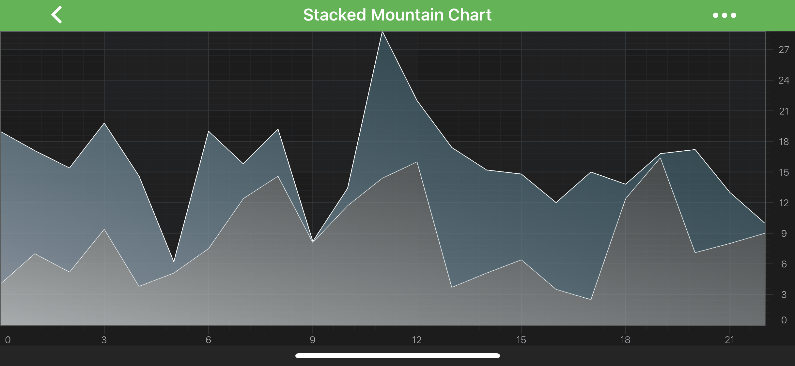
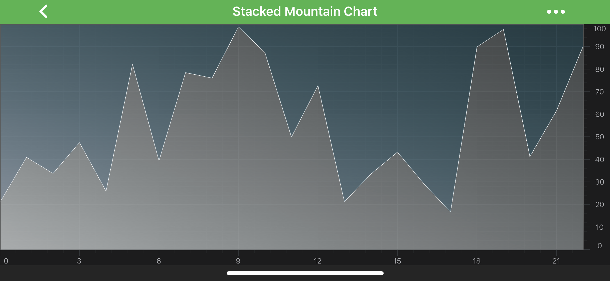

# The Stacked Mountain Series Type
The **Stacked Mountain** series can be created by using <xref:com.scichart.charting.visuals.renderableSeries.StackedMountainRenderableSeries> and <xref:com.scichart.charting.visuals.renderableSeries.VerticallyStackedSeriesCollection> classes. Stacked Mountain series shares most of its properties with the regular **[Mountain (Area) Series](xref:chart2d.renderableSeries.MountainSeries)**, with the added feature that mountains are **automatically stacked** (aggregate its Y-Values).

> [!NOTE] 
> In multi axis scenarios, a series has to be assigned to **particular X and Y axes**. This can be done by passing the axes IDs to the [xAxisId](xref:com.scichart.charting.visuals.renderableSeries.IRenderableSeries.setXAxisId(java.lang.String)), [yAxisId](xref:com.scichart.charting.visuals.renderableSeries.IRenderableSeries.setYAxisId(java.lang.String)) properties.

> [!NOTE] 
> Examples of the **Stacked Mountain Series** can be found in the [SciChart Android Examples Suite](https://www.scichart.com/examples/android-chart/) as well as on [GitHub](https://github.com/ABTSoftware/SciChart.Android.Examples):
> - [Native Example](https://www.scichart.com/example/android-chart/android-chart-stacked-mountain-chart-example/)
> - [Xamarin Example](https://www.scichart.com/example/xamarin-chart/xamarin-chart-stacked-mountain-chart-example/)

## How the Stacking Works for Mountain Series
Stacking Mountain series is handled by special renderableSeries - <xref:com.scichart.charting.visuals.renderableSeries.VerticallyStackedSeriesCollection>.

Basically, it's a simple <xref:com.scichart.core.observable.ObservableCollection> of **Stacked Mountain Series**, where the order of items in it determines how series should be stacked and drawn - the first item will be drawn as regular mountain series and the rest will be stacked on top of each other. 

If you want to have several sets of **Stacked Mountain Series** which should be stacked independently, all you need to do - is to create corresponding amount of <xref:com.scichart.charting.visuals.renderableSeries.VerticallyStackedSeriesCollection> which will hold appropriate <xref:com.scichart.charting.visuals.renderableSeries.StackedMountainRenderableSeries>.

## Create a Vertically Stacked Mountain Series 
To create a **Vertically Stacked Mountain Series**, use the following code:

# [Java](#tab/java)
[!code-java[StackedMountain](../../../samples/sandbox/app/src/main/java/com/scichart/docsandbox/examples/java/series2d/StackedMountainSeries2D.java#Example)]
# [Java with Builders API](#tab/javaBuilder)
[!code-java[StackedMountain](../../../samples/sandbox/app/src/main/java/com/scichart/docsandbox/examples/javaBuilder/series2d/StackedMountainSeries2D.java#Example)]
# [Kotlin](#tab/kotlin)
[!code-swift[StackedMountain](../../../samples/sandbox/app/src/main/java/com/scichart/docsandbox/examples/kotlin/series2d/StackedMountainSeries2D.kt#Example)]
***

## 100% Stacked Mountains
Similarly to [Stacked Column Series](xref:chart2d.renderableSeries.StackedColumnSeries) in SciChart it is possible to have **Stacked Mountains**, which fills all available vertical space. This mode is called **100% Stacked Mountains**.

To use it on your <xref:com.scichart.charting.visuals.renderableSeries.VerticallyStackedSeriesCollection>, just change the corresponding property of your collection:
- [isOneHundredPercent](xref:com.scichart.charting.visuals.renderableSeries.VerticallyStackedSeriesCollection.setIsOneHundredPercent(boolean))

