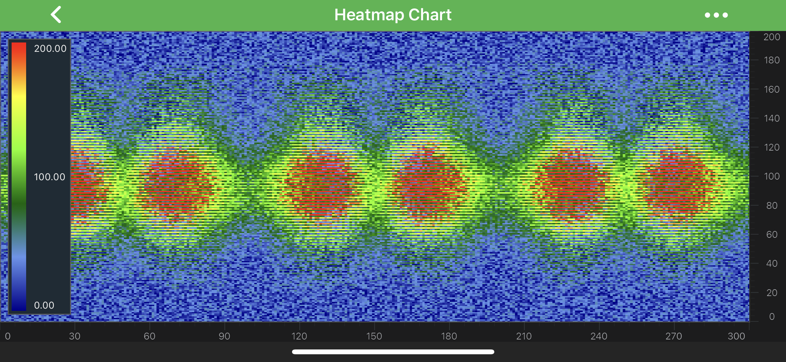

# The Uniform Heatmap Series Type
Heatmaps are provided by the <xref:com.scichart.charting.visuals.renderableSeries.FastUniformHeatmapRenderableSeries>, which consumes data from a <xref:com.scichart.charting.model.dataSeries.UniformHeatmapDataSeries>. 
This is designed to display **2D array of data** with real values. Every item in the 2D array is represented as a colored rectangle - **cell**. The color depends on corresponding item’s `Z-Value`.

> [!NOTE]
> For more info about <xref:com.scichart.charting.model.dataSeries.UniformHeatmapDataSeries>, as well as other DataSeries types in SciChart, see the [DataSeries API](xref:chart2d.DataSeriesAPIs) article.

> [!NOTE]
> Examples for the **Uniform Heatmap Series** can be found in the [SciChart Android Examples Suite](https://www.scichart.com/examples/Android-chart/) as well as on [GitHub](https://github.com/ABTSoftware/SciChart.Android.Examples):
> - [Native Example](https://www.scichart.com/example/android-chart/android-heatmap-chart-example/)
> - [Xamarin Example](https://www.scichart.com/example/xamarin-chart/xamarin-chart-heatmap-chart-example/)

Uniform heatmaps are **extremely fast**, **lightweight** series types for rendering two dimensional data as a heatmap or spectrogram. As mentioned above - the <xref:com.scichart.charting.visuals.renderableSeries.FastUniformHeatmapRenderableSeries> type should be used in conjunction with a <xref:com.scichart.charting.model.dataSeries.UniformHeatmapDataSeries>, when you simply want to specify a *Step* in the `X, Y` direction (each cell is the same size).

All `Z-Values` should fall into the range determined by the **Minimum, Maximum** values (they may go beyond it though), which are available via the following properties:
- [minimum](xref:com.scichart.charting.visuals.renderableSeries.FastUniformHeatmapRenderableSeries.setMinimum(double))
- [minimum](xref:com.scichart.charting.visuals.renderableSeries.FastUniformHeatmapRenderableSeries.setMaximum(double))

Also, **Uniform Heatmap Series** requires a <xref:com.scichart.charting.visuals.renderableSeries.ColorMap> to be set. The **ColorMap** determines how a gradient color transition occurs and can be applied via the [colorMap](xref:com.scichart.charting.visuals.renderableSeries.FastUniformHeatmapRenderableSeries.setColorMap(com.scichart.charting.visuals.renderableSeries.ColorMap)) property.

## Add a Legend onto a Heatmap Chart
There is a special view designed to be used in tandem with <xref:com.scichart.charting.visuals.renderableSeries.FastUniformHeatmapRenderableSeries> called <xref:com.scichart.charting.visuals.SciChartHeatmapColourMap>. It is not required by a Heatmap and is **fully optional**. It can be placed anywhere on the layout.

Similarly to the <xref:com.scichart.charting.visuals.renderableSeries.FastUniformHeatmapRenderableSeries>, the <xref:com.scichart.charting.visuals.SciChartHeatmapColourMap> type allows to set the **Minimum, Maximum** values and apply a **ColorMap**. All these can be assigned via the corresponding properties:
- [minimum](xref:com.scichart.charting.visuals.SciChartHeatmapColourMap.setMinimum(double))
- [maximum](xref:com.scichart.charting.visuals.SciChartHeatmapColourMap.setMaximum(double))
- [colorMap](xref:com.scichart.charting.visuals.SciChartHeatmapColourMap.setColorMap(com.scichart.charting.visuals.renderableSeries.ColorMap))

The numeric labels can be formatted by apply **TextFormatting** to them via the [textFormat](xref:com.scichart.charting.visuals.SciChartHeatmapColourMap.setTextFormat(java.text.Format)) property.

Finally, there is the [orientation](xref:com.scichart.charting.visuals.SciChartHeatmapColourMap.setOrientation(int)) property to specify whether the legend appears Horizontally or Vertically.

## Create a Heatmap Series
To create a **Uniform Heatmap Chart**, use the following code:

# [Java](#tab/java)
[!code-java[HeatmapSeries](../../../samples/sandbox/app/src/main/java/com/scichart/docsandbox/examples/java/series2d/HeatmapSeries2D.java#Example)]
# [Java with Builders API](#tab/javaBuilder)
[!code-java[HeatmapSeries](../../../samples/sandbox/app/src/main/java/com/scichart/docsandbox/examples/javaBuilder/series2d/HeatmapSeries2D.java#Example)]
# [Kotlin](#tab/kotlin)
[!code-swift[HeatmapSeries](../../../samples/sandbox/app/src/main/java/com/scichart/docsandbox/examples/kotlin/series2d/HeatmapSeries2D.kt#Example)]
***

The code above creates a **Heatmap with a ColorMap** that has gradient transitions between five colors and a <xref:com.scichart.charting.visuals.SciChartHeatmapColourMap> **Legend** to it.

> [!NOTE]
> In multi axis scenarios, a series has to be assigned to **particular X and Y axes**. This can be done passing the axes IDs to the [xAxisId](xref:com.scichart.charting.visuals.renderableSeries.IRenderableSeries.setXAxisId(java.lang.String)), [yAxisId](xref:com.scichart.charting.visuals.renderableSeries.IRenderableSeries.setYAxisId(java.lang.String)) properties.

## Updating Data in the Heatmap
The <xref:com.scichart.charting.model.dataSeries.UniformHeatmapDataSeries> does not support **Append, Insert, Update, Remove** like the other DataSeries do. You can, however, update the data by simply updating the array passed in. There are a bunch of methods provided to update Heatmap data:

- <xref:com.scichart.charting.model.dataSeries.IUniformHeatmapDataSeries.updateRangeZAt(int,int,TZ[])> - updates the range of Z values for this series;
- <xref:com.scichart.charting.model.dataSeries.IUniformHeatmapDataSeries.updateRangeZAt(int,int,com.scichart.core.model.IValues&lt;TZ&gt;)> - updates the range of Z values for this series;
- <xref:com.scichart.charting.model.dataSeries.IUniformHeatmapDataSeries.updateRangeZAt(int,int,java.util.List&lt;TZ&gt;)> - updates the range of Z values for this series;
- <xref:com.scichart.charting.model.dataSeries.IUniformHeatmapDataSeries.updateZAt(int,int,TZ)> - updates Z Value at specified xIndex and yIndex;
- <xref:com.scichart.charting.model.dataSeries.IUniformHeatmapDataSeries.updateZValues(TZ[])> - updates all Z values for this series;
- <xref:com.scichart.charting.model.dataSeries.IUniformHeatmapDataSeries.updateZValues(com.scichart.core.model.IValues&lt;TZ&gt;)> - updates all Z values for this series;
- <xref:com.scichart.charting.model.dataSeries.IUniformHeatmapDataSeries.updateZValues(java.util.List&lt;TZ&gt;)> - updates all Z values for this series;

> [!NOTE]
> It is highly recommended to update <xref:com.scichart.charting.model.dataSeries.UniformHeatmapDataSeries> using our <com.scichart.core.model.IValues> which allows to omit the boxing/unboxing of values, to make sure you get the most out of performance during your updates.
