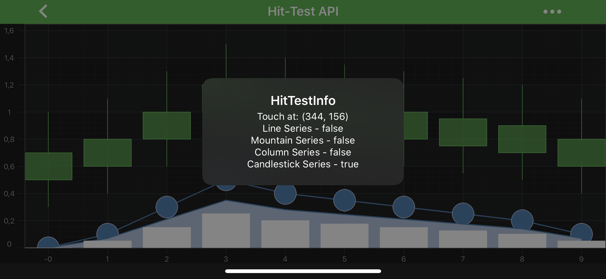

# Hit-Test API
The **Hit-Test API** is a set of virtual methods defined on <xref:com.scichart.charting.visuals.renderableSeries.IRenderableSeries> such as:
  - <xref:com.scichart.charting.visuals.renderableSeries.IRenderableSeries.hitTest(com.scichart.charting.visuals.renderableSeries.hitTest.HitTestInfo,float,float)>
  - <xref:com.scichart.charting.visuals.renderableSeries.IRenderableSeries.hitTest(com.scichart.charting.visuals.renderableSeries.hitTest.HitTestInfo,float,float,float)>
  - <xref:com.scichart.charting.visuals.renderableSeries.IRenderableSeries.verticalSliceHitTest(com.scichart.charting.visuals.renderableSeries.hitTest.HitTestInfo,float,float)>

This API is used by the <xref:com.scichart.charting.modifiers.RolloverModifier>, <xref:com.scichart.charting.modifiers.TooltipModifier>, <xref:com.scichart.charting.modifiers.CursorModifier> and <xref:com.scichart.charting.modifiers.SeriesSelectionModifier> to transform touch on screen into **data-points**, and determine if touch event occurs over a point or over a series.

To call the **Hit-Test** method, use the following code:

> [!NOTE]
> You **must** transform any touch events into the coordinate space of the main chart area. Without this, all **hit-test** results will be inaccurate. You can learn more about it in the [Axis APIs - Convert Pixel to Data coordinates](xref:axisAPIs.AxisAPIsConvertPixelToDataCoordinates#transforming-pixels-to-the-inner-viewport) article.

# [Java](#tab/java)
[!code-java[PerformHitTest](../../samples/sandbox/app/src/main/java/com/scichart/docsandbox/examples/java/series2d/HitTestAPI.java#PerformHitTest)]
# [Java with Builders API](#tab/javaBuilder)
[!code-java[PerformHitTest](../../samples/sandbox/app/src/main/java/com/scichart/docsandbox/examples/javaBuilder/series2d/HitTestAPI.java#PerformHitTest)]
# [Kotlin](#tab/kotlin)
[!code-swift[PerformHitTest](../../samples/sandbox/app/src/main/java/com/scichart/docsandbox/examples/kotlin/series2d/HitTestAPI.kt#PerformHitTest)]
***

> [!NOTE]
> You can see hit-test in action, in our full **Hit-Test API** example, which be found in the [SciChart Android Examples Suite](https://www.scichart.com/examples/Android-chart/) as well as on [GitHub](https://github.com/ABTSoftware/SciChart.Android.Examples):
> - [Native Example](https://www.scichart.com/example/android-chart-example-hit-test-api/)

## The Hit-Test Results
The <xref:com.scichart.charting.visuals.renderableSeries.hitTest.HitTestInfo> which is used for **Hit-Test** contains some useful properties to determine what point was touched.

| **Property**                         | **Description**                                                                                                     |
| ------------------------------------ | ------------------------------------------------------------------------------------------------------------------- |
| [hitTestPoint](xref:com.scichart.charting.visuals.renderableSeries.hitTest.HitTestInfo.hitTestPoint)        | The coordinates of a point, that is used for **Hit-Test**.                                                                     |
| [hitTestRadius](xref:com.scichart.charting.visuals.renderableSeries.hitTest.HitTestInfo.hitTestRadius)       | The **Hit-Test** radius which was used for searching of nearest data point.                                         |
| [dataSeriesIndex](xref:com.scichart.charting.visuals.renderableSeries.hitTest.HitTestInfo.dataSeriesIndex)     | If data point that was hit contains the index of the point in <xref:com.scichart.charting.model.dataSeries.IDataSeries> which was hit.                            |
| [pointSeriesIndex](xref:com.scichart.charting.visuals.renderableSeries.hitTest.HitTestInfo.pointSeriesIndex)    | If data point that was hit contains the index of hit test point in associated <xref:com.scichart.charting.visuals.renderableSeries.data.ISeriesRenderPassData>.                |
| [isHit](xref:com.scichart.charting.visuals.renderableSeries.hitTest.HitTestInfo.isHit)               | Boolean flag which tells whether or not [hitTestPoint](xref:com.scichart.charting.visuals.renderableSeries.hitTest.HitTestInfo.hitTestPoint) was within a certain radius of point on a series. |
| [isWithinDataBounds](xref:com.scichart.charting.visuals.renderableSeries.hitTest.HitTestInfo.isWithinDataBounds)  | Boolean flag which tells if [hitTestPoint](xref:com.scichart.charting.visuals.renderableSeries.hitTest.HitTestInfo.hitTestPoint) lies between first and last X point on series.            |
| [hitRenderableSeries](xref:com.scichart.charting.visuals.renderableSeries.hitTest.HitTestInfo.hitRenderableSeries) | The <xref:com.scichart.charting.visuals.renderableSeries.IRenderableSeries> which we perform **Hit-Test** on.                                                        |

## UseInterpolation Flag
The **UseInterpolation** flag increases the accuracy of the **Hit-Test** at the expense of performance. You can modify its value via the [useInterpolation](xref:com.scichart.charting.modifiers.TooltipModifierBase.setUseInterpolation(boolean)) property, which is available for all the inheritors such as <xref:com.scichart.charting.modifiers.TooltipModifier>, for example.

Consider <xref:com.scichart.charting.visuals.renderableSeries.FastLineRenderableSeries> and it's possible interpolation cases:
- `useInterpolation = false` - hit-test will return [isHit](xref:com.scichart.charting.visuals.renderableSeries.hitTest.HitTestInfo.isHit) = true - **only** if the input mouse-point **is over a data-point**.
- `useInterpolation = true` - hit-test will return [isHit](xref:com.scichart.charting.visuals.renderableSeries.hitTest.HitTestInfo.isHit) = true - if the input touch event **is over the line**.

This is useful say if you wanted to show a tooltip only on data-points (`useInterpolation = false`) vs. anywhere on the line (`useInterpolation= true`).

For other series types, such as <xref:com.scichart.charting.visuals.renderableSeries.FastCandlestickRenderableSeries>, <xref:com.scichart.charting.visuals.renderableSeries.FastColumnRenderableSeries>, <xref:com.scichart.charting.visuals.renderableSeries.FastMountainRenderableSeries>, using `useInterpolation = false` will result in an `isHit = true` when touch is **over the series** as opposed to **over the data-points**.

> [!NOTE]
> The interpolation is linear and linear only at the time of writing, it is not suitable for use by [Logarithmic Axis](xref:axis.AxisAPIs#logarithmicnumericaxis).
