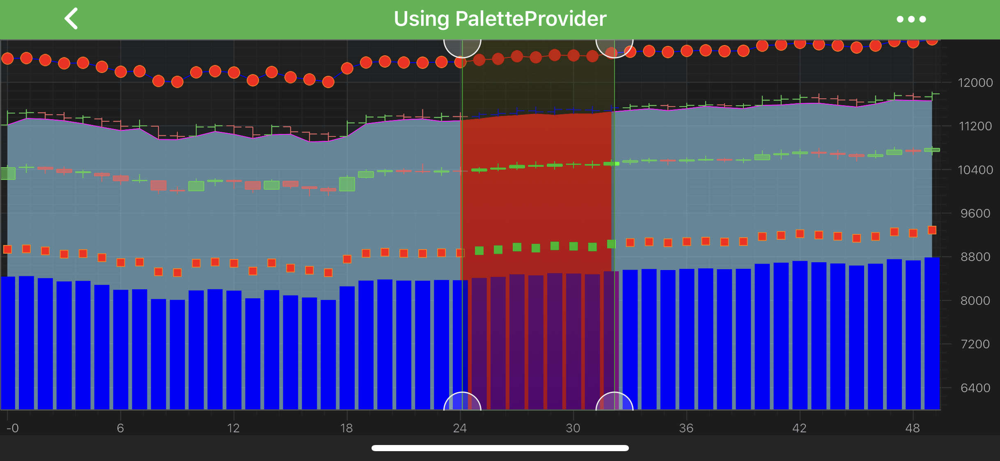

# PaletteProvider API
SciChart features a rich **PaletteProvider API** with gives the ability to change color on a point-by-point basis.

> [!NOTE]
> Examples of using **PaletteProvider API** can be found in the [SciChart Android Examples Suite](https://www.scichart.com/examples/Android-chart/) as well as on [GitHub](https://github.com/ABTSoftware/SciChart.Android.Examples):
> - [Native Example](https://www.scichart.com/example/android-chart/android-chart-example-using-paletteprovider/)

To enable series coloring with **PaletteProvider**, you need to create a class which conforms to one of the following (or possibly to all of them):
- <xref:com.scichart.charting.visuals.renderableSeries.paletteProviders.IStrokePaletteProvider> - allows painting parts of the **series' outline**;
- <xref:com.scichart.charting.visuals.renderableSeries.paletteProviders.IFillPaletteProvider> - allows **painting some area** in a color that differs from the rest of a series;
- <xref:com.scichart.charting.visuals.renderableSeries.paletteProviders.IPointMarkerPaletteProvider> - allows changing the **fill** of some **[PointMarkers](xref:chart2d.PointMarkerAPI)**.

A choice depends on a RenderableSeries type, which PaletteProvider is designed for. 

Every **PaletteProvider** protocol declares **the only property**, which returns an array with colors for every data points. 
The <xref:com.scichart.charting.visuals.renderableSeries.paletteProviders.IPaletteProvider.update()> method is called every time a **RenderableSeries** requires a redraw, so it expects that the colors array should be updated there correspondingly.

For the convenience, there is also the <xref:com.scichart.charting.visuals.renderableSeries.paletteProviders.PaletteProviderBase> class, which provides some basic implementation, so it's recommended to inherit from it while implementing custom **PaletteProviders**.

## Create Custom PaletteProvider
The following code snippet demonstrates how to create a custom **PaletteProvider** which conforms to all - **Fill, Stroke, PointMarker** - palette providers and potentially can be shared between multiple series.

> [!NOTE]
> The below code is based on the **Line Chart** Example which can be found in the [SciChart Android Examples Suite](https://www.scichart.com/examples/Android-chart/) as well as on [GitHub](https://github.com/ABTSoftware/SciChart.Android.Examples):
> - [Native Example](https://www.scichart.com/example/android-chart/android-line-chart-example/)
> - [Xamarin Example](https://www.scichart.com/example/xamarin-chart/xamarin-chart-line-chart-example/)

# [Java](#tab/java)
[!code-java[CreatePaletteProvider](../../samples/sandbox/app/src/main/java/com/scichart/docsandbox/examples/java/series2d/PaletteProviderAPI.java#CreatePaletteProvider)]
# [Java with Builders API](#tab/javaBuilder)
[!code-java[CreatePaletteProvider](../../samples/sandbox/app/src/main/java/com/scichart/docsandbox/examples/javaBuilder/series2d/PaletteProviderAPI.java#CreatePaletteProvider)]
# [Kotlin](#tab/kotlin)
[!code-swift[CreatePaletteProvider](../../samples/sandbox/app/src/main/java/com/scichart/docsandbox/examples/kotlin/series2d/PaletteProviderAPI.kt#CreatePaletteProvider)]
***

Once a **PaletteProvider** class is ready, its instances can be used to set it for a RenderableSeries via the <xref:com.scichart.charting.visuals.renderableSeries.IRenderableSeries.setPaletteProvider(com.scichart.charting.visuals.renderableSeries.paletteProviders.IPaletteProvider)> property:

# [Java](#tab/java)
[!code-java[UsePaletteProvider](../../samples/sandbox/app/src/main/java/com/scichart/docsandbox/examples/java/series2d/PaletteProviderAPI.java#UsePaletteProvider)]
# [Java with Builders API](#tab/javaBuilder)
[!code-java[UsePaletteProvider](../../samples/sandbox/app/src/main/java/com/scichart/docsandbox/examples/javaBuilder/series2d/PaletteProviderAPI.java#UsePaletteProvider)]
# [Kotlin](#tab/kotlin)
[!code-swift[UsePaletteProvider](../../samples/sandbox/app/src/main/java/com/scichart/docsandbox/examples/kotlin/series2d/PaletteProviderAPI.kt#UsePaletteProvider)]
***

The code above results in a chart with renderableSeries listed below:
- [Line Series](xref:chart2d.renderableSeries.LineSeries)
- [Scatter Series](xref:chart2d.renderableSeries.ScatterSeries)
- [Mountain (Area) Series](xref:chart2d.renderableSeries.MountainSeries)

These charts are changing colors depending on the threshold levels provided by two [Horizontal Line Annotations](xref:annotationsAPIs.HorizontalLineAnnotation):

<video autoplay loop muted playsinline src="2dChartTypes/images/palette-provider-thresholds.mp4"></video>

> [!NOTE]
> The `DataManager` is just a class, that provides stub data for Example Suite
