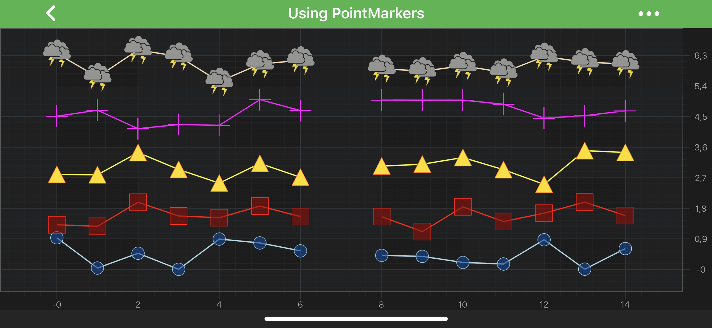
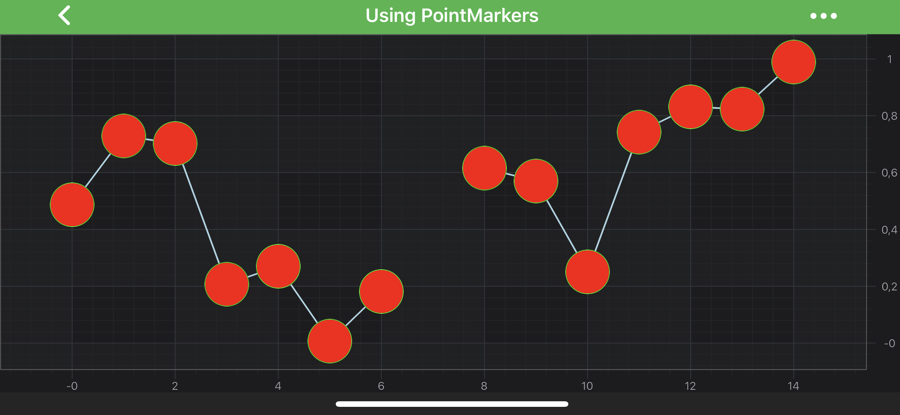
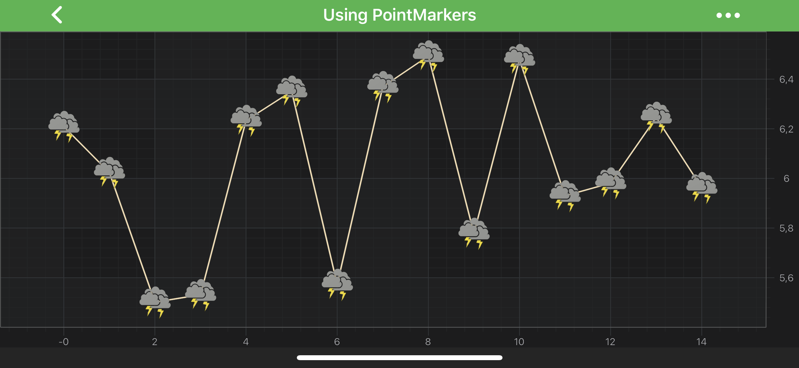

# PointMarker API
SciChart features a rich **PointMarkers API** to annotate the data-points of certain series with markers, e.g. **Ellipse**, **Square**, **Triangle**, **Cross** or a **Custom Shape** marker. Some series types, such as <xref:com.scichart.charting.visuals.renderableSeries.XyScatterRenderableSeries> or <xref:com.scichart.charting.visuals.renderableSeries.FastImpulseRenderableSeries>, require a PointMarker assigned to them unless they won't render at all.

This article is about how to configure and add PointMarkers to a <xref:com.scichart.charting.visuals.renderableSeries.IRenderableSeries> to render markers for every data point.

> [!NOTE]
> Examples of using **PointMarkers API** can be found in the [SciChart Android Examples Suite](https://www.scichart.com/examples/Android-chart/) as well as on [GitHub](https://github.com/ABTSoftware/SciChart.Android.Examples):
> - [Native Example](https://www.scichart.com/example/android-chart-example-using-pointmarkers/)

## PointMarker Types
SciChart provides several **PointMarker** shapes out of the box which can be found below:
- <xref:com.scichart.charting.visuals.pointmarkers.EllipsePointMarker>
- <xref:com.scichart.charting.visuals.pointmarkers.TrianglePointMarker>
- <xref:com.scichart.charting.visuals.pointmarkers.SquarePointMarker>
- <xref:com.scichart.charting.visuals.pointmarkers.CrossPointMarker>
- <xref:com.scichart.charting.visuals.pointmarkers.SpritePointMarker>

It is possible to change how point markers appears by extending any of the above classes. The <xref:com.scichart.charting.visuals.pointmarkers.SpritePointMarker> allows to render a point marker from a [Bitmap](https://developer.android.com/reference/android/graphics/Bitmap). For more details, refer to the [Custom PointMarkers](#custom-pointmarkers) section down the page.

All the **PointMarker** types conforms to the <xref:com.scichart.charting.visuals.pointmarkers.IPointMarker> protocol, which provides the following properties for styling point markers:

| **<xref:com.scichart.charting.visuals.pointmarkers.IPointMarker> property** | **Description**                                                                                                                                  |
| ------------------------------ | ------------------------------------------------------------------------------------------------------------------------------------------------ |
| [size](xref:com.scichart.charting.visuals.pointmarkers.IPointMarker.setSize(int,int))         | Allows to specify the size of a PointMarker. PointMarkers will not appear if this value isn't set. The units are in user space coordinate system |
| [strokeStyle](xref:com.scichart.charting.visuals.pointmarkers.IPointMarker.setStrokeStyle(com.scichart.drawing.common.PenStyle))  | Specifies a stroke pen of the <xref:com.scichart.drawing.common.PenStyle> type. It contains information about the **Color, Stroke Thickness**, etc.                            |
| [fillStyle](xref:com.scichart.charting.visuals.pointmarkers.IPointMarker.setFillStyle(com.scichart.drawing.common.BrushStyle))    | Specifies a fill brush of the <xref:com.scichart.drawing.common.BrushStyle> type. It contains information about the fill Color and the desired type of visual output.          |

> [!NOTE]
> To learn more about **Pens** and **Brushes** and how to utilize them, please refer to the [PenStyle, BrushStyle and FontStyle](xref:stylingAndTheming.PenStyleBrushStyleAndFontStyle) article.

## Using PointMarkers
Code for creation and assigning a **PointMarker** to a <xref:com.scichart.charting.visuals.renderableSeries.IRenderableSeries> is essentially the same regardless of a PointMarker type. 
After an instance of it has been created, it can be configured and then applied to the [pointMarker](xref:com.scichart.charting.visuals.renderableSeries.IRenderableSeries.setPointMarker(com.scichart.charting.visuals.pointmarkers.IPointMarker)) property:

# [Java](#tab/java)
[!code-java[CreatePointMarker](../../samples/sandbox/app/src/main/java/com/scichart/docsandbox/examples/java/series2d/PointMarkerAPI.java#CreatePointMarker)]
# [Java with Builders API](#tab/javaBuilder)
[!code-java[CreatePointMarker](../../samples/sandbox/app/src/main/java/com/scichart/docsandbox/examples/javaBuilder/series2d/PointMarkerAPI.java#CreatePointMarker)]
# [Kotlin](#tab/kotlin)
[!code-swift[CreatePointMarker](../../samples/sandbox/app/src/main/java/com/scichart/docsandbox/examples/kotlin/series2d/PointMarkerAPI.kt#CreatePointMarker)]
***

The code above will produce the following chart (assuming that the data has been added to the **[Line Series](xref:chart2d.renderableSeries.LineSeries)**):

## Custom PointMarkers
There are two ways of creating custom **PointMarkers** in SciChart. The [first one](#extend-drawablepointmarker) involves using our **RenderContext2D API** for drawing, and [the second](#implement-ispritepointmarkerdrawer) allows to use CoreGraphics drawing capabilities.

#### Extend DrawablePointMarker
This technique requires extending the <xref:com.scichart.charting.visuals.pointmarkers.DrawablePointMarker> class and overriding the its <xref:com.scichart.charting.visuals.pointmarkers.DrawablePointMarker.internalDraw(com.scichart.drawing.common.IRenderContext2D,float,float,com.scichart.drawing.common.IPen2D,com.scichart.drawing.common.IBrush2D)> method which is called for every data point in a series. 
In the implementation, a **PointMarker** can be drawn calling methods from <xref:com.scichart.drawing.common.IRenderContext2D>. 
The code below demonstrates how custom **EllipsePointMarker** can be created using this approach:

# [Java](#tab/java)
[!code-java[ExtendDrawablePointMarker](../../samples/sandbox/app/src/main/java/com/scichart/docsandbox/examples/java/series2d/PointMarkerAPI.java#ExtendDrawablePointMarker)]
# [Java with Builders API](#tab/javaBuilder)
[!code-java[ExtendDrawablePointMarker](../../samples/sandbox/app/src/main/java/com/scichart/docsandbox/examples/javaBuilder/series2d/PointMarkerAPI.java#ExtendDrawablePointMarker)]
# [Kotlin](#tab/kotlin)
[!code-swift[ExtendDrawablePointMarker](../../samples/sandbox/app/src/main/java/com/scichart/docsandbox/examples/kotlin/series2d/PointMarkerAPI.kt#ExtendDrawablePointMarker)]
***

However, the **RenderContext2D API** has its own limitations. It isn't suitable for drawing complex custom shapes. 
Besides, calling drawing methods for every data point is redundant and is an overkill. So the second technique, described in the following paragraph, is **better suited** for most cases.

#### Implement ISpritePointMarkerDrawer 
This approach is rather different. It allows to draw a shape on [Android Canvas](https://developer.android.com/guide/topics/graphics/drawables) with [Android Paint](https://developer.android.com/reference/android/graphics/Paint.html) objects. 
Then, a sprite is created out of the Canvas, which is rendered for every data point in a series. 

This requires creating an object which conforms to <xref:com.scichart.charting.visuals.pointmarkers.SpritePointMarker.ISpritePointMarkerDrawer> protocol and pass it's instance into the <xref:com.scichart.charting.visuals.pointmarkers.SpritePointMarker> initializer, like shown below:

# [Java](#tab/java)
[!code-java[CreateCustomPointMarkerDrawer](../../samples/sandbox/app/src/main/java/com/scichart/docsandbox/examples/java/series2d/PointMarkerAPI.java#CreateCustomPointMarkerDrawer)]
[!code-java[UseCustomPointMarkerDrawer](../../samples/sandbox/app/src/main/java/com/scichart/docsandbox/examples/java/series2d/PointMarkerAPI.java#UseCustomPointMarkerDrawer)]
# [Java with Builders API](#tab/javaBuilder)
[!code-java[CreateCustomPointMarkerDrawer](../../samples/sandbox/app/src/main/java/com/scichart/docsandbox/examples/javaBuilder/series2d/PointMarkerAPI.java#CreateCustomPointMarkerDrawer)]
[!code-java[UseCustomPointMarkerDrawer](../../samples/sandbox/app/src/main/java/com/scichart/docsandbox/examples/javaBuilder/series2d/PointMarkerAPI.java#UseCustomPointMarkerDrawer)]
# [Kotlin](#tab/kotlin)
[!code-swift[CreateCustomPointMarkerDrawer](../../samples/sandbox/app/src/main/java/com/scichart/docsandbox/examples/kotlin/series2d/PointMarkerAPI.kt#CreateCustomPointMarkerDrawer)]
[!code-swift[UseCustomPointMarkerDrawer](../../samples/sandbox/app/src/main/java/com/scichart/docsandbox/examples/kotlin/series2d/PointMarkerAPI.kt#UseCustomPointMarkerDrawer)]
***

This would result in the following chart:

