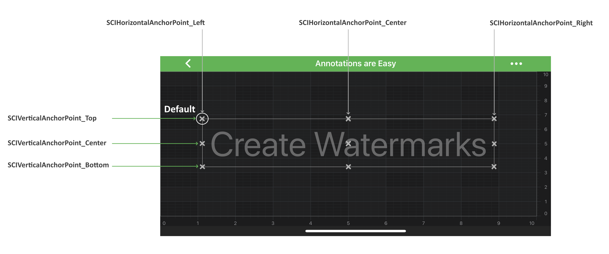

# Annotations API

SciChart features a rich **Annotations API**, that allows you to place different elements over a chart:

> [!NOTE]
> Examples of the **Annotations** usage can be found in the [SciChart Android Examples Suite](https://www.scichart.com/examples/Android-chart/) as well as on [GitHub](https://github.com/ABTSoftware/SciChart.Android.Examples):
> - [Native Android Chart Annotations Example](https://www.scichart.com/example/android-chart/android-chart-annotations-example/)
> - [Native Android Chart Interactive Annotations Example](https://www.scichart.com/example/android-chart/android-chart-interaction-with-annotations-example/)
>
> - [Xamarin Android Chart Annotations Example](https://www.scichart.com/example/xamarin-chart/xamarin-chart-annotations-example/)
> - [Xamarin Android Chart Interactive Annotations Example](https://www.scichart.com/example/xamarin-chart/xamarin-chart-interaction-with-annotations-example/)

There are many different **Annotations** provided by SciChart and each one deserves an article by itself! 
This article is concerned with simply giving **an overview of the annotations** and where you can find the examples in our [SciChart Android Examples Suite](https://www.scichart.com/examples/Android-chart/) which demonstrate them.

The annotations which are available out the box in SciChart are listed below:

| **Annotation Type**                                          | **Description**                                                                                                        |
| ------------------------------------------------------------ | ---------------------------------------------------------------------------------------------------------------------- |
| [BoxAnnotation](xref:annotationsAPIs.BoxAnnotation)                       | Draws a **rectangle** at specific `X1, X2, Y1, Y2` coordinates.                                                        |
| [LineAnnotation](xref:annotationsAPIs.LineAnnotation)                     | Draws a **line** between `[X1, Y1]` and `[X2, Y2]` coordinates.                                                        |
| [LineArrowAnnotation](xref:annotationsAPIs.LineArrowAnnotation)           | Draws an **arrow** from `[X1, Y1]` to `[X2, Y2]` coordinates.                                                          |
| [HorizontalLineAnnotation](xref:annotationsAPIs.HorizontalLineAnnotation) | Draws a **horizontal line** between `[X1, Y1]` and `[X2, Y2]` coordinates.                                             |
| [VerticalLineAnnotation](xref:annotationsAPIs.VerticalLineAnnotation)     | Draws a **vertical line** between `[X1, Y1]` and `[X2, Y2]` coordinates.                                               |
| [TextAnnotation](xref:annotationsAPIs.TextAnnotation)                     | Allows to place a piece of **text** at specific `[X1, Y1]` coordinates on a chart.                                     |
| [AxisLabelAnnotation](xref:annotationsAPIs.AxisLabelAnnotation)           | Allows to place a piece of **text** at specific `X1` or  `Y1` coordinate on a chart **Axis**.                          |
| [AxisMarkerAnnotation](xref:annotationsAPIs.AxisMarkerAnnotation)         | Allows to place **markers** with custom text onto `X or Y axes`. By default, shows the axis **value at its location**. | 
| [CustomAnnotation](xref:annotationsAPIs.CustomAnnotation)                 | Allows to place any `UIView` at a specific `[X1, Y1]` coordinates on a chart.                                          |

> [!NOTE]
> To learn more about **Annotation API**, please read the [Common Annotations Features](#common-annotations-features) section. 
> To find out more about a **specific** Annotation Type, please refer to a corresponding article about this **Annotation type**.

## Adding an Annotation Onto a Chart
The <xref:com.scichart.charting.visuals.SciChartSurface> stores all its annotations in the internal <xref:com.scichart.charting.model.AnnotationCollection>. 
It exposes the <xref:com.scichart.charting.visuals.ISciChartSurface.getAnnotations()> property to access it.

The following code can be used to add the <xref:com.scichart.charting.visuals.annotations.LineAnnotation> to the chart:

# [Java](#tab/java)
[!code-java[AddLineAnnotation](../../../samples/sandbox/app/src/main/java/com/scichart/docsandbox/examples/java/annotationsAPIs/LineAnnotationFragment.java#AddLineAnnotation)]
# [Java with Builders API](#tab/javaBuilder)
[!code-java[AddLineAnnotation](../../../samples/sandbox/app/src/main/java/com/scichart/docsandbox/examples/javaBuilder/annotationsAPIs/LineAnnotationFragment.java#AddLineAnnotation)]
# [Kotlin](#tab/kotlin)
[!code-swift[AddLineAnnotation](../../../samples/sandbox/app/src/main/java/com/scichart/docsandbox/examples/kotlin/annotationsAPIs/LineAnnotationFragment.kt#AddLineAnnotation)]
***

## Common Annotations Features
All the **Annotation** classes provided by SciChart conforms to the <xref:com.scichart.charting.visuals.annotations.IAnnotation> protocol and derive from the <xref:com.scichart.charting.visuals.annotations.AnnotationBase> class. 
These provide an API which allows to put them onto a chart and interact with them.

> [!NOTE]
> Please refer to the beginning of this article for the complete list of all the **Annotation types** available out of the box in SciChart.

Please see the list of common features below:

| **Feature**                                                                        | **Description**                                                                                                                  |
| ---------------------------------------------------------------------------------- | -------------------------------------------------------------------------------------------------------------------------------- |
| [x1](xref:com.scichart.charting.visuals.annotations.IAnnotation.setX1(java.lang.Comparable)), [y1](xref:com.scichart.charting.visuals.annotations.IAnnotation.setY1(java.lang.Comparable)), [x2](xref:com.scichart.charting.visuals.annotations.IAnnotation.setX2(java.lang.Comparable)), [y2](xref:com.scichart.charting.visuals.annotations.IAnnotation.setY2(java.lang.Comparable)) | [X1, X2, Y1, Y2] coordinates specifies the position of an annotation on a <xref:com.scichart.charting.visuals.SciChartSurface>. These are chart coordinates, not device (screen or pixel) coordinates. To find out about coordinate transformation in SciChart, please refer to the [Convert Pixels to Data Coordinates article](<xref:axisAPIs.AxisAPIsConvertPixelToDataCoordinates>). |
| [xAxisId](xref:com.scichart.charting.visuals.annotations.IAnnotation.setXAxisId(java.lang.String)), [yAxisId](xref:com.scichart.charting.visuals.annotations.IAnnotation.setYAxisId(java.lang.String))                                 | Specifies the ID of **X-Axis** and **Y-Axis** that this annotation is measured against.                                          |
| [isSelected](xref:com.scichart.charting.visuals.annotations.IAnnotation.setSelected(boolean))                                                        | Defines whether the annotation is **Selected**. When Selected - round **resizing markers** appears at the ends or corners of the annotation which can be used to resize it. Resizing markers can be accessed via the [resizingGrip](xref:com.scichart.charting.visuals.annotations.AnnotationBase.setResizingGrip(com.scichart.charting.visuals.annotations.IResizingGrip)) property |
| [isEditable](xref:com.scichart.charting.visuals.annotations.IAnnotation.setIsEditable(boolean))                                                        | Specifies whether an annotation is **available for interaction**. When Editable, the annotation can be **Selected**, **Moved** and **Resized** by a user with a touch interaction. |
| [isHidden](xref:com.scichart.charting.visuals.annotations.IAnnotation.setIsHidden(boolean))                                                          | **Hides** or **shows** an annotation.                                                                                            |
| [dragDirections](xref:com.scichart.charting.visuals.annotations.IAnnotation.setDragDirections(com.scichart.charting.Direction2D))                                                    | Allows to **constrain drag directions** for an annotation. Accepts a member of the <xref:com.scichart.charting.Direction2D> enumeration.                 |
| [resizeDirections](xref:com.scichart.charting.visuals.annotations.IAnnotation.setResizeDirections(com.scichart.charting.Direction2D))                                                  | Allows to **constrain resize directions** for an annotation. Accepts a member of the <xref:com.scichart.charting.Direction2D> enumeration.               |
| [coordinateMode](xref:com.scichart.charting.visuals.annotations.AnnotationBase.setCoordinateMode(com.scichart.charting.visuals.annotations.AnnotationCoordinateMode))                                                 | Determines whether [X1, X2, Y1, Y2] coordinates are **in chart** coordinates or in **relative** screen coordinates. **Relative** coordinates range from **[0 to 1]**, where 1 refers to the full Width or Height of the canvas. **Absolute** coordinates are the **data-values** which must correspond to the [Axis Type](xref:axis.AxisAPIs). Defined by the <xref:com.scichart.charting.visuals.annotations.AnnotationCoordinateMode> enumeration. |
| [resizingGrip](xref:com.scichart.charting.visuals.annotations.AnnotationBase.setResizingGrip(com.scichart.charting.visuals.annotations.IResizingGrip))                                                   | Determines what **resizing markers** look like. Custom ones have to implement <xref:com.scichart.charting.visuals.annotations.IResizingGrip>.                                |
| [annotationSurface](xref:com.scichart.charting.visuals.annotations.AnnotationBase.setAnnotationSurface(com.scichart.charting.visuals.annotations.AnnotationSurfaceEnum))                                                 | Specifies a **surface** to place an annotation on. Possible options are declared by the <xref:com.scichart.charting.visuals.annotations.AnnotationSurfaceEnum> enumeration.  |

> [!NOTE]
> The **xAxisId** and **yAxisId** must be supplied if you have axis with **non-default** Axis Ids.

Below is the list of some methods and listeners:

| **Feature**                                                                        | **Description**                                                                                                                  |
| ---------------------------------------------------------------------------------- | -------------------------------------------------------------------------------------------------------------------------------- |
| <xref:com.scichart.charting.visuals.annotations.AnnotationBase.update(com.scichart.charting.visuals.axes.IAxis,com.scichart.charting.visuals.axes.IAxis)>                                         | **Redraws** an annotation without invalidating the `parentSurface` of the <xref:com.scichart.charting.visuals.annotations.IAnnotation> instance.                             |
| <xref:com.scichart.charting.visuals.annotations.IAnnotation.moveAnnotation(float,float)>                                 | **Moves** an annotation by the specified X and Y **delta** in horizontal and vertical directions.                                |
|                                                                                    |                                                                                                                                  |
| <xref:com.scichart.charting.visuals.annotations.IAnnotation.setOnAnnotationDragListener(com.scichart.charting.visuals.annotations.OnAnnotationDragListener)>                                            | Allows to appoint <xref:com.scichart.charting.visuals.annotations.OnAnnotationDragListener> to receive notifications about **user interactions** with an annotation.           |
| <xref:com.scichart.charting.visuals.annotations.IAnnotation.setOnAnnotationSelectionChangeListener(com.scichart.charting.visuals.annotations.OnAnnotationSelectionChangeListener)>                                | Allows to appoint <xref:com.scichart.charting.visuals.annotations.OnAnnotationSelectionChangeListener> to receive notifications when the annotation **selection has changed** |
| <xref:com.scichart.charting.visuals.annotations.IAnnotation.setOnAnnotationIsHiddenChangeListener(com.scichart.charting.visuals.annotations.OnAnnotationIsHiddenChangeListener)>                                 | Allows to appoint <xref:com.scichart.charting.visuals.annotations.OnAnnotationIsHiddenChangeListener> to receive notifications when an annotation **gets hidden or visible**. |

> [!NOTE]
> To find out more about a **specific** Annotation Type, please refer to a corresponding article about this **Annotation type**.

## Annotation Alignment (Anchor Points)
There is the subset of classes among all the **annotation types** that allows their instances to be aligned **relative to the [X1, Y1]** **_control point_**. 
The base class responsible for this behavior is called <xref:com.scichart.charting.visuals.annotations.AnchorPointAnnotation>. 
It has two properties, which accepts the <xref:com.scichart.charting.visuals.annotations.HorizontalAnchorPoint> and <xref:com.scichart.charting.visuals.annotations.VerticalAnchorPoint> enumerations correspondingly:
- <xref:com.scichart.charting.visuals.annotations.AnchorPointAnnotation.setHorizontalAnchorPoint(com.scichart.charting.visuals.annotations.HorizontalAnchorPoint)>
- <xref:com.scichart.charting.visuals.annotations.AnchorPointAnnotation.setVerticalAnchorPoint(com.scichart.charting.visuals.annotations.VerticalAnchorPoint)>

The image below illustrates how those works:

The annotation types that derive from AnchorPointAnnotation are the following:
- <xref:annotationsAPIs.TextAnnotation>
- <xref:annotationsAPIs.CustomAnnotation>
- <xref:annotationsAPIs.AxisMarkerAnnotation>
- <xref:annotationsAPIs.AxisLabelAnnotation>

As the information above implies, annotations of these types are controlled by the **[X1, Y1]** coordinates **only**. 
The **[X2, Y2]** coordinates have no impact on placement and are **simply ignored**.

## Editing Annotations via User Drag
In SciChart - **All Annotation Types** are supporting dragging and repositioning via touch. 
As mentioned [above](#common-annotations-features) - that's can be controlled via the [isEditable](xref:com.scichart.charting.visuals.annotations.IAnnotation.setIsEditable(boolean)). 

<video autoplay loop muted playsinline src="images/interaction-with-annotations-example.mp4"></video>

> [!NOTE]
> This is demonstrated in the **Interaction with Annotations** example which can be found in the [SciChart Android Examples Suite](https://www.scichart.com/examples/Android-chart/) as well as on [GitHub](https://github.com/ABTSoftware/SciChart.Android.Examples):
> - [Native Example](https://www.scichart.com/example/android-chart/android-chart-interaction-with-annotations-example/)
> - [Xamarin Example](https://www.scichart.com/example/xamarin-chart/xamarin-chart-interaction-with-annotations-example/)
