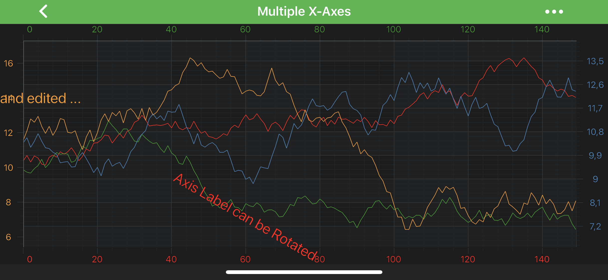

# The AxisLabelAnnotation
The <xref:com.scichart.charting.visuals.annotations.AxisLabelAnnotation> allows to place a piece of **text** at a specific location on an [Axis](<xref:axis.AxisAPIs>):

> [!NOTE]
> Examples of the **Annotations** usage can be found in the [SciChart Android Examples Suite](https://www.scichart.com/examples/Android-chart/) as well as on [GitHub](https://github.com/ABTSoftware/SciChart.Android.Examples):
> - [Native Android Chart Annotations Example](https://www.scichart.com/example/android-chart/android-chart-annotations-example/)
> - [Native Android Chart Interactive Annotations Example](https://www.scichart.com/example/android-chart/android-chart-interaction-with-annotations-example/)
>
> - [Xamarin Android Chart Annotations Example](https://www.scichart.com/example/xamarin-chart/xamarin-chart-annotations-example/)
> - [Xamarin Android Chart Interactive Annotations Example](https://www.scichart.com/example/xamarin-chart/xamarin-chart-interaction-with-annotations-example/)

Since <xref:com.scichart.charting.visuals.annotations.AxisLabelAnnotation> is nearly the same as [TextAnnotation](xref:annotationsAPIs.TextAnnotation), hence everything about configuring it is the same. Please see the [TextAnnotation](xref:annotationsAPIs.TextAnnotation) article to learn more.

The only difference is that <xref:com.scichart.charting.visuals.annotations.AxisLabelAnnotation> can be placed on the **X-Axis** or the **Y-Axis** instead of the **Chart Surface**.
That's is specified via the [annotationSurface](xref:com.scichart.charting.visuals.annotations.AnnotationBase.setAnnotationSurface(com.scichart.charting.visuals.annotations.AnnotationSurfaceEnum)) property.
It accepts a member of the <xref:com.scichart.charting.visuals.annotations.AnnotationSurfaceEnum> enumeration and it **defaults** to **`XAxis`** for the **AxisMarkerAnnotation**.

Position of the <xref:com.scichart.charting.visuals.annotations.AxisMarkerAnnotation> is defined by the `X1` or `Y1` coordinate, depending on the axis. 
Those values can be accessed via the [x1](xref:com.scichart.charting.visuals.annotations.IAnnotation.setX1(java.lang.Comparable)) and [y1](xref:com.scichart.charting.visuals.annotations.IAnnotation.setY1(java.lang.Comparable)) properties.

> [!NOTE]
> The **xAxisId** and **yAxisId** must be supplied if you have axis with **non-default** Axis Ids, e.g. in **multi-axis** scenario.

## Create a AxisLabelAnnotation
A <xref:com.scichart.charting.visuals.annotations.AxisLabelAnnotation> can be added onto a chart using the following code:

# [Java](#tab/java)
[!code-java[AddAxisLabelAnnotation](../../../samples/sandbox/app/src/main/java/com/scichart/docsandbox/examples/java/annotationsAPIs/AxisLabelAnnotationFragment.java#AddAxisLabelAnnotation)]
# [Java with Builders API](#tab/javaBuilder)
[!code-java[AddAxisLabelAnnotation](../../../samples/sandbox/app/src/main/java/com/scichart/docsandbox/examples/javaBuilder/annotationsAPIs/AxisLabelAnnotationFragment.java#AddAxisLabelAnnotation)]
# [Kotlin](#tab/kotlin)
[!code-swift[AddAxisLabelAnnotation](../../../samples/sandbox/app/src/main/java/com/scichart/docsandbox/examples/kotlin/annotationsAPIs/AxisLabelAnnotationFragment.kt#AddAxisLabelAnnotation)]
***

> [!NOTE]
> To learn more about other **Annotation Types**, available out of the box in SciChart, please find the comprehensive list in the [Annotation APIs](xref:annotationsAPIs.AnnotationsAPIs) article.

## Edit AxisLabelAnnotation in Run-Time
Similarly to the [TextAnnotation](xref:annotationsAPIs.TextAnnotation) - <xref:com.scichart.charting.visuals.annotations.AxisLabelAnnotation> can be edited in run-time. To turn that on - just set <xref:com.scichart.charting.visuals.annotations.TextAnnotationBase.setCanEditText(boolean)> to `true` on your annotation.

<video autoplay loop muted playsinline src="images/axis-label-annotation-editing.mp4"></video>

> [!NOTE]
> Be aware, if you use **canEditText** (allows edit text in run-time) in conjunction with **isEditable** (allows drag annotation over that chart), you will need to perform **2 taps** - first one to select annotation, and only after that - tap to enter editing.