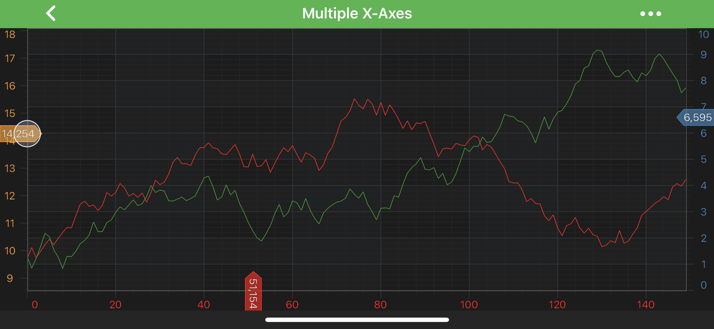
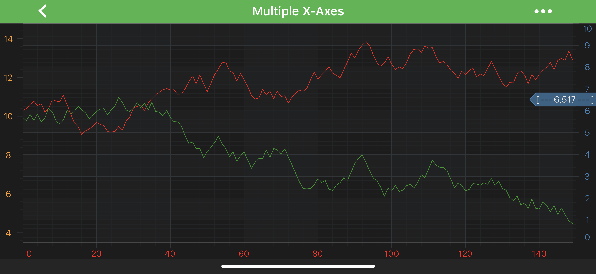

# The AxisMarkerAnnotation
The <xref:com.scichart.charting.visuals.annotations.AxisMarkerAnnotation> type allows to place **markers** with custom text onto **X or Y axes**. 
They show the **axis value** at their location **by default**:

> [!NOTE]
> Examples of the **Annotations** usage can be found in the [SciChart Android Examples Suite](https://www.scichart.com/examples/Android-chart/) as well as on [GitHub](https://github.com/ABTSoftware/SciChart.Android.Examples):
> - [Native Android Chart Annotations Example](https://www.scichart.com/example/android-chart-annotations-example/)
> - [Native Android Chart Interactive Annotations Example](https://www.scichart.com/example/android-chart-interaction-with-annotations-example/)
>
> - [Xamarin Android Chart Annotations Example](https://www.scichart.com/example/xamarin-chart-annotations-example/)
> - [Xamarin Android Chart Interactive Annotations Example](https://www.scichart.com/example/xamarin-chart-interaction-with-annotations-example/)

The <xref:com.scichart.charting.visuals.annotations.AxisMarkerAnnotation> can be configured using the properties listed in the table below:

| **Feature**                                           | **Description**                                                    | 
| ----------------------------------------------------- | ------------------------------------------------------------------ |
| <xref:com.scichart.charting.visuals.annotations.AxisMarkerAnnotation.setFormattedValue(java.lang.CharSequence)>              | Allows to specify the **text** that will appear **on the marker**. |
| <xref:com.scichart.charting.visuals.annotations.AxisMarkerAnnotation.setFormattedValueProvider(com.scichart.charting.visuals.annotations.IFormattedValueProvider)> | Allows to override the **default formatted value**, which comes from an axis via an <xref:com.scichart.charting.visuals.axes.AxisInfo> object. Please refer to the [AxisMarkerAnnotation TextFormatting](#axismarkerannotation-textformatting) section to learn more.|
| <xref:com.scichart.charting.visuals.annotations.AxisMarkerAnnotation.setFontStyle(com.scichart.drawing.common.FontStyle)>                    | Determines the **appearance of the text** on the marker via the <xref:com.scichart.drawing.common.FontStyle> object. Please refer to the [Styling and Theming](xref:stylingAndTheming.PenStyleBrushStyleAndFontStyle) article to learn more. |
| <xref:com.scichart.charting.visuals.annotations.AxisMarkerAnnotation.setMarkerPointWidth(int)>              | Allows to specify the **length of the pointed end** of the marker. |

> [!NOTE]
> To learn more about other **Annotation Types**, available out of the box in SciChart, please find the comprehensive list in the [Annotation APIs](xref:annotationsAPIs.AnnotationsAPIs) article.

The <xref:com.scichart.charting.visuals.annotations.AxisMarkerAnnotation> can be placed on the **X-Axis** or the **Y-Axis** which is specified via the [annotationSurface](xref:com.scichart.charting.visuals.annotations.AnnotationBase.setAnnotationSurface(com.scichart.charting.visuals.annotations.AnnotationSurfaceEnum)) property.
It accepts a member of the <xref:com.scichart.charting.visuals.annotations.AnnotationSurfaceEnum> enumeration and it **defaults** to **XAxis** for the **AxisMarkerAnnotation**.

Position of the <xref:com.scichart.charting.visuals.annotations.AxisMarkerAnnotation> is defined by the `X1` or `Y1` coordinate, depending on the axis. 
Those values can be accessed via the [x1](xref:com.scichart.charting.visuals.annotations.IAnnotation.setX1(java.lang.Comparable)) and [y1](xref:com.scichart.charting.visuals.annotations.IAnnotation.setY1(java.lang.Comparable)) properties.

Also, **AxisMarkerAnnotation** can be aligned relative to the `X1` or `Y1` coordinate by setting Anchor Points. 
For more information about the [Anchor Points](xref:annotationsAPIs.AnnotationsAPIs#annotation-alignment-anchor-points) - refer to the corresponding section [Annotations APIs](xref:annotationsAPIs.AnnotationsAPIs) article.

> [!NOTE]
> The **xAxisId** and **yAxisId** must be supplied if you have axis with **non-default** Axis Ids, e.g. in **multi-axis** scenario.

## Create an AxisMarkerAnnotation
A simple <xref:com.scichart.charting.visuals.annotations.AxisMarkerAnnotation> can be added onto a chart using the following code:

# [Java](#tab/java)
[!code-java[AddAxisMarkerAnnotation](../../../samples/sandbox/app/src/main/java/com/scichart/docsandbox/examples/java/annotationsAPIs/AxisMarkerAnnotationFragment.java#AddAxisMarkerAnnotation)]
# [Java with Builders API](#tab/javaBuilder)
[!code-java[AddAxisMarkerAnnotation](../../../samples/sandbox/app/src/main/java/com/scichart/docsandbox/examples/javaBuilder/annotationsAPIs/AxisMarkerAnnotationFragment.java#AddAxisMarkerAnnotation)]
# [Kotlin](#tab/kotlin)
[!code-swift[AddAxisMarkerAnnotation](../../../samples/sandbox/app/src/main/java/com/scichart/docsandbox/examples/kotlin/annotationsAPIs/AxisMarkerAnnotationFragment.kt#AddAxisMarkerAnnotation)]
***

#### AxisMarkerAnnotation TextFormatting
By default, the **axis marker** text is formatted by the [textFormatting](xref:com.scichart.charting.visuals.axes.IAxisCore.setTextFormatting(java.lang.String)) property. For more information, refer to the [Axis Labels - TextFormatting and CursorTextFormatting](xref:axisAPIs.AxisLabelsTextFormattingAndCursorTextFormatting) article.

But you can also override the default behaviour by using textformatting by providing custom the <xref:com.scichart.charting.visuals.annotations.IFormattedValueProvider> for your <xref:com.scichart.charting.visuals.annotations.AxisMarkerAnnotation> corresponding property.

Let's see a short example which shows how to use the above:

# [Java](#tab/java)
[!code-java[CreateAnnotationValueProviderForAxisMarkerAnnotation](../../../samples/sandbox/app/src/main/java/com/scichart/docsandbox/examples/java/annotationsAPIs/AxisMarkerAnnotationFragment.java#CreateAnnotationValueProviderForAxisMarkerAnnotation)]
[!code-java[SetAnnotationValueProvider](../../../samples/sandbox/app/src/main/java/com/scichart/docsandbox/examples/java/annotationsAPIs/AxisMarkerAnnotationFragment.java#SetAnnotationValueProvider)]

# [Java with Builders API](#tab/javaBuilder)
[!code-java[CreateAnnotationValueProviderForAxisMarkerAnnotation](../../../samples/sandbox/app/src/main/java/com/scichart/docsandbox/examples/javaBuilder/annotationsAPIs/AxisMarkerAnnotationFragment.java#CreateAnnotationValueProviderForAxisMarkerAnnotation)]
[!code-java[SetAnnotationValueProvider](../../../samples/sandbox/app/src/main/java/com/scichart/docsandbox/examples/javaBuilder/annotationsAPIs/AxisMarkerAnnotationFragment.java#SetAnnotationValueProvider)]

# [Kotlin](#tab/kotlin)
[!code-swift[CreateAnnotationValueProviderForAxisMarkerAnnotation](../../../samples/sandbox/app/src/main/java/com/scichart/docsandbox/examples/kotlin/annotationsAPIs/AxisMarkerAnnotationFragment.kt#CreateAnnotationValueProviderForAxisMarkerAnnotation)]
[!code-swift[SetAnnotationValueProvider](../../../samples/sandbox/app/src/main/java/com/scichart/docsandbox/examples/kotlin/annotationsAPIs/AxisMarkerAnnotationFragment.kt#SetAnnotationValueProvider)]
***

which will result in the following:

> [!NOTE]
> To learn more about other **Annotation Types**, available out of the box in SciChart, please find the comprehensive list in the [Annotation APIs](xref:annotationsAPIs.AnnotationsAPIs) article.
