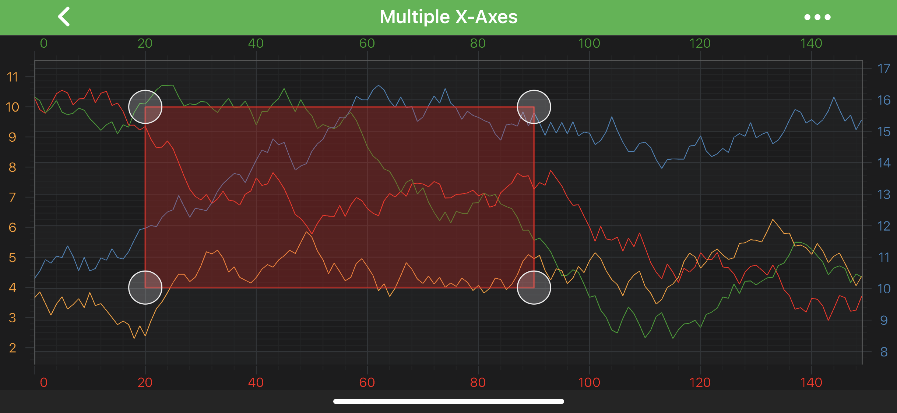

# The BoxAnnotation
The <xref:com.scichart.charting.visuals.annotations.BoxAnnotation> draws a rectangle at specific `X1, X2, Y1, Y2` coordinates:

> [!NOTE]
> Examples of the **Annotations** usage can be found in the [SciChart Android Examples Suite](https://www.scichart.com/examples/Android-chart/) as well as on [GitHub](https://github.com/ABTSoftware/SciChart.Android.Examples):
> - [Native Android Chart Annotations Example](https://www.scichart.com/example/android-chart-annotations-example/)
> - [Native Android Chart Interactive Annotations Example](https://www.scichart.com/example/android-chart-interaction-with-annotations-example/)
>
> - [Xamarin Android Chart Annotations Example](https://www.scichart.com/example/xamarin-chart-annotations-example/)
> - [Xamarin Android Chart Interactive Annotations Example](https://www.scichart.com/example/xamarin-chart-interaction-with-annotations-example/)

A <xref:com.scichart.charting.visuals.annotations.BoxAnnotation> is placed on a chart at the position determined by its `[X1, Y1]` and `[X2, Y2]` coordinates, which correspond to the **top-left** and **bottom-right** corners of the drawn rectangle. 
Those can be accessed via the following properties: [x1](xref:com.scichart.charting.visuals.annotations.IAnnotation.setX1(java.lang.Comparable)), [y1](xref:com.scichart.charting.visuals.annotations.IAnnotation.setY1(java.lang.Comparable)), [x2](xref:com.scichart.charting.visuals.annotations.IAnnotation.setX2(java.lang.Comparable)), [y2](xref:com.scichart.charting.visuals.annotations.IAnnotation.setY2(java.lang.Comparable))

> [!NOTE]
> The **xAxisId** and **yAxisId** must be supplied if you have axis with **non-default** Axis Ids, e.g. in **multi-axis** scenario.

## Create a BoxAnnotation
A <xref:com.scichart.charting.visuals.annotations.BoxAnnotation> can be added onto a chart using the following code:

# [Java](#tab/java)
[!code-java[AddBoxAnnotation](../../../samples/sandbox/app/src/main/java/com/scichart/docsandbox/examples/java/annotationsAPIs/BoxAnnotationFragment.java#AddBoxAnnotation)]
# [Java with Builders API](#tab/javaBuilder)
[!code-java[AddBoxAnnotation](../../../samples/sandbox/app/src/main/java/com/scichart/docsandbox/examples/javaBuilder/annotationsAPIs/BoxAnnotationFragment.java#AddBoxAnnotation)]
# [Kotlin](#tab/kotlin)
[!code-swift[AddBoxAnnotation](../../../samples/sandbox/app/src/main/java/com/scichart/docsandbox/examples/kotlin/annotationsAPIs/BoxAnnotationFragment.kt#AddBoxAnnotation)]
***

> [!NOTE]
> To learn more about other **Annotation Types**, available out of the box in SciChart, please find the comprehensive list in the [Annotation APIs](xref:annotationsAPIs.AnnotationsAPIs) article.
