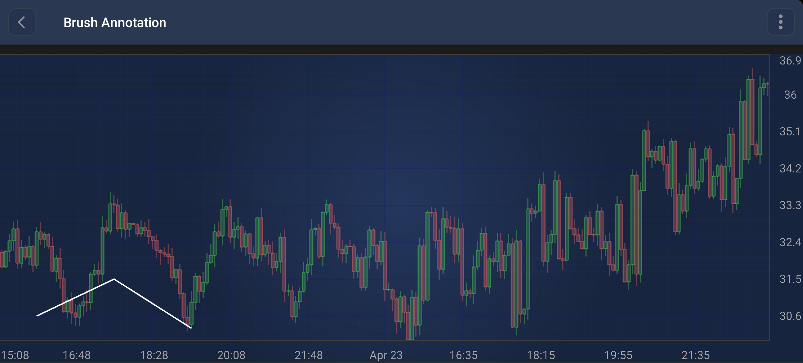

# The BrushAnnotation
The <xref:com.scichart.charting.visuals.annotations.tradingAnnotations.BrushAnnotation> allows for freehand drawing on the chart:

> [!NOTE]
> Examples of the **Annotations** usage can be found in the [SciChart Android Examples Suite](https://www.scichart.com/examples/Android-chart/) as well as on [GitHub](https://github.com/ABTSoftware/SciChart.Android.Examples):
> - [Native Android Chart Annotations Example](https://www.scichart.com/example/android-chart/android-chart-annotations-example/)
> - [Native Android Chart Interactive Annotations Example](https://www.scichart.com/example/android-chart/android-chart-interaction-with-annotations-example/)
>
> - [Xamarin Android Chart Annotations Example](https://www.scichart.com/example/xamarin-chart/xamarin-chart-annotations-example/)
> - [Xamarin Android Chart Interactive Annotations Example](https://www.scichart.com/example/xamarin-chart/xamarin-chart-interaction-with-annotations-example/)

A <xref:com.scichart.charting.visuals.annotations.tradingAnnotations.BrushAnnotation> is a multi-point annotation that stores a collection of points to form a freehand stroke. 
It provides properties to customize its appearance:
- [brushColor](xref:com.scichart.charting.visuals.annotations.tradingAnnotations.BrushAnnotation.setBrushColor(int)): Sets the color of the brush stroke.
- [brushThickness](xref:com.scichart.charting.visuals.annotations.tradingAnnotations.BrushAnnotation.setBrushThickness(float)): Sets the thickness of the brush stroke.

Points can be added or updated using the following methods:
- [setBasePoint(Comparable<?> x, Comparable<?> y)](xref:com.scichart.charting.visuals.annotations.tradingAnnotations.BrushAnnotation.setBasePoint(java.lang.Comparable, java.lang.Comparable)): Adds a new point to the annotation.
- [updateBasePoint(int index, Comparable<?> x, Comparable<?> y)](xref:com.scichart.charting.visuals.annotations.tradingAnnotations.BrushAnnotation.updateBasePoint(int, java.lang.Comparable, java.lang.Comparable)): Updates an existing point at the specified index.

> [!NOTE]
> The **xAxisId** and **yAxisId** must be supplied if you have axis with **non-default** Axis Ids, e.g. in **multi-axis** scenario.

## Create a BrushAnnotation
A <xref:com.scichart.charting.visuals.annotations.tradingAnnotations.BrushAnnotation> can be added onto a chart using the following code:

# [Java](#tab/java)
[!code-java[AddBrushAnnotation](../../../samples/sandbox/app/src/main/java/com/scichart/docsandbox/examples/java/annotationsAPIs/BrushAnnotationFragment.java#AddBrushAnnotation)]
# [Java with Builders API](#tab/javaBuilder)
[!code-java[AddBrushAnnotation](../../../samples/sandbox/app/src/main/java/com/scichart/docsandbox/examples/javaBuilder/annotationsAPIs/BrushAnnotationFragment.java#AddBrushAnnotation)]
# [Kotlin](#tab/kotlin)
[!code-swift[AddBrushAnnotation](../../../samples/sandbox/app/src/main/java/com/scichart/docsandbox/examples/kotlin/annotationsAPIs/BrushAnnotationFragment.kt#AddBrushAnnotation)]
***

> [!NOTE]
> To learn more about other **Annotation Types**, available out of the box in SciChart, please find the comprehensive list in the [Annotation APIs](xref:annotationsAPIs.AnnotationsAPIs) article.
