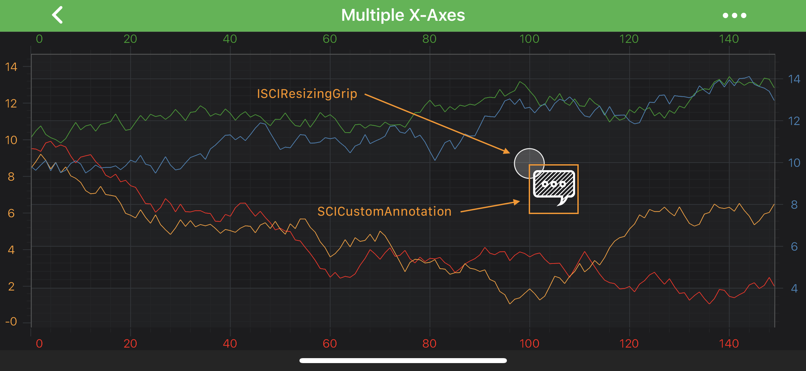

# The CustomAnnotation
The <xref:com.scichart.charting.visuals.annotations.CustomAnnotation> allows to place any [Android View](https://developer.android.com/reference/android/view/View) at a specific location on a chart:

> [!NOTE]
> Examples of the **Annotations** usage can be found in the [SciChart Android Examples Suite](https://www.scichart.com/examples/Android-chart/) as well as on [GitHub](https://github.com/ABTSoftware/SciChart.Android.Examples):
> - [Native Android Chart Annotations Example](https://www.scichart.com/example/android-chart/android-chart-annotations-example/)
> - [Native Android Chart Interactive Annotations Example](https://www.scichart.com/example/android-chart/android-chart-interaction-with-annotations-example/)
>
> - [Xamarin Android Chart Annotations Example](https://www.scichart.com/example/xamarin-chart/xamarin-chart-annotations-example/)
> - [Xamarin Android Chart Interactive Annotations Example](https://www.scichart.com/example/xamarin-chart/xamarin-chart-interaction-with-annotations-example/)

You can place any [Android View](https://developer.android.com/reference/android/view/View) by passing it into the <xref:com.scichart.charting.visuals.annotations.CustomAnnotation.setContentView(android.view.View)> method or an layout id into the <xref:com.scichart.charting.visuals.annotations.CustomAnnotation.setContentId(int)> method..

Position of the <xref:com.scichart.charting.visuals.annotations.CustomAnnotation> is defined by the `X1` or `Y1` coordinate, depending on the axis. 
Those values can be accessed via the [x1](xref:com.scichart.charting.visuals.annotations.IAnnotation.setX1(java.lang.Comparable)) and [y1](xref:com.scichart.charting.visuals.annotations.IAnnotation.setY1(java.lang.Comparable)) properties.

> [!NOTE]
> The **xAxisId** and **yAxisId** must be supplied if you have axis with **non-default** Axis Ids, e.g. in **multi-axis** scenario.

Also, because <xref:com.scichart.charting.visuals.annotations.CustomAnnotation> is derived from the <xref:com.scichart.charting.visuals.annotations.AnchorPointAnnotation> it can be aligned relative to the `X1` or `Y1` coordinate by setting the Anchor Points. For more information about the **[Anchor Points](xref:annotationsAPIs.AnnotationsAPIs#annotation-alignment-anchor-points)** - refer to the corresponding section [Annotations APIs](xref:annotationsAPIs.AnnotationsAPIs) article.

> [!NOTE]
> To learn more about **Annotations** in general - please see the [Common Annotation Features](xref:annotationsAPIs.AnnotationsAPIs#common-annotations-features) article.

## Create a CustomAnnotation
A simple <xref:com.scichart.charting.visuals.annotations.CustomAnnotation> with an [ImageView](https://developer.android.com/reference/android/widget/ImageView) can be added onto a chart using the following code:

# [Java](#tab/java)
[!code-java[AddCustomAnnotation](../../../samples/sandbox/app/src/main/java/com/scichart/docsandbox/examples/java/annotationsAPIs/CustomAnnotationFragment.java#AddCustomAnnotation)]
# [Java with Builders API](#tab/javaBuilder)
[!code-java[AddCustomAnnotation](../../../samples/sandbox/app/src/main/java/com/scichart/docsandbox/examples/javaBuilder/annotationsAPIs/CustomAnnotationFragment.java#AddCustomAnnotation)]
# [Kotlin](#tab/kotlin)
[!code-swift[AddCustomAnnotation](../../../samples/sandbox/app/src/main/java/com/scichart/docsandbox/examples/kotlin/annotationsAPIs/CustomAnnotationFragment.kt#AddCustomAnnotation)]
***

> [!NOTE]
> To learn more about other **Annotation Types**, available out of the box in SciChart, please find the comprehensive list in the [Annotation APIs](xref:annotationsAPIs.AnnotationsAPIs) article.