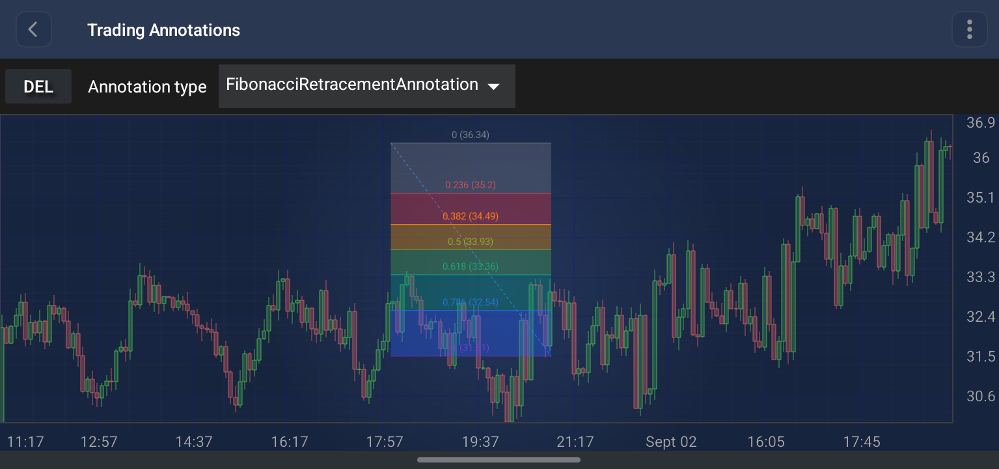

# The FibonacciRetracementAnnotation
The <xref:com.scichart.charting.visuals.annotations.tradingAnnotations.FibonacciRetracementAnnotation> is a specialized trading annotation that draws **Fibonacci retracement levels** across a price move defined by two points.



> [!NOTE]
> Examples of the **Annotations** usage can be found in the [SciChart Android Examples Suite](https://www.scichart.com/examples/Android-chart/) as well as on [GitHub](https://github.com/ABTSoftware/SciChart.Android.Examples):
> - [Native Android Chart Annotations Example](https://www.scichart.com/example/android-chart/android-chart-annotations-example/)
> - [Native Android Chart Interactive Annotations Example](https://www.scichart.com/example/android-chart/android-chart-interaction-with-annotations-example/)

## Structure and Points
The `FibonacciRetracementAnnotation` is defined by **two** anchor points - the start and the end of the price move:
- **Point 0**: The start of the move, corresponding to the **0.0** ratio.
- **Point 1**: The end of the move, corresponding to the **1.0** ratio.

For every configured ratio, a **horizontal level line** is drawn spanning the X range between the two points, at the price:

```
levelValue = y0 + ratio * (y1 - y0)
```

Each level line carries a **text label**, and a translucent **fill band** is drawn between every pair of adjacent levels. A dashed **connector line** joins the two anchor points diagonally.

## Levels and Colors
The set of ratios is controlled by the [levels](xref:com.scichart.charting.visuals.annotations.tradingAnnotations.FibonacciRetracementAnnotation.setLevels(java.util.List<java.lang.Double>)) property, which defaults to the classic Fibonacci sequence:

`0.0, 0.236, 0.382, 0.5, 0.618, 0.786, 1.0`

Colors are assigned per level from the [levelColors](xref:com.scichart.charting.visuals.annotations.tradingAnnotations.FibonacciRetracementAnnotation.setLevelColors(java.util.List<java.lang.Integer>)) list. The list is **cycled** if it is shorter than the level count, so any number of levels is supported. Each level's color applies to its line, its label text (unless overridden) and the band drawn below it.

> [!NOTE]
> Assigning a new list to **levels** rebuilds the level lines, labels and bands, so the annotation can be re-configured at any time after it has been created.

## Label Configuration
Labels are configured with three enumerations:

| **Property**                                                                                                                                                                                                | **Description**                                                                                                                                                                                                                              |
| ----------------------------------------------------------------------------------------------------------------------------------------------------------------------------------------------------------- | -------------------------------------------------------------------------------------------------------------------------------------------------------------------------------------------------------------------------------------------- |
| [labelPlacement](xref:com.scichart.charting.visuals.annotations.tradingAnnotations.FibonacciRetracementAnnotation.setLabelPlacement(com.scichart.charting.visuals.annotations.tradingAnnotations.FibonacciRetracementAnnotation.LabelPlacement))                     | `SIDE` places each label beside the visually-left anchor point, right-aligned against the level line. `CENTER` centers each label horizontally between the two anchor points. Defaults to **SIDE**.                                            |
| [labelFormat](xref:com.scichart.charting.visuals.annotations.tradingAnnotations.FibonacciRetracementAnnotation.setLabelFormat(com.scichart.charting.visuals.annotations.tradingAnnotations.FibonacciRetracementAnnotation.LabelFormat))                              | `RATIO` formats the text as the raw ratio followed by the price, e.g. `0.786 (66K)`. `PERCENT` formats the ratio as a percentage followed by the price, e.g. `78.6% 66K`. Defaults to `null` - the format follows `labelPlacement` (see below). |
| [labelVerticalPosition](xref:com.scichart.charting.visuals.annotations.tradingAnnotations.FibonacciRetracementAnnotation.setLabelVerticalPosition(com.scichart.charting.visuals.annotations.tradingAnnotations.FibonacciRetracementAnnotation.LabelVerticalPosition)) | `ABOVE`, `ON_LINE` or `BELOW` - where the label sits vertically relative to its level line. Defaults to **ON_LINE**.                                                                                                                          |

When [labelFormat](xref:com.scichart.charting.visuals.annotations.tradingAnnotations.FibonacciRetracementAnnotation.setLabelFormat(com.scichart.charting.visuals.annotations.tradingAnnotations.FibonacciRetracementAnnotation.LabelFormat)) is left as `null`, the format is chosen automatically from the placement - `RATIO` for `SIDE` placement, `PERCENT` for `CENTER` placement.

Prices of **1000** and above are abbreviated with a `K` suffix in the label text.

## Appearance Properties
The following properties can be used to customize the appearance of the `FibonacciRetracementAnnotation`:

| **Property**                                                                                                                                                                                | **Description**                                                                                                                                            |
| ------------------------------------------------------------------------------------------------------------------------------------------------------------------------------------------- | ---------------------------------------------------------------------------------------------------------------------------------------------------------- |
| [levels](xref:com.scichart.charting.visuals.annotations.tradingAnnotations.FibonacciRetracementAnnotation.setLevels(java.util.List<java.lang.Double>))                                                         | The list of Fibonacci ratios to draw. Defaults to `0.0, 0.236, 0.382, 0.5, 0.618, 0.786, 1.0`.                                                              |
| [levelColors](xref:com.scichart.charting.visuals.annotations.tradingAnnotations.FibonacciRetracementAnnotation.setLevelColors(java.util.List<java.lang.Integer>))                                               | The per-level colors, cycled if shorter than the number of levels.                                                                                          |
| [fillOpacity](xref:com.scichart.charting.visuals.annotations.tradingAnnotations.FibonacciRetracementAnnotation.setFillOpacity(float))                                                        | The opacity of the fill bands between adjacent levels, in the **[0 to 1]** range. Defaults to **0.35**.                                                     |
| [strokeThickness](xref:com.scichart.charting.visuals.annotations.tradingAnnotations.TradingAnnotationBase.setStrokeThickness(float))                                                                                   | The thickness of the level lines.                                                                                                                           |
| [stroke](xref:com.scichart.charting.visuals.annotations.tradingAnnotations.TradingAnnotationBase.setStroke(com.scichart.drawing.common.PenStyle))                                                                      | Provides the **color of the dashed connector line** joining the two anchor points. The level lines take their colors from `levelColors` instead.             |
| [showConnectorLine](xref:com.scichart.charting.visuals.annotations.tradingAnnotations.FibonacciRetracementAnnotation.setShowConnectorLine(boolean))                                          | Shows or hides the dashed connector line. Defaults to **true**.                                                                                             |
| [labelFontSize](xref:com.scichart.charting.visuals.annotations.tradingAnnotations.FibonacciRetracementAnnotation.setLabelFontSize(float))                                                    | The font size of the level labels. Defaults to **15**.                                                                                                      |
| [labelTextColor](xref:com.scichart.charting.visuals.annotations.tradingAnnotations.FibonacciRetracementAnnotation.setLabelTextColor(java.lang.Integer))                                      | An **override** for the label text color. Pass `null` to have each label follow its level's line color.                                                     |
| [labelBackgroundColor](xref:com.scichart.charting.visuals.annotations.tradingAnnotations.FibonacciRetracementAnnotation.setLabelBackgroundColor(java.lang.Integer))                           | An **override** for the label background color. Pass `null` to render the labels with no background.                                                        |

> [!NOTE]
> The **xAxisId** and **yAxisId** must be supplied if you have axis with **non-default** Axis Ids, e.g. in **multi-axis** scenario.

## Create a FibonacciRetracementAnnotation
A <xref:com.scichart.charting.visuals.annotations.tradingAnnotations.FibonacciRetracementAnnotation> can be added onto a chart using the following code:

# [Java](#tab/java)
[!code-java[AddFibonacciRetracementAnnotation](../../../samples/sandbox/app/src/main/java/com/scichart/docsandbox/examples/java/annotationsAPIs/FibonacciRetracementAnnotationFragment.java#AddFibonacciRetracementAnnotation)]
# [Java with Builders API](#tab/javaBuilder)
[!code-java[AddFibonacciRetracementAnnotation](../../../samples/sandbox/app/src/main/java/com/scichart/docsandbox/examples/javaBuilder/annotationsAPIs/FibonacciRetracementAnnotationFragment.java#AddFibonacciRetracementAnnotation)]
# [Kotlin](#tab/kotlin)
[!code-swift[AddFibonacciRetracementAnnotation](../../../samples/sandbox/app/src/main/java/com/scichart/docsandbox/examples/kotlin/annotationsAPIs/FibonacciRetracementAnnotationFragment.kt#AddFibonacciRetracementAnnotation)]
***

> [!NOTE]
> For interactive creation of the `FibonacciRetracementAnnotation`, use the [FibonacciRetracementAnnotationCreationModifier](xref:annotationsAPIs.FibonacciRetracementAnnotationCreationModifier).

> [!NOTE]
> To learn more about other **Annotation Types**, available out of the box in SciChart, please find the comprehensive list in the [Annotation APIs](xref:annotationsAPIs.AnnotationsAPIs) article.
