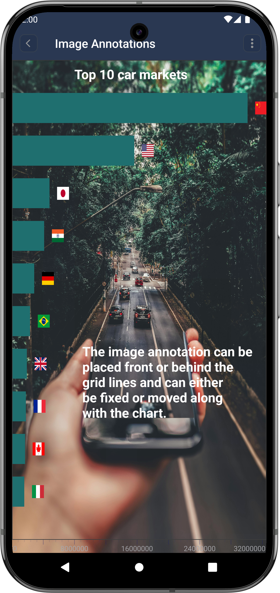
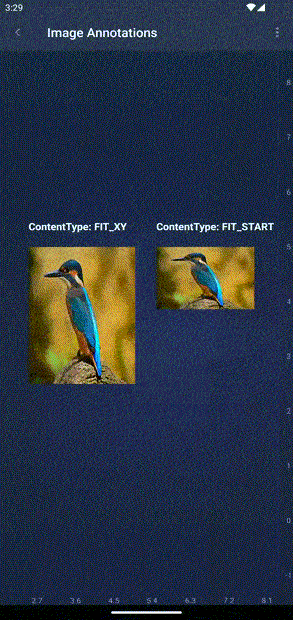

# The ImageAnnotation
The <xref:com.scichart.charting.visuals.annotations.ImageAnnotation> draws a rectangle at specific `X1, X2, Y1, Y2` coordinates:

A <xref:com.scichart.charting.visuals.annotations.ImageAnnotation> is placed on a chart at the position determined by its `[X1, Y1]` and `[X2, Y2]` coordinates, which correspond to the **top-left** and **bottom-right** corners of the drawn rectangle. 
Those can be accessed via the following properties: [x1](xref:com.scichart.charting.visuals.annotations.IAnnotation.setX1(java.lang.Comparable)), [y1](xref:com.scichart.charting.visuals.annotations.IAnnotation.setY1(java.lang.Comparable)), [x2](xref:com.scichart.charting.visuals.annotations.IAnnotation.setX2(java.lang.Comparable)), [y2](xref:com.scichart.charting.visuals.annotations.IAnnotation.setY2(java.lang.Comparable))

A <xref:com.scichart.charting.visuals.annotations.ImageAnnotation> can also be placed on a chart at the position determined by its `[X1, Y1]` coordinates, which correspond to the **top-left** corners, here <xref:com.scichart.charting.visuals.annotations.ImageAnnotation> will take the size of the image provided and will maintain its size and aspect ration on zoom and pan.

Image aspect ratio can be changed by setting setContentMode(ScaleType) which accepts the [ScaleType](https://developer.android.com/reference/android/widget/ImageView.ScaleType) from android.

In <xref:com.scichart.charting.visuals.annotations.ImageAnnotation> image size can be set using `setDesiredSize` method, which accepts width and height of the image. ImageAnnotation either requires `[X2, Y2]` or `setDesiredSize`, where `[X2, Y2]` will be given the priority.

A <xref:com.scichart.charting.visuals.annotations.ImageAnnotation> can be configured using the properties listed in the table below:

| **Feature**                                           | **Description**                                                    | 
| ----------------------------------------------------- | ------------------------------------------------------------------ |
| `ImageAnnotation.image`              | Allows to specify the **image** resource drawable that will appear **on the surface**. |
| `ImageAnnotation.contentMode`                   | Determines the **layout** i.e **content mode** of the image. It accepts a member of the [ScaleType](https://developer.android.com/reference/android/widget/ImageView.ScaleType) enumeration.|
| `ImageAnnotation.alpha`                   | Allows to specify the opacity of the image.|
| `ImageAnnotation.desiredSize`             | Allows to specify the **reuired size** of the image. **_NOTE:_** The annotation will not be affected by this property when a bounding box with four coordinates is defined.|

> [!NOTE]
> The **xAxisId** and **yAxisId** must be supplied if you have axis with **non-default** Axis Ids, e.g. in **multi-axis** scenario.

## Create a ImageAnnotation
A <xref:com.scichart.charting.visuals.annotations.ImageAnnotation> can be added onto a chart using the following code:

# [Java](#tab/java)
[!code-java[AddBoxAnnotation](../../../samples/sandbox/app/src/main/java/com/scichart/docsandbox/examples/java/annotationsAPIs/ImageAnnotationFragment.java#AddImageAnnotation)]
# [Java with Builders API](#tab/javaBuilder)
[!code-java[AddBoxAnnotation](../../../samples/sandbox/app/src/main/java/com/scichart/docsandbox/examples/javaBuilder/annotationsAPIs/ImageAnnotationFragment.java#AddImageAnnotation)]
# [Kotlin](#tab/kotlin)
[!code-swift[AddBoxAnnotation](../../../samples/sandbox/app/src/main/java/com/scichart/docsandbox/examples/kotlin/annotationsAPIs/ImageAnnotationFragment.kt#AddImageAnnotation)]
***

> [!NOTE]
> To learn more about other **Annotation Types**, available out of the box in SciChart, please find the comprehensive list in the [Annotation APIs](xref:annotationsAPIs.AnnotationsAPIs) article.
