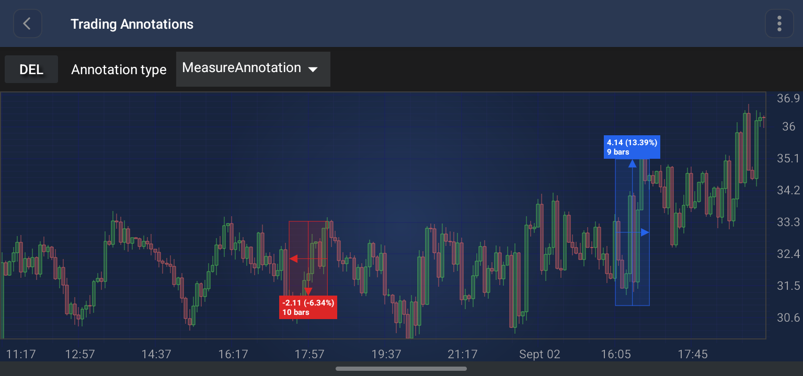

# The MeasureAnnotation
The <xref:com.scichart.charting.visuals.annotations.tradingAnnotations.MeasureAnnotation> is a specialized trading annotation that **measures the move between two points** on the chart, reporting the price change, the percentage change and the number of bars between them.

> [!NOTE]
> Examples of the **Annotations** usage can be found in the [SciChart Android Examples Suite](https://www.scichart.com/examples/Android-chart/) as well as on [GitHub](https://github.com/ABTSoftware/SciChart.Android.Examples):
> - [Native Android Chart Annotations Example](https://www.scichart.com/example/android-chart/android-chart-annotations-example/)
> - [Native Android Chart Interactive Annotations Example](https://www.scichart.com/example/android-chart/android-chart-interaction-with-annotations-example/)

## Structure and Points
The `MeasureAnnotation` is defined by **two** anchor points, which are the opposite corners of the measured region:
- **Point 0**: The start of the move - the **reference** price.
- **Point 1**: The end of the move - the **measured** price.

It renders as a filled and stroked rectangle spanning both points, with a **horizontal** and a **vertical** arrowed line crossing through its center, plus a floating **stat label**.

The color of the annotation is chosen automatically from the direction of the move:
- if the **Y value of Point 1 is greater than or equal to** the Y value of Point 0, the move is **growing** and the [growingColor](xref:com.scichart.charting.visuals.annotations.tradingAnnotations.MeasureAnnotation.setGrowingColor(int)) is used;
- otherwise the move is **declining** and the [decliningColor](xref:com.scichart.charting.visuals.annotations.tradingAnnotations.MeasureAnnotation.setDecliningColor(int)) is used.

The label is anchored **above** the top of the box for a growing move, and **below** its bottom for a declining move.

## The Stat Label
The label reports, on separate lines:
- the **price change** and the **percentage change**, formatted as `delta (percent%)` - the percentage is relative to the Y value of **Point 0**;
- the change scaled by the [yValueScaleFactor](xref:com.scichart.charting.visuals.annotations.tradingAnnotations.MeasureAnnotation.setYValueScaleFactor(double)), suffixed with `bp` - shown **only** when the factor is not `1.0`. This is useful for instruments quoted in basis points or pips;
- the number of **bars** spanned by the measurement, when it can be determined.

The bar count is resolved in one of two ways:
- On a **category axis**, the base-point X values are already bar indices, so the count is the difference between them.
- On a **value axis** (numeric, date), the count requires a [snapSeries](xref:com.scichart.charting.visuals.annotations.tradingAnnotations.MeasureAnnotation.setSnapSeries(com.scichart.charting.visuals.renderableSeries.IRenderableSeries)) to be set - the indices of the two X values are looked up in that series' X values. Without a snap series, the bar count line is omitted.

## Snapping to Data Points
If a renderable series is supplied via [snapSeries](xref:com.scichart.charting.visuals.annotations.tradingAnnotations.MeasureAnnotation.setSnapSeries(com.scichart.charting.visuals.renderableSeries.IRenderableSeries)), **both** anchor points snap to the nearest rendered data point (the bar's X value and **close** price) whenever the touch position is within [snapToDataPointRadius](xref:com.scichart.charting.visuals.annotations.tradingAnnotations.MeasureAnnotation.setSnapToDataPointRadius(float)) pixels of it. Snapping applies on creation, on vertex-grip drag and on whole-annotation drag.

Snapping requires the series to be backed by an OHLC data series - it is skipped for other data series types. It can be turned off without clearing the series via [snapToDataPointEnabled](xref:com.scichart.charting.visuals.annotations.tradingAnnotations.MeasureAnnotation.setSnapToDataPointEnabled(boolean)).

## Appearance Properties
The following properties can be used to customize the appearance and behavior of the `MeasureAnnotation`:

| **Property**                                                                                                                                                                                    | **Description**                                                                                                                              |
| ----------------------------------------------------------------------------------------------------------------------------------------------------------------------------------------------- | -------------------------------------------------------------------------------------------------------------------------------------------- |
| [growingColor](xref:com.scichart.charting.visuals.annotations.tradingAnnotations.MeasureAnnotation.setGrowingColor(int))                                                                         | The color used for the box, the arrows and the label background when the move is **upwards**. Defaults to `#2563EB` (blue).                   |
| [decliningColor](xref:com.scichart.charting.visuals.annotations.tradingAnnotations.MeasureAnnotation.setDecliningColor(int))                                                                     | The color used for the box, the arrows and the label background when the move is **downwards**. Defaults to `#DC2626` (red).                  |
| [fillOpacity](xref:com.scichart.charting.visuals.annotations.tradingAnnotations.MeasureAnnotation.setFillOpacity(float))                                                                         | The opacity of the box fill, in the **[0 to 1]** range. Defaults to **0.16**.                                                                 |
| [strokeThickness](xref:com.scichart.charting.visuals.annotations.tradingAnnotations.TradingAnnotationBase.setStrokeThickness(float))                                                                                       | The thickness of the box outline and of the arrowed lines.                                                                                    |
| [showArrows](xref:com.scichart.charting.visuals.annotations.tradingAnnotations.MeasureAnnotation.setShowArrows(boolean))                                                                         | Shows or hides the horizontal and vertical arrowed lines. Defaults to **true**.                                                               |
| [yValueScaleFactor](xref:com.scichart.charting.visuals.annotations.tradingAnnotations.MeasureAnnotation.setYValueScaleFactor(double))                                                            | A multiplier applied to the price change to produce the extra `bp` line in the label. Defaults to **1.0** - the line is not shown.            |
| [snapSeries](xref:com.scichart.charting.visuals.annotations.tradingAnnotations.MeasureAnnotation.setSnapSeries(com.scichart.charting.visuals.renderableSeries.IRenderableSeries))                 | The renderable series that anchor points snap to, and from which the bar count is resolved. Pass `null` to disable snapping.                  |
| [snapToDataPointEnabled](xref:com.scichart.charting.visuals.annotations.tradingAnnotations.MeasureAnnotation.setSnapToDataPointEnabled(boolean))                                                 | Enables or disables snapping without clearing the `snapSeries`. Defaults to **true**.                                                         |
| [snapToDataPointRadius](xref:com.scichart.charting.visuals.annotations.tradingAnnotations.MeasureAnnotation.setSnapToDataPointRadius(float))                                                     | The hit-test radius, in pixels, within which an anchor point snaps to a data point. Defaults to **10**.                                       |
| [labelFontSize](xref:com.scichart.charting.visuals.annotations.tradingAnnotations.MeasureAnnotation.setLabelFontSize(float))                                                                     | The font size of the label text. Defaults to **15**.                                                                                         |
| [labelTextColor](xref:com.scichart.charting.visuals.annotations.tradingAnnotations.MeasureAnnotation.setLabelTextColor(int))                                                                     | The color of the label text. Defaults to **white**.                                                                                          |
| [labelBackgroundColor](xref:com.scichart.charting.visuals.annotations.tradingAnnotations.MeasureAnnotation.setLabelBackgroundColor(java.lang.Integer))                                           | An **override** for the label background color. Pass `null` to have the background follow the growing / declining color.                      |

> [!NOTE]
> The **xAxisId** and **yAxisId** must be supplied if you have axis with **non-default** Axis Ids, e.g. in **multi-axis** scenario.

## Create a MeasureAnnotation
A <xref:com.scichart.charting.visuals.annotations.tradingAnnotations.MeasureAnnotation> can be added onto a chart using the following code:

# [Java](#tab/java)
[!code-java[AddMeasureAnnotation](../../../samples/sandbox/app/src/main/java/com/scichart/docsandbox/examples/java/annotationsAPIs/MeasureAnnotationFragment.java#AddMeasureAnnotation)]
# [Java with Builders API](#tab/javaBuilder)
[!code-java[AddMeasureAnnotation](../../../samples/sandbox/app/src/main/java/com/scichart/docsandbox/examples/javaBuilder/annotationsAPIs/MeasureAnnotationFragment.java#AddMeasureAnnotation)]
# [Kotlin](#tab/kotlin)
[!code-swift[AddMeasureAnnotation](../../../samples/sandbox/app/src/main/java/com/scichart/docsandbox/examples/kotlin/annotationsAPIs/MeasureAnnotationFragment.kt#AddMeasureAnnotation)]
***

> [!NOTE]
> For interactive creation of the `MeasureAnnotation`, use the [MeasureAnnotationCreationModifier](xref:annotationsAPIs.MeasureAnnotationCreationModifier).

> [!NOTE]
> To learn more about other **Annotation Types**, available out of the box in SciChart, please find the comprehensive list in the [Annotation APIs](xref:annotationsAPIs.AnnotationsAPIs) article.
