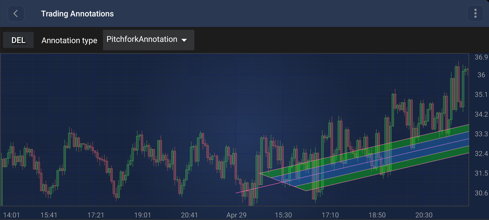

# The PitchforkAnnotation
The <xref:com.scichart.charting.visuals.annotations.tradingAnnotations.PitchforkAnnotation> (also known as Andrew's Pitchfork) is a specialized trading annotation that uses three points to identify support and resistance levels.

> [!NOTE]
> Examples of the **Annotations** usage can be found in the [SciChart Android Examples Suite](https://www.scichart.com/examples/Android-chart/) as well as on [GitHub](https://github.com/ABTSoftware/SciChart.Android.Examples):
> - [Native Android Chart Trading Annotations Example](https://www.scichart.com/example/android-chart/android-chart-trading-annotations-example/)

## Structure and Points
The `PitchforkAnnotation` is defined by 3 base points:
- **Point 0 (Handle)**: The starting point of the median line.
- **Point 1 (High/Low)**: The first point of the cross-line.
- **Point 2 (Low/High)**: The second point of the cross-line.

The median line starts at Point 0 and passes through the midpoint of the segment connecting Point 1 and Point 2. Two additional lines are drawn parallel to the median line, starting from Point 1 and Point 2.

## Appearance Properties
The following properties can be used to customize the appearance of the `PitchforkAnnotation`:
- [stroke](xref:com.scichart.charting.visuals.annotations.AnnotationBase.setStroke(com.scichart.drawing.common.PenStyle)): Sets the pen style for all the lines in the pitchfork.
- [sidesFill](xref:com.scichart.charting.visuals.annotations.tradingAnnotations.PitchforkAnnotation.setSidesFill(com.scichart.drawing.common.BrushStyle)): Sets the brush style for the outer filled areas.
- [middleFill](xref:com.scichart.charting.visuals.annotations.tradingAnnotations.PitchforkAnnotation.setMiddleFill(com.scichart.drawing.common.BrushStyle)): Sets the brush style for the inner filled area around the median line.

## Create a PitchforkAnnotation
A <xref:com.scichart.charting.visuals.annotations.tradingAnnotations.PitchforkAnnotation> can be added onto a chart using the following code:

# [Java](#tab/java)
[!code-java[AddPitchforkAnnotation](../../../samples/sandbox/app/src/main/java/com/scichart/docsandbox/examples/java/annotationsAPIs/PitchforkAnnotationFragment.java#AddPitchforkAnnotation)]
# [Java with Builders API](#tab/javaBuilder)
[!code-java[AddPitchforkAnnotation](../../../samples/sandbox/app/src/main/java/com/scichart/docsandbox/examples/javaBuilder/annotationsAPIs/PitchforkAnnotationFragment.java#AddPitchforkAnnotation)]
# [Kotlin](#tab/kotlin)
[!code-swift[AddPitchforkAnnotation](../../../samples/sandbox/app/src/main/java/com/scichart/docsandbox/examples/kotlin/annotationsAPIs/PitchforkAnnotationFragment.kt#AddPitchforkAnnotation)]
***

> [!NOTE]
> For interactive creation of the `PitchforkAnnotation`, use the [PitchforkAnnotationCreationModifier](xref:annotationsAPIs.PitchforkAnnotationCreationModifier).

> [!NOTE]
> To learn more about other **Annotation Types**, available out of the box in SciChart, please find the comprehensive list in the [Annotation APIs](xref:annotationsAPIs.AnnotationsAPIs) article.
