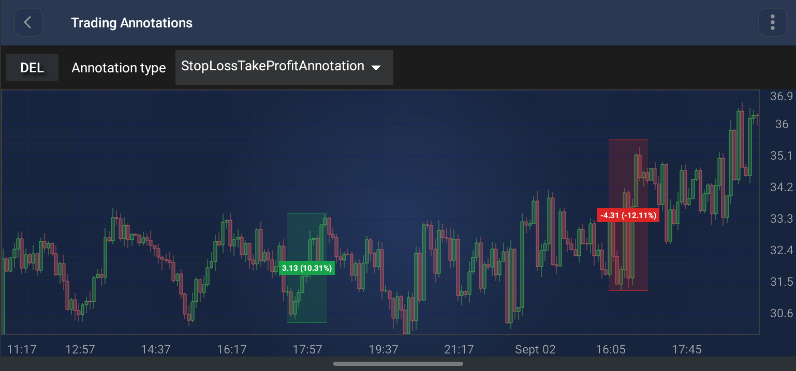

# The StopLossTakeProfitAnnotation
The <xref:com.scichart.charting.visuals.annotations.tradingAnnotations.StopLossTakeProfitAnnotation> is a specialized trading annotation that draws a **rectangular price zone** between two points and automatically colors it as a **take-profit** or a **stop-loss** band, depending on the direction of the move.

> [!NOTE]
> Examples of the **Annotations** usage can be found in the [SciChart Android Examples Suite](https://www.scichart.com/examples/Android-chart/) as well as on [GitHub](https://github.com/ABTSoftware/SciChart.Android.Examples):
> - [Native Android Chart Annotations Example](https://www.scichart.com/example/android-chart/android-chart-annotations-example/)
> - [Native Android Chart Interactive Annotations Example](https://www.scichart.com/example/android-chart/android-chart-interaction-with-annotations-example/)

## Structure and Points
The `StopLossTakeProfitAnnotation` is a simple **two-point** annotation - the two anchor points are just **opposite corners** of the zone, not an entry/stop/target composite:
- **Point 0**: The first corner of the zone - treated as the **reference** (entry) price.
- **Point 1**: The opposite corner of the zone - treated as the **target** price.

The zone renders as a filled rectangle with only its **top and bottom edges stroked** (the left and right edges are not stroked). When the zone has zero height, the redundant bottom stroke is hidden.

The color of the zone is chosen automatically from the vertical direction of the move:
- if the **Y value of Point 1 is greater than or equal to** the Y value of Point 0, the zone is a **take-profit** zone and is drawn with the [takeProfitColor](xref:com.scichart.charting.visuals.annotations.tradingAnnotations.StopLossTakeProfitAnnotation.setTakeProfitColor(int));
- otherwise the zone is a **stop-loss** zone and is drawn with the [stopLossColor](xref:com.scichart.charting.visuals.annotations.tradingAnnotations.StopLossTakeProfitAnnotation.setStopLossColor(int)).

## The Distance Label
A label is placed in the **center** of the zone showing the absolute and the percentage price change between the two points, formatted as `delta (percent%)` - for example `1.20 (3.64%)`. The percentage is calculated relative to the Y value of **Point 0**.

The label can be turned off with the [showDistanceLabel](xref:com.scichart.charting.visuals.annotations.tradingAnnotations.StopLossTakeProfitAnnotation.setShowDistanceLabel(boolean)) property.

## Appearance Properties
The following properties can be used to customize the appearance of the `StopLossTakeProfitAnnotation`:

| **Property**                                                                                                                                                                          | **Description**                                                                                                                                    |
| ------------------------------------------------------------------------------------------------------------------------------------------------------------------------------------- | -------------------------------------------------------------------------------------------------------------------------------------------------- |
| [takeProfitColor](xref:com.scichart.charting.visuals.annotations.tradingAnnotations.StopLossTakeProfitAnnotation.setTakeProfitColor(int))                                              | The color used for the fill, the edge strokes and the label background when the move is **upwards**. Defaults to `#16A34A` (green).                 |
| [stopLossColor](xref:com.scichart.charting.visuals.annotations.tradingAnnotations.StopLossTakeProfitAnnotation.setStopLossColor(int))                                                  | The color used for the fill, the edge strokes and the label background when the move is **downwards**. Defaults to `#DC2626` (red).                 |
| [fillOpacity](xref:com.scichart.charting.visuals.annotations.tradingAnnotations.StopLossTakeProfitAnnotation.setFillOpacity(float))                                                    | The opacity of the zone fill, in the **[0 to 1]** range. Defaults to **0.18**.                                                                      |
| [strokeThickness](xref:com.scichart.charting.visuals.annotations.tradingAnnotations.TradingAnnotationBase.setStrokeThickness(float))                                                                             | The thickness of the top and the bottom edge strokes.                                                                                              |
| [strokeDashArray](xref:com.scichart.charting.visuals.annotations.tradingAnnotations.StopLossTakeProfitAnnotation.setStrokeDashArray(float[]))                                          | Makes the edge strokes **dashed**. Accepts an array of on/off lengths, e.g. `new float[] { 6f, 3f }`. Defaults to `null` - a solid stroke.          |
| [showDistanceLabel](xref:com.scichart.charting.visuals.annotations.tradingAnnotations.StopLossTakeProfitAnnotation.setShowDistanceLabel(boolean))                                      | Shows or hides the price change label. Defaults to **true**.                                                                                       |
| [labelFontSize](xref:com.scichart.charting.visuals.annotations.tradingAnnotations.StopLossTakeProfitAnnotation.setLabelFontSize(float))                                                | The font size of the label text. Defaults to **15**.                                                                                               |
| [labelTextColor](xref:com.scichart.charting.visuals.annotations.tradingAnnotations.StopLossTakeProfitAnnotation.setLabelTextColor(int))                                                | The color of the label text. Defaults to **white**.                                                                                                |
| [labelBackgroundColor](xref:com.scichart.charting.visuals.annotations.tradingAnnotations.StopLossTakeProfitAnnotation.setLabelBackgroundColor(java.lang.Integer))                      | An **override** for the label background color. Pass `null` to have the background follow the take-profit / stop-loss color.                        |

> [!NOTE]
> The **xAxisId** and **yAxisId** must be supplied if you have axis with **non-default** Axis Ids, e.g. in **multi-axis** scenario.

## Create a StopLossTakeProfitAnnotation
A <xref:com.scichart.charting.visuals.annotations.tradingAnnotations.StopLossTakeProfitAnnotation> can be added onto a chart using the following code:

# [Java](#tab/java)
[!code-java[AddStopLossTakeProfitAnnotation](../../../samples/sandbox/app/src/main/java/com/scichart/docsandbox/examples/java/annotationsAPIs/StopLossTakeProfitAnnotationFragment.java#AddStopLossTakeProfitAnnotation)]
# [Java with Builders API](#tab/javaBuilder)
[!code-java[AddStopLossTakeProfitAnnotation](../../../samples/sandbox/app/src/main/java/com/scichart/docsandbox/examples/javaBuilder/annotationsAPIs/StopLossTakeProfitAnnotationFragment.java#AddStopLossTakeProfitAnnotation)]
# [Kotlin](#tab/kotlin)
[!code-swift[AddStopLossTakeProfitAnnotation](../../../samples/sandbox/app/src/main/java/com/scichart/docsandbox/examples/kotlin/annotationsAPIs/StopLossTakeProfitAnnotationFragment.kt#AddStopLossTakeProfitAnnotation)]
***

> [!NOTE]
> For interactive creation of the `StopLossTakeProfitAnnotation`, use the [StopLossTakeProfitAnnotationCreationModifier](xref:annotationsAPIs.StopLossTakeProfitAnnotationCreationModifier).

> [!NOTE]
> To learn more about other **Annotation Types**, available out of the box in SciChart, please find the comprehensive list in the [Annotation APIs](xref:annotationsAPIs.AnnotationsAPIs) article.
