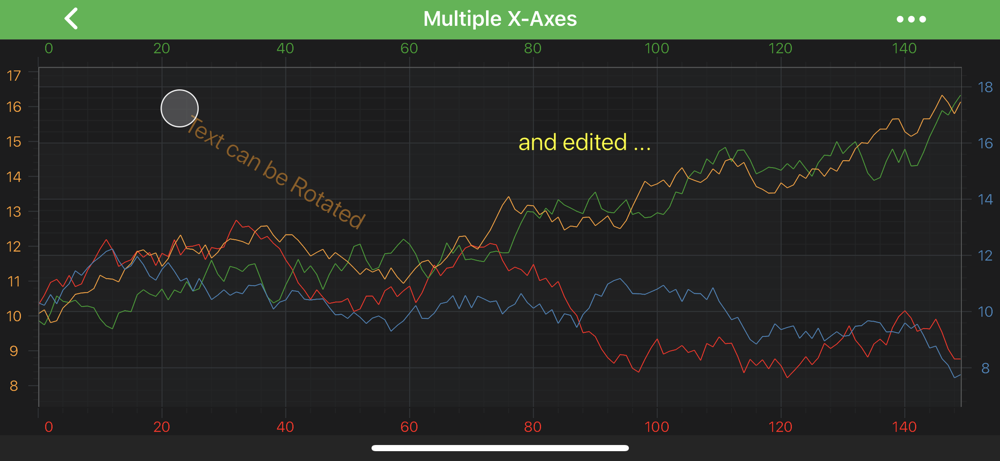

# The TextAnnotation
The <xref:com.scichart.charting.visuals.annotations.TextAnnotation> allows to place a piece of **text** at a specific location on a chart:

> [!NOTE]
> Examples of the **Annotations** usage can be found in the [SciChart Android Examples Suite](https://www.scichart.com/examples/Android-chart/) as well as on [GitHub](https://github.com/ABTSoftware/SciChart.Android.Examples):
> - [Native Android Chart Annotations Example](https://www.scichart.com/example/android-chart-annotations-example/)
> - [Native Android Chart Interactive Annotations Example](https://www.scichart.com/example/android-chart-interaction-with-annotations-example/)
>
> - [Xamarin Android Chart Annotations Example](https://www.scichart.com/example/xamarin-chart-annotations-example/)
> - [Xamarin Android Chart Interactive Annotations Example](https://www.scichart.com/example/xamarin-chart-interaction-with-annotations-example/)

The <xref:com.scichart.charting.visuals.annotations.TextAnnotation> can be configured using the properties listed in the table below:

| **Property**                           | **Description**                                                                                      |
| -------------------------------------- | ---------------------------------------------------------------------------------------------------- |
| [text](xref:com.scichart.charting.visuals.annotations.TextAnnotationBase.setText(java.lang.CharSequence))           | Specifies the **text** for an annotation.                                                            |
| [fontStyle](xref:com.scichart.charting.visuals.annotations.TextAnnotationBase.setFontStyle(com.scichart.drawing.common.FontStyle))      | Determines the **appearance** of the text via the <xref:com.scichart.drawing.common.FontStyle> object. Please refer to the [Styling and Theming](xref:stylingAndTheming.StylingAndTheming) article to learn more. |
| [textGravity](xref:com.scichart.charting.visuals.annotations.TextAnnotationBase.setTextGravity(int))      | Specifies a text gravity with [Android Gravity](https://developer.android.com/reference/android/view/Gravity).                                                      |
| [canEditText](xref:com.scichart.charting.visuals.annotations.TextAnnotationBase.setCanEditText(boolean))    | When set to `true` - allows to **modify the text in run-time** after selecting an annotation. See the [Edit TextAnnotation in Run-Time](#edit-textannotation-in-run-time) section. |
| [rotationAngle](xref:com.scichart.charting.visuals.annotations.TextAnnotationBase.setRotationAngle(float))  | **Rotates** an annotation through the specified angle in **degrees**.                                 |

Position of the <xref:com.scichart.charting.visuals.annotations.TextAnnotation> is defined by the `X1` or `Y1` coordinate, depending on the axis. 
Those values can be accessed via the [x1](xref:com.scichart.charting.visuals.annotations.IAnnotation.setX1(java.lang.Comparable)) and [y1](xref:com.scichart.charting.visuals.annotations.IAnnotation.setY1(java.lang.Comparable)) properties.

> [!NOTE]
> The **xAxisId** and **yAxisId** must be supplied if you have axis with **non-default** Axis Ids, e.g. in **multi-axis** scenario.

Also, because **TextAnnotation** is derived from the <xref:com.scichart.charting.visuals.annotations.AnchorPointAnnotation> it can be aligned relative to the `X1` or `Y1` coordinate by setting the Anchor Points. For more information about the **[Anchor Points](xref:annotationsAPIs.AnnotationsAPIs#annotation-alignment-anchor-points)** - refer to the corresponding section [Annotations APIs](Annotations APIs.html) article.

> [!NOTE]
> To learn more about other **Annotation Types**, available out of the box in SciChart, please find the comprehensive list in the [Annotation APIs](xref:annotationsAPIs.AnnotationsAPIs) article.

## Create a TextAnnotation
A <xref:com.scichart.charting.visuals.annotations.TextAnnotation> can be added onto a chart using the following code:

# [Java](#tab/java)
[!code-java[AddTextAnnotation](../../../samples/sandbox/app/src/main/java/com/scichart/docsandbox/examples/java/annotationsAPIs/TextAnnotationFragment.java#AddTextAnnotation)]
# [Java with Builders API](#tab/javaBuilder)
[!code-java[AddTextAnnotation](../../../samples/sandbox/app/src/main/java/com/scichart/docsandbox/examples/javaBuilder/annotationsAPIs/TextAnnotationFragment.java#AddTextAnnotation)]
# [Kotlin](#tab/kotlin)
[!code-swift[AddTextAnnotation](../../../samples/sandbox/app/src/main/java/com/scichart/docsandbox/examples/kotlin/annotationsAPIs/TextAnnotationFragment.kt#AddTextAnnotation)]
***

> [!NOTE]
> To learn more about other **Annotation Types**, available out of the box in SciChart, please find the comprehensive list in the [Annotation APIs](xref:annotationsAPIs.AnnotationsAPIs) article.

## Edit TextAnnotation in Run-Time
The <xref:com.scichart.charting.visuals.annotations.TextAnnotation> can be edited in run-time. To turn that on - just set [canEditText](xref:com.scichart.charting.visuals.annotations.TextAnnotationBase.setCanEditText(boolean)) to `true` on your annotation.

Please see the code snippet and result below:

# [Java](#tab/java)
[!code-java[EditTextAnnotation](../../../samples/sandbox/app/src/main/java/com/scichart/docsandbox/examples/java/annotationsAPIs/TextAnnotationFragment.java#EditTextAnnotation)]
# [Java with Builders API](#tab/javaBuilder)
[!code-java[EditTextAnnotation](../../../samples/sandbox/app/src/main/java/com/scichart/docsandbox/examples/javaBuilder/annotationsAPIs/TextAnnotationFragment.java#EditTextAnnotation)]
# [Kotlin](#tab/kotlin)
[!code-swift[EditTextAnnotation](../../../samples/sandbox/app/src/main/java/com/scichart/docsandbox/examples/kotlin/annotationsAPIs/TextAnnotationFragment.kt#EditTextAnnotation)]
***

<video autoplay loop muted playsinline src="images/text-annotation-editing.mp4"></video>

> [!NOTE]
> Be aware, if you use **canEditText** (allows edit text in run-time) in conjunction with **isEditable** (allows drag annotation over that chart), you will need to perform **2 taps** - first one to select annotation, and only after that - tap to enter editing.