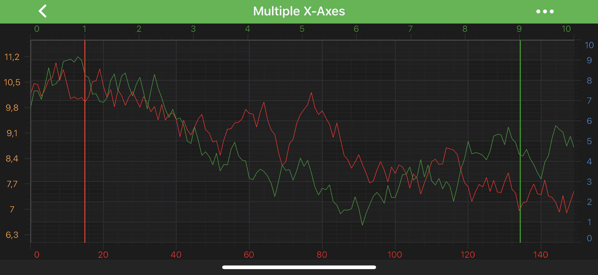
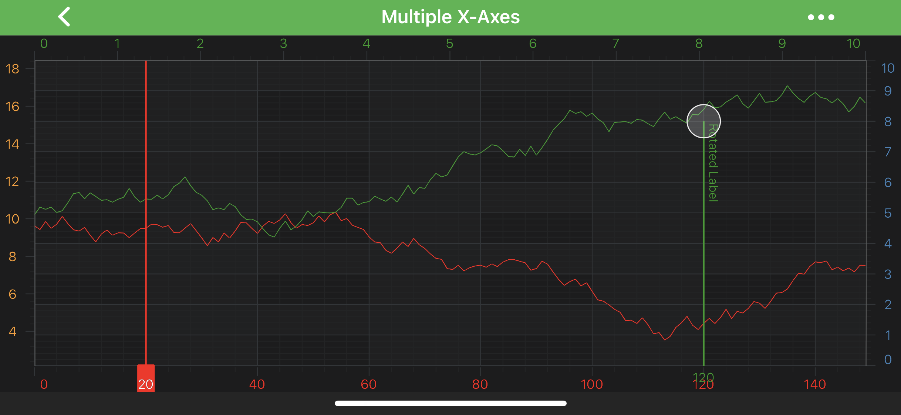
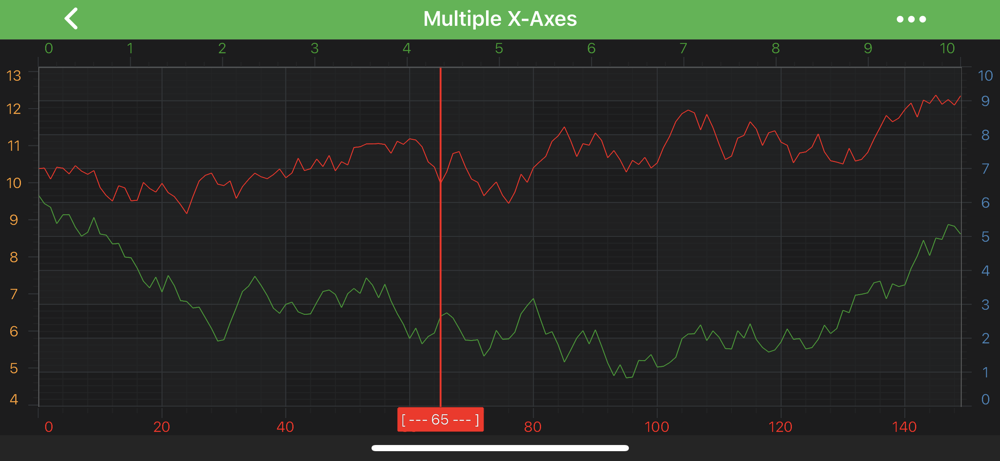

# The VerticalLineAnnotation
The <xref:com.scichart.charting.visuals.annotations.VerticalLineAnnotation> draws the **vertical line** between `Y1` and `Y2` coordinates at `X1`:

> [!NOTE]
> You might also be interested in learning about the [HorizontalLineAnnotation](xref:annotationsAPIs.VerticalLineAnnotation) since it's very similar with the **Horizontal** one.

> [!NOTE]
> Examples of the **Annotations** usage can be found in the [SciChart Android Examples Suite](https://www.scichart.com/examples/Android-chart/) as well as on [GitHub](https://github.com/ABTSoftware/SciChart.Android.Examples):
> - [Native Android Chart Annotations Example](https://www.scichart.com/example/android-chart/android-chart-annotations-example/)
> - [Native Android Chart Interactive Annotations Example](https://www.scichart.com/example/android-chart/android-chart-interaction-with-annotations-example/)
>
> - [Xamarin Android Chart Annotations Example](https://www.scichart.com/example/xamarin-chart/xamarin-chart-annotations-example/)
> - [Xamarin Android Chart Interactive Annotations Example](https://www.scichart.com/example/xamarin-chart/xamarin-chart-interaction-with-annotations-example/)

The <xref:com.scichart.charting.visuals.annotations.VerticalLineAnnotation> class is inherited from [LineAnnotation](xref:annotationsAPIs.LineAnnotation), and hence, provides the [stroke](xref:com.scichart.charting.visuals.annotations.LineAnnotationBase.setStroke(com.scichart.drawing.common.PenStyle)) property which is used to define the line annotation color. It expects a <xref:com.scichart.drawing.common.PenStyle> object.
To learn more about **Pens** and **Brushes** and how to utilize them, please refer to the [PenStyle, BrushStyle and FontStyle](xref:stylingAndTheming.PenStyleBrushStyleAndFontStyle) article.

> [!NOTE]
> To learn more about **Annotations** in general - please see the [Common Annotation Features](xref:annotationsAPIs.AnnotationsAPIs#common-annotations-features) article.

In **general** case, the position of an <xref:com.scichart.charting.visuals.annotations.VerticalLineAnnotation> can only be defined by the [x1](xref:com.scichart.charting.visuals.annotations.IAnnotation.setX1(java.lang.Comparable)) value, which will lead to full-height vertical line at `X1` coordinate.

Despite the above, it is possible to specify `Y1` and `Y2` coordinates for the line ends, but it will work differently while combined with different [Gravity](https://developer.android.com/reference/android/view/Gravity). 
[verticalGravity](xref:com.scichart.charting.visuals.annotations.VerticalLineAnnotation.setVerticalGravity(int)) property can consume the following values:
- [Gravity.TOP](https://developer.android.com/reference/android/view/Gravity.html#TOP) - the `Y1` coordinate will be applied to the **bottom** end of a line. The line appears pinned to the **top** side.
- [Gravity.BOTTOM](https://developer.android.com/reference/android/view/Gravity.html#BOTTOM) - the `Y1` coordinate will be applied to the **top** end of a line. The line appears pinned to the **bottom** side.
- [Gravity.CENTER_VERTICAL](https://developer.android.com/reference/android/view/Gravity.html#CENTER_VERTICAL) - both `Y1` and `Y2` coordinates **will be applied**.
- [Gravity.FILL_VERTICAL](https://developer.android.com/reference/android/view/Gravity.html#FILL_VERTICAL) - both `Y1` and `Y2` coordinates **are ignored**. The line appears vertically stretched. This is the **default value**.

The `Y1` and `Y2` values can be accessed via the [y1](xref:com.scichart.charting.visuals.annotations.IAnnotation.setY1(java.lang.Comparable)) and [y2](xref:com.scichart.charting.visuals.annotations.IAnnotation.setY2(java.lang.Comparable)) properties.

> [!NOTE]
> The **xAxisId** and **yAxisId** must be supplied if you have axis with **non-default** Axis Ids, e.g. in **multi-axis** scenario.

## Create a VerticalLine Annotation
A <xref:com.scichart.charting.visuals.annotations.VerticalLineAnnotation> can be added onto a chart using the following code:

# [Java](#tab/java)
[!code-java[AddVerticalLineAnnotation](../../../samples/sandbox/app/src/main/java/com/scichart/docsandbox/examples/java/annotationsAPIs/VerticalLineAnnotationFragment.java#AddVerticalLineAnnotation)]
# [Java with Builders API](#tab/javaBuilder)
[!code-java[AddVerticalLineAnnotation](../../../samples/sandbox/app/src/main/java/com/scichart/docsandbox/examples/javaBuilder/annotationsAPIs/VerticalLineAnnotationFragment.java#AddVerticalLineAnnotation)]
# [Kotlin](#tab/kotlin)
[!code-swift[AddVerticalLineAnnotation](../../../samples/sandbox/app/src/main/java/com/scichart/docsandbox/examples/kotlin/annotationsAPIs/VerticalLineAnnotationFragment.kt#AddVerticalLineAnnotation)]
***

> [!NOTE]
> To learn more about other **Annotation Types**, available out of the box in SciChart, please find the comprehensive list in the [Annotation APIs](xref:annotationsAPIs.AnnotationsAPIs) article.

## The AnnotationLabels collection
By default, the <xref:com.scichart.charting.visuals.annotations.VerticalLineAnnotation> does not show any labels. You can show a label by adding a <xref:com.scichart.charting.visuals.annotations.AnnotationLabel> to the <xref:com.scichart.charting.visuals.annotations.LineAnnotationWithLabelsBase.annotationLabels> collection, like below:

# [Java](#tab/java)
[!code-java[AddVerticalLineAnnotationLabel](../../../samples/sandbox/app/src/main/java/com/scichart/docsandbox/examples/java/annotationsAPIs/VerticalLineAnnotationFragment.java#AddVerticalLineAnnotationLabel)]
# [Java with Builders API](#tab/javaBuilder)
[!code-java[AddVerticalLineAnnotationLabel](../../../samples/sandbox/app/src/main/java/com/scichart/docsandbox/examples/javaBuilder/annotationsAPIs/VerticalLineAnnotationFragment.java#AddVerticalLineAnnotationLabel)]
# [Kotlin](#tab/kotlin)
[!code-swift[AddVerticalLineAnnotationLabel](../../../samples/sandbox/app/src/main/java/com/scichart/docsandbox/examples/kotlin/annotationsAPIs/VerticalLineAnnotationFragment.kt#AddVerticalLineAnnotationLabel)]
***

The Label position can be changed by setting the [labelPlacement](xref:com.scichart.charting.visuals.annotations.AnnotationLabel.setLabelPlacement(com.scichart.charting.visuals.annotations.LabelPlacement)) property which expects one of the <xref:com.scichart.charting.visuals.annotations.LabelPlacement> enumeration.

> [!NOTE]
> Everything about **AnnotationLabels collection** and <xref:com.scichart.charting.visuals.annotations.AnnotationLabel> can be also applied to the [HorizontalLineAnnotation](xref:annotationsAPIs.HorizontalLineAnnotation)

#### The AnnotationLabel Type
You can change appearance, position, custom value, etcetera for any annotation label which are listed below:
- [setLabelStyle](xref:com.scichart.charting.visuals.annotations.AnnotationLabel.setLabelStyle(com.scichart.core.common.Action1<com.scichart.charting.visuals.annotations.AnnotationLabel>)) - applies style for AnnotationLabel.
- [rotationAngle](xref:com.scichart.charting.visuals.layout.RotationLayout.setRotationAngle(float)) - allows to rotate annotation label text, expects ***degrees***
- [text](xref:com.scichart.charting.visuals.annotations.TextLabelContainer.setText(java.lang.CharSequence)) - you can set custom **text** for your label.
- [fontStyle](xref:com.scichart.charting.visuals.annotations.TextLabelContainer.setFontStyle(com.scichart.drawing.common.FontStyle)) - applies the <xref:com.scichart.drawing.common.FontStyle> object onto the text.

> [!NOTE]
> By default, <xref:com.scichart.charting.visuals.annotations.AnnotationLabel> uses its associated axis `Y-value` to display a label.
> To learn more about **Pens** and **Brushes** and how to utilize them, please refer to the [PenStyle, BrushStyle and FontStyle](xref:stylingAndTheming.PenStyleBrushStyleAndFontStyle) article.

Also, you can have more than one **AnnotationLabel** associated with <xref:com.scichart.charting.visuals.annotations.HorizontalLineAnnotation> by adding more than one to the <xref:com.scichart.charting.visuals.annotations.LineAnnotationWithLabelsBase.annotationLabels> collection.

Please see the code below, which showcases the utilization of the above settings:

# [Java](#tab/java)
[!code-java[AddAnnotationLabelsToVerticalLineAnnotation](../../../samples/sandbox/app/src/main/java/com/scichart/docsandbox/examples/java/annotationsAPIs/VerticalLineAnnotationFragment.java#AddAnnotationLabelsToVerticalLineAnnotation)]
# [Java with Builders API](#tab/javaBuilder)
[!code-java[AddAnnotationLabelsToVerticalLineAnnotation](../../../samples/sandbox/app/src/main/java/com/scichart/docsandbox/examples/javaBuilder/annotationsAPIs/VerticalLineAnnotationFragment.java#AddAnnotationLabelsToVerticalLineAnnotation)]
# [Kotlin](#tab/kotlin)
[!code-swift[AddAnnotationLabelsToVerticalLineAnnotation](../../../samples/sandbox/app/src/main/java/com/scichart/docsandbox/examples/kotlin/annotationsAPIs/VerticalLineAnnotationFragment.kt#AddAnnotationLabelsToVerticalLineAnnotation)]
***

This will result in the following:

#### Annotation Label Value and TextFormatting
By default, the label text is formatted by the [textFormatting](xref:com.scichart.charting.visuals.axes.IAxisCore.setTextFormatting(java.lang.String)) property. For more information, refer to the [Axis Labels - TextFormatting and CursorTextFormatting](xref:axisAPIs.AxisLabelsTextFormattingAndCursorTextFormatting) article.

But you can also override the default behaviour by providing a custom <xref:com.scichart.charting.visuals.annotations.IFormattedValueProvider> for your <xref:com.scichart.charting.visuals.annotations.VerticalLineAnnotation> corresponding property.

Let's see a short example which shows how to use the above:

# [Java](#tab/java)
[!code-java[CreateAnnotationValueProviderForVerticalLineAnnotation](../../../samples/sandbox/app/src/main/java/com/scichart/docsandbox/examples/java/annotationsAPIs/VerticalLineAnnotationFragment.java#CreateAnnotationValueProviderForVerticalLineAnnotation)]
[!code-java[UseAnnotationValueProviderForVerticalLineAnnotation](../../../samples/sandbox/app/src/main/java/com/scichart/docsandbox/examples/java/annotationsAPIs/VerticalLineAnnotationFragment.java#UseAnnotationValueProviderForVerticalLineAnnotation)]

# [Java with Builders API](#tab/javaBuilder)
[!code-java[CreateAnnotationValueProviderForVerticalLineAnnotation](../../../samples/sandbox/app/src/main/java/com/scichart/docsandbox/examples/javaBuilder/annotationsAPIs/VerticalLineAnnotationFragment.java#CreateAnnotationValueProviderForVerticalLineAnnotation)]
[!code-java[UseAnnotationValueProviderForVerticalLineAnnotation](../../../samples/sandbox/app/src/main/java/com/scichart/docsandbox/examples/javaBuilder/annotationsAPIs/VerticalLineAnnotationFragment.java#UseAnnotationValueProviderForVerticalLineAnnotation)]

# [Kotlin](#tab/kotlin)
[!code-swift[CreateAnnotationValueProviderForVerticalLineAnnotation](../../../samples/sandbox/app/src/main/java/com/scichart/docsandbox/examples/kotlin/annotationsAPIs/VerticalLineAnnotationFragment.kt#CreateAnnotationValueProviderForVerticalLineAnnotation)]
[!code-swift[UseAnnotationValueProviderForVerticalLineAnnotation](../../../samples/sandbox/app/src/main/java/com/scichart/docsandbox/examples/kotlin/annotationsAPIs/VerticalLineAnnotationFragment.kt#UseAnnotationValueProviderForVerticalLineAnnotation)]
***

This will result in the following:

> [!NOTE]
> To learn more about other **Annotation Types**, available out of the box in SciChart, please find the comprehensive list in the [Annotation APIs](xref:annotationsAPIs.AnnotationsAPIs) article.
