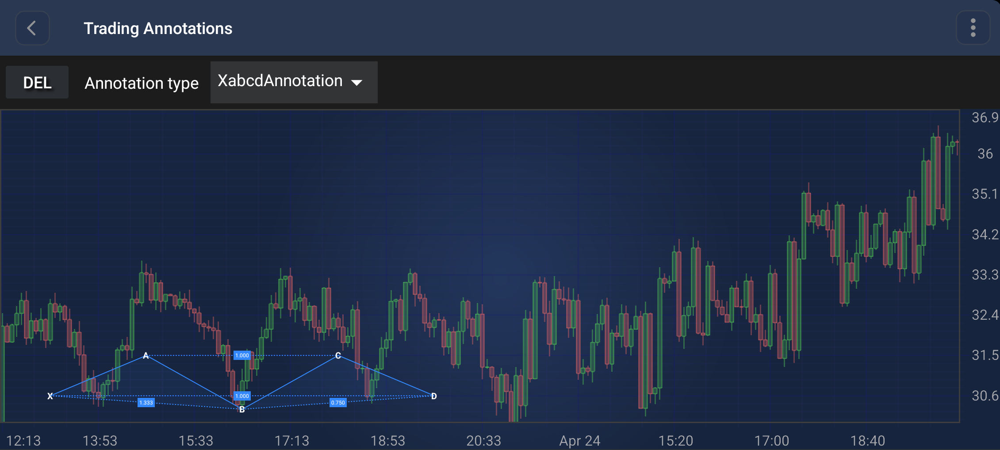

# The XabcdAnnotation
The <xref:com.scichart.charting.visuals.annotations.tradingAnnotations.XabcdAnnotation> is a specialized multi-point annotation used for drawing harmonic patterns (such as Gartley, Butterfly, Bat, and Crab patterns) which consist of 5 points: **X, A, B, C,** and **D**.

> [!NOTE]
> Examples of the **Annotations** usage can be found in the [SciChart Android Examples Suite](https://www.scichart.com/examples/Android-chart/) as well as on [GitHub](https://github.com/ABTSoftware/SciChart.Android.Examples):
> - [Native Android Chart Trading Annotations Example](https://www.scichart.com/example/android-chart/android-chart-trading-annotations-example/)

## Points and Ratios
The `XabcdAnnotation` requires 5 points to be placed. Once all points are set, it automatically calculates and displays the following Fibonacci-style ratios:
- **XB Ratio**: Calculated as `|B - A| / |A - X|`
- **AC Ratio**: Calculated as `|C - B| / |B - A|`
- **BD Ratio**: Calculated as `|D - C| / |C - B|`
- **XD Ratio**: Calculated as `|D - A| / |A - X|`

These ratios are calculated based on the values on the specified [ratioAxisId](xref:com.scichart.charting.visuals.annotations.tradingAnnotations.XabcdAnnotation.setRatioAxisId(java.lang.String)). If no axis ID is specified, the primary Y-Axis is used.

## Appearance Properties
The following properties can be used to customize the appearance of the `XabcdAnnotation`:
- [stroke](xref:com.scichart.charting.visuals.annotations.AnnotationBase.setStroke(com.scichart.drawing.common.PenStyle)): Sets the pen style for the primary lines (XA, AB, BC, CD) and the secondary dashed lines (XB, AC, BD, XD).
- [fill](xref:com.scichart.charting.visuals.annotations.tradingAnnotations.XabcdAnnotation.setFill(com.scichart.drawing.common.BrushStyle)): Sets the brush style for the two filled triangular areas (XAB and BCD).

## Create an XabcdAnnotation
An <xref:com.scichart.charting.visuals.annotations.tradingAnnotations.XabcdAnnotation> can be added onto a chart using the following code:

# [Java](#tab/java)
[!code-java[AddXabcdAnnotation](../../../samples/sandbox/app/src/main/java/com/scichart/docsandbox/examples/java/annotationsAPIs/XabcdAnnotationFragment.java#AddXabcdAnnotation)]
# [Java with Builders API](#tab/javaBuilder)
[!code-java[AddXabcdAnnotation](../../../samples/sandbox/app/src/main/java/com/scichart/docsandbox/examples/javaBuilder/annotationsAPIs/XabcdAnnotationFragment.java#AddXabcdAnnotation)]
# [Kotlin](#tab/kotlin)
[!code-swift[AddXabcdAnnotation](../../../samples/sandbox/app/src/main/java/com/scichart/docsandbox/examples/kotlin/annotationsAPIs/XabcdAnnotationFragment.kt#AddXabcdAnnotation)]
***

> [!NOTE]
> For interactive creation of the `XabcdAnnotation`, use the [XabcdAnnotationCreationModifier](xref:annotationsAPIs.XabcdAnnotationCreationModifier).

> [!NOTE]
> To learn more about other **Annotation Types**, available out of the box in SciChart, please find the comprehensive list in the [Annotation APIs](xref:annotationsAPIs.AnnotationsAPIs) article.
