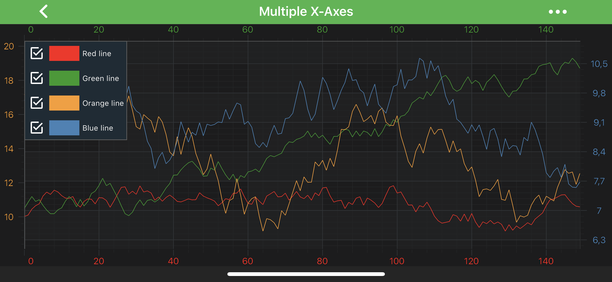
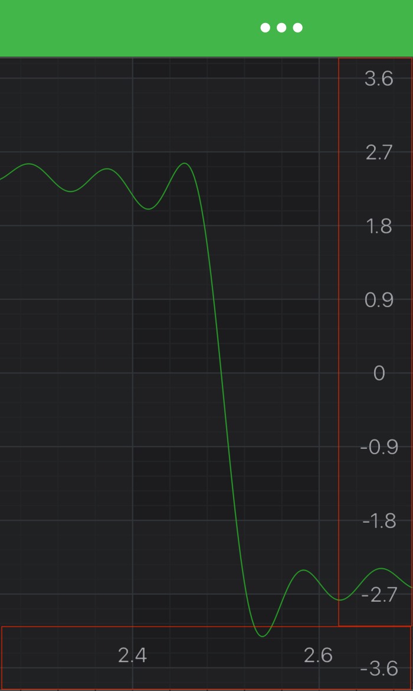
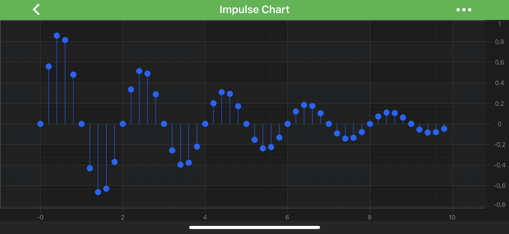
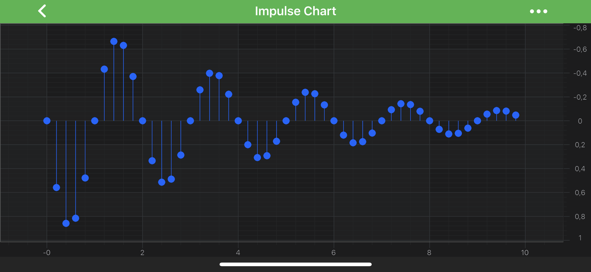
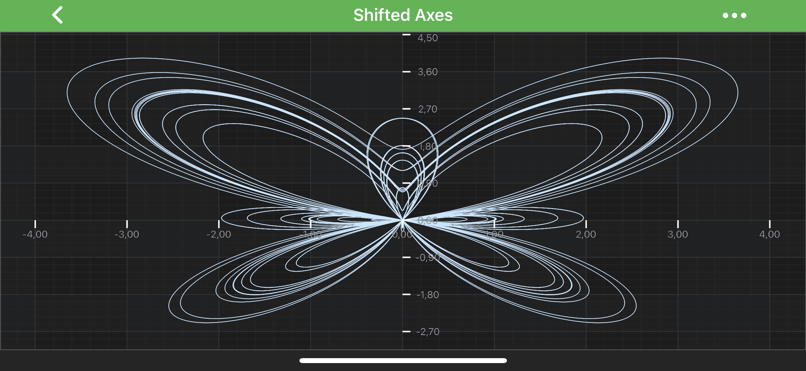

# Add an Axis to a SciChartSurface
While creating your [First SciChart Android App](xref:quickStartGuide.CreatingYourFirstSciChartAndroidApp) you've added *axes* to a <xref:com.scichart.charting.visuals.SciChartSurface>. With SciChart you can also have **unlimited number of axes**, whether it's left, right, top or bottom, X or Y Axes.

You can also place axes **in the centre** of the chart or **swap X and Y axes** over to create a **vertical chart**. Please see these examples from the [SciChart Android Examples Suite](https://www.scichart.com/examples/Android-chart/) for reference:
- [Multiple X-Axis Chart](https://www.scichart.com/example/android-chart-example-multiple-xaxis/)
- [Central X Axis and Y Axis](https://www.scichart.com/example/android-chart-example-central-xaxis-and-yaxis/)
- [Vertical Charts](https://www.scichart.com/example/android-chart-vertical-charts-example/)
- [Vertically Stacked Y Axes](https://www.scichart.com/example/android-chart-example-vertically-stacked-yaxes/)

Axes can be added to either the [xAxes](xref:com.scichart.charting.visuals.ISciChartSurface.getXAxes()) or [yAxes](xref:com.scichart.charting.visuals.ISciChartSurface.getYAxes()) collection of <xref:com.scichart.charting.visuals.SciChartSurface>. In case of having **multiple X or Y** axes, every axis should have a **unique ID** assigned to it. All axes are positioned on a chart according to their <xref:com.scichart.charting.visuals.axes.AxisAlignment>.

## Adding an Axis
To add X and Y axes to a <xref:com.scichart.charting.visuals.SciChartSurface>, use the following code:

# [Java](#tab/java)
[!code-java[AddingAxes](../../../samples/sandbox/app/src/main/java/com/scichart/docsandbox/examples/java/axisAPIs/AddAxisToSciChartSurface.java#AddingAxes)]
# [Java with Builders API](#tab/javaBuilder)
[!code-java[AddingAxes](../../../samples/sandbox/app/src/main/java/com/scichart/docsandbox/examples/javaBuilder/axisAPIs/AddAxisToSciChartSurface.java#AddingAxes)]
# [Kotlin](#tab/kotlin)
[!code-swift[AddingAxes](../../../samples/sandbox/app/src/main/java/com/scichart/docsandbox/examples/kotlin/axisAPIs/AddAxisToSciChartSurface.kt#AddingAxes)]
***

Similarly, you can add **multiple X or Y axes** to your <xref:com.scichart.charting.visuals.SciChartSurface>. 

> [!NOTE]
> As mentioned above, every axis should have a **unique ID** assigned to it. By default, each axis has a `DefaultAxisId` which isn't sufficient for multiple X or Y Axes.

## Aligning an Axis Inside a Chart
To **change the position** of an axis, set <xref:com.scichart.charting.visuals.axes.AxisAlignment> on it:

# [Java](#tab/java)
[!code-java[AddAxisAlignment](../../../samples/sandbox/app/src/main/java/com/scichart/docsandbox/examples/java/axisAPIs/AddAxisToSciChartSurface.java#AddAxisAlignment)]
# [Java with Builders API](#tab/javaBuilder)
[!code-java[AddAxisAlignment](../../../samples/sandbox/app/src/main/java/com/scichart/docsandbox/examples/javaBuilder/axisAPIs/AddAxisToSciChartSurface.java#AddAxisAlignment)]
# [Kotlin](#tab/kotlin)
[!code-swift[AddAxisAlignment](../../../samples/sandbox/app/src/main/java/com/scichart/docsandbox/examples/kotlin/axisAPIs/AddAxisToSciChartSurface.kt#AddAxisAlignment)]
***

Also, it's possible pointing an axis **inward or outward** relative to the chart area. It requires setting [isCenterAxis](xref:com.scichart.charting.visuals.axes.IAxis.setIsCenterAxis(boolean)) property on an axis. By default, it is set to `false`, thus axis labels and ticks are turned outside a chart. Setting it to `true` will provide the following output:

> [!NOTE]
> You might want to create **Vertical(Rotated)** Charts, to learn more - refer to the [Create a Vertical Chart](xref:axisAPIs.AxisAlignmentCreateAVerticalChart) article or the [Vertical Charts example](https://www.scichart.com/example/android-chart-vertical-charts-example/).

## Changing Axis Direction
You can change **Axis Direction** via [flipCoordinates](xref:com.scichart.charting.visuals.axes.IAxisCore.setFlipCoordinates(boolean)) property. By default it's `false`. Please see the difference below:

| **Default**                                       | **Flipped Y Coordinates**                                   |
| ------------------------------------------------- | ----------------------------------------------------------- |
|  |  |

## Central Axis
Placing an axis in the center of a chart is a bit more advanced topic. It requires changes to the layout process in <xref:com.scichart.charting.layoutManagers.ILayoutManager> to specify the exact axis position inside a chart area. Please refer to the [Central Axis](xref:axisAPIs.AxisLayoutCentralAxis) article or the [Central X Axis and Y Axis](https://www.scichart.com/example/android-chart-example-central-xaxis-and-yaxis/) for more info.

## Stacking Multiple Axes Vertically or Horizontally
It is also possible to configure chart layout to have **axes** placed **one next to another** vertically or horizontally. This requires changes to the layout process in <xref:com.scichart.charting.layoutManagers.ILayoutManager>. Please refer to the [Stack Axes Vertically or Horizontally](xref:axisAPIs.AxisLayoutStackAxesVerticallyOrHorizontally) article or the [Vertically Stacked Y Axes](https://www.scichart.com/example/android-chart-example-vertically-stacked-yaxes/) example for more info.

> [!NOTE]
> Every **RenderableSeries** (chart types e.g. <xref:com.scichart.charting.visuals.renderableSeries.FastLineRenderableSeries>, <xref:com.scichart.charting.visuals.renderableSeries.FastCandlestickRenderableSeries> etc.), every [Annotation](xref:annotationsAPIs.AnnotationsAPIs) and some **Chart Modifiers** (e.g. <xref:com.scichart.charting.modifiers.PinchZoomModifier>, <xref:com.scichart.charting.modifiers.ZoomPanModifier>) requires to be measured against **particular axis** (in other words - **attached** to it). You **must** specify the **Axis ID** for them via the [xAxisId](xref:com.scichart.charting.visuals.renderableSeries.IRenderableSeries.setXAxisId(java.lang.String)) and [yAxisId](xref:com.scichart.charting.visuals.renderableSeries.IRenderableSeries.setYAxisId(java.lang.String)) properties.
>
> However, If you have only a **single X and Y Axis**, setting these ID properties **isn't required**. This is **required** only for the **multiple axis** cases.
