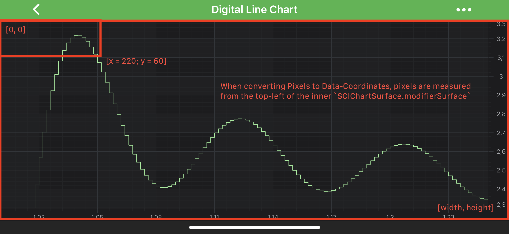
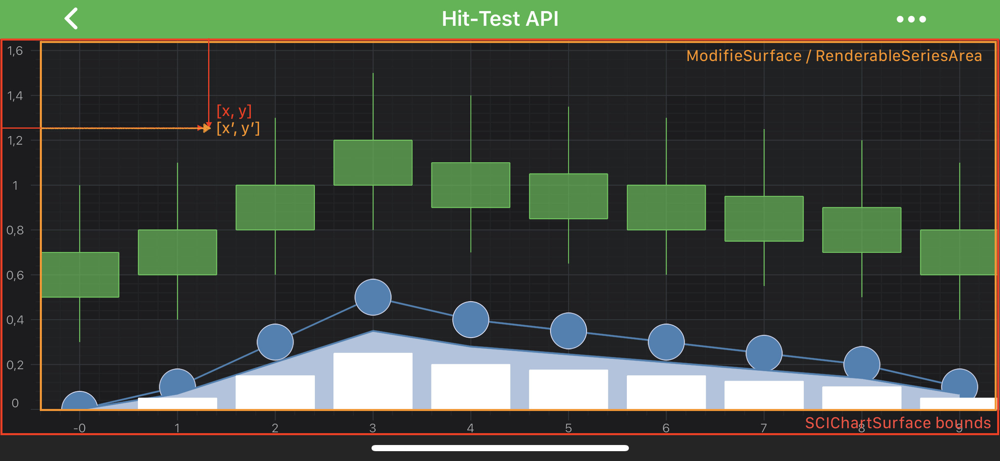

# Axis APIs - Convert Pixel to Data coordinates
SciChart Android provides a clean and simple API to transform **pixels** to **data-values** and vice versa via the following methods:
- <xref:com.scichart.charting.visuals.axes.IAxisCore.getCoordinate(java.lang.Comparable)> - expects a chart `data-value` and returns the corresponding **pixel coordinate**.
- <xref:com.scichart.charting.visuals.axes.IAxisCore.getDataValue(float)> - expects a `coordinate in pixels` and returns the closest **data value** to that coordinate.

It is also possible, to perform such conversion using our [CoordinateCalculator APIs](#icoordinatecalculator-api)

## Where Pixel Coordinates are measured from

It is important to note when converting **Pixels** to **Data Coordinates** and vice versa that pixels are measured from the top-left inside corner of the chart. So, let's see correspondence of the pixel coordinate and data-values in the table below:

| **Pixel Coordinate** | **Data-Value**                                     |
| -------------------- | -------------------------------------------------- |
| `[0, 0]`             | `[xAxis.getVisibleRange().getMin(), yAxis.getVisibleRange().getMax()]` |
| `[width, height]`    | `[xAxis.getVisibleRange().getMax(), yAxis.getVisibleRange().getMin()]` |

> [!NOTE]
> Learn more about <xref:com.scichart.charting.visuals.axes.IAxisCore.getVisibleRange()> and how to use this property at the [Axis Ranging - VisibleRange and DataRange](xref:axisAPIs.AxisRangingVisibleRangeAndDataRange) article.

## Converting between Pixels and Data Coordinates
As mentioned [above](#axis-apis---convert-pixel-to-data-coordinates) - **data-values** are converted to **pixel coordinates** via the <xref:com.scichart.charting.visuals.axes.IAxisCore.getCoordinate(java.lang.Comparable)> method. Also, Coordinates in pixels are converted back to chart data-values via the <xref:com.scichart.charting.visuals.axes.IAxisCore.getDataValue(float)> method. 

You can find simple examples how to do the conversions below.

**NumericAxis conversions**

# [Java](#tab/java)
[!code-java[NumericAxisConversions](../../../samples/sandbox/app/src/main/java/com/scichart/docsandbox/examples/java/axisAPIs/AxisAPIsConvertPixelToDataCoordinates.java#NumericAxisConversions)]
# [Java with Builders API](#tab/javaBuilder)
[!code-java[NumericAxisConversions](../../../samples/sandbox/app/src/main/java/com/scichart/docsandbox/examples/javaBuilder/axisAPIs/AxisAPIsConvertPixelToDataCoordinates.java#NumericAxisConversions)]
# [Kotlin](#tab/kotlin)
[!code-swift[NumericAxisConversions](../../../samples/sandbox/app/src/main/java/com/scichart/docsandbox/examples/kotlin/axisAPIs/AxisAPIsConvertPixelToDataCoordinates.kt#NumericAxisConversions)]
***

**DateAxis conversions**

# [Java](#tab/java)
[!code-java[DateAxisConversions](../../../samples/sandbox/app/src/main/java/com/scichart/docsandbox/examples/java/axisAPIs/AxisAPIsConvertPixelToDataCoordinates.java#DateAxisConversions)]
# [Java with Builders API](#tab/javaBuilder)
[!code-java[DateAxisConversions](../../../samples/sandbox/app/src/main/java/com/scichart/docsandbox/examples/javaBuilder/axisAPIs/AxisAPIsConvertPixelToDataCoordinates.java#DateAxisConversions)]
# [Kotlin](#tab/kotlin)
[!code-swift[DateAxisConversions](../../../samples/sandbox/app/src/main/java/com/scichart/docsandbox/examples/kotlin/axisAPIs/AxisAPIsConvertPixelToDataCoordinates.kt#DateAxisConversions)]
***

**CategoryDateAxis conversions**

# [Java](#tab/java)
[!code-java[CategoryDateAxisConversions](../../../samples/sandbox/app/src/main/java/com/scichart/docsandbox/examples/java/axisAPIs/AxisAPIsConvertPixelToDataCoordinates.java#CategoryDateAxisConversions)]
# [Java with Builders API](#tab/javaBuilder)
[!code-java[CategoryDateAxisConversions](../../../samples/sandbox/app/src/main/java/com/scichart/docsandbox/examples/javaBuilder/axisAPIs/AxisAPIsConvertPixelToDataCoordinates.java#CategoryDateAxisConversions)]
# [Kotlin](#tab/kotlin)
[!code-swift[CategoryDateAxisConversions](../../../samples/sandbox/app/src/main/java/com/scichart/docsandbox/examples/kotlin/axisAPIs/AxisAPIsConvertPixelToDataCoordinates.kt#CategoryDateAxisConversions)]
***

## Getting a CoordinateCalculator instance
There is a [currentCoordinateCalculator](xref:com.scichart.charting.visuals.axes.IAxisCore.getCurrentCoordinateCalculator()) property, which is `readonly`, and which provides a coordinate calculator instance which is valid for the current render pass.

> [!NOTE]
> If the <xref:com.scichart.charting.visuals.axes.IAxisCore.getVisibleRange()> changes, the data changes, or the viewport size changes - then the <xref:com.scichart.charting.numerics.coordinateCalculators.ICoordinateCalculator> will be recreated under the hood.

## ICoordinateCalculator API
Like <xref:com.scichart.charting.visuals.axes.IAxisCore>, <xref:com.scichart.charting.numerics.coordinateCalculators.ICoordinateCalculator> has the following methods:
- <xref:com.scichart.charting.visuals.axes.IAxisCore.getCoordinate(java.lang.Comparable)> - expects a **double** representation of `data-value` and returns the corresponding **pixel coordinate**.
- <xref:com.scichart.charting.visuals.axes.IAxisCore.getDataValue(float)> - expects a `coordinate in pixels` and returns the closest **data value** to that coordinate (represented in **double**).

But in addition to the above, coordinate calculators API, provides methods, to perform conversions in batches via the following:
- <xref:com.scichart.charting.numerics.coordinateCalculators.ICoordinateCalculator.getCoordinates(double[],float[],int)>
- <xref:com.scichart.charting.numerics.coordinateCalculators.ICoordinateCalculator.getDataValues(float[],double[],int)>

As you might guess, converting Pixels to Data-Coordinates and vise versa slightly differs for different axis types due to difference in underlying **data-types**. In particular the following ones:
- [NumericAxis](#numericaxis-conversions)
- [DateAxis](#dateaxis-conversions)
- [CategoryDateAxis](#categorydateaxis-conversions)

Read on to get better understanding of such conversions.

### NumericAxis conversions
The simplest case is the <xref:com.scichart.charting.visuals.axes.NumericAxis>. <xref:com.scichart.charting.numerics.coordinateCalculators.ICoordinateCalculator> for NumericAxis works the **data-value** as **double**. So let's take our [Digital Line Chart](https://www.scichart.com/example/android-chart-example-digital-line-chart/) example, and try do some conversions

# [Java](#tab/java)
[!code-java[NumericAxisCoordinateCalculator](../../../samples/sandbox/app/src/main/java/com/scichart/docsandbox/examples/java/axisAPIs/AxisAPIsConvertPixelToDataCoordinates.java#NumericAxisCoordinateCalculator)]
# [Java with Builders API](#tab/javaBuilder)
[!code-java[NumericAxisCoordinateCalculator](../../../samples/sandbox/app/src/main/java/com/scichart/docsandbox/examples/javaBuilder/axisAPIs/AxisAPIsConvertPixelToDataCoordinates.java#NumericAxisCoordinateCalculator)]
# [Kotlin](#tab/kotlin)
[!code-swift[NumericAxisCoordinateCalculator](../../../samples/sandbox/app/src/main/java/com/scichart/docsandbox/examples/kotlin/axisAPIs/AxisAPIsConvertPixelToDataCoordinates.kt#NumericAxisCoordinateCalculator)]
***

VisibleRange = [1, 1.25], Data-Value = 1.2, Pixel-Coordinate = 272.8

> [!NOTE]
> The exact **data-values** and **coordinates** might differ depending on your **visibleRange, viewport** etc...

### DateAxis conversions
Similarly to <xref:com.scichart.charting.visuals.axes.NumericAxis> - the <xref:com.scichart.charting.visuals.axes.DateAxis> is quite simple with one difference - it's <xref:com.scichart.charting.numerics.coordinateCalculators.ICoordinateCalculator> works with **long representation** of **Date**, which is **[getTime()](https://developer.android.com/reference/java/util/Date#getTime())**. So let's take our [Mountain Line Chart](https://www.scichart.com/example/android-mountain-chart-example/) as an example, and try do some conversions. 

> [!NOTE]
> Since the <xref:com.scichart.charting.numerics.coordinateCalculators.ICoordinateCalculator> works with long representation of Date in [getTime()](https://developer.android.com/reference/java/util/Date#getTime()), you will need to do all the needed conversions on your own. See the code below:

# [Java](#tab/java)
[!code-java[DateAxisCoordinateCalculator](../../../samples/sandbox/app/src/main/java/com/scichart/docsandbox/examples/java/axisAPIs/AxisAPIsConvertPixelToDataCoordinates.java#DateAxisCoordinateCalculator)]
# [Java with Builders API](#tab/javaBuilder)
[!code-java[DateAxisCoordinateCalculator](../../../samples/sandbox/app/src/main/java/com/scichart/docsandbox/examples/javaBuilder/axisAPIs/AxisAPIsConvertPixelToDataCoordinates.java#DateAxisCoordinateCalculator)]
# [Kotlin](#tab/kotlin)
[!code-swift[DateAxisCoordinateCalculator](../../../samples/sandbox/app/src/main/java/com/scichart/docsandbox/examples/kotlin/axisAPIs/AxisAPIsConvertPixelToDataCoordinates.kt#DateAxisCoordinateCalculator)]
***

VisibleRange = [2010-09-28, 2011-12-09], Data-Value = "2011-05-01", Pixel-Coordinate = 374.658417

> [!NOTE]
> The exact **data-values** and **coordinates** might differ depending on your **visibleRange, viewport** etc...

### CategoryDateAxis conversions
<xref:com.scichart.charting.visuals.axes.CategoryDateAxis> is **slightly different**. It's <xref:com.scichart.charting.numerics.coordinateCalculators.ICoordinateCalculator> conversion methods works with an integers, which is **the index of a data points** inside an appropriate <xref:com.scichart.charting.model.dataSeries.IDataSeries>. You can convert Date to index and vice versa through the <xref:com.scichart.charting.numerics.labelProviders.ICategoryLabelProvider>. So let's work with our [Candlestick Chart](https://www.scichart.com/example/android-candlestick-chart-example/) as an example, since is has <xref:com.scichart.charting.visuals.axes.CategoryDateAxis>. 

> [!NOTE]
> Conversion from Date to Index and vice versa can be performed using the <xref:com.scichart.charting.numerics.labelProviders.ICategoryLabelProvider>. See the code below:

# [Java](#tab/java)
[!code-java[CategoryDateAxisCoordinateCalculator](../../../samples/sandbox/app/src/main/java/com/scichart/docsandbox/examples/java/axisAPIs/AxisAPIsConvertPixelToDataCoordinates.java#CategoryDateAxisCoordinateCalculator)]
# [Java with Builders API](#tab/javaBuilder)
[!code-java[CategoryDateAxisCoordinateCalculator](../../../samples/sandbox/app/src/main/java/com/scichart/docsandbox/examples/javaBuilder/axisAPIs/AxisAPIsConvertPixelToDataCoordinates.java#CategoryDateAxisCoordinateCalculator)]
# [Kotlin](#tab/kotlin)
[!code-swift[CategoryDateAxisCoordinateCalculator](../../../samples/sandbox/app/src/main/java/com/scichart/docsandbox/examples/kotlin/axisAPIs/AxisAPIsConvertPixelToDataCoordinates.kt#CategoryDateAxisCoordinateCalculator)]
***

VisibleRange(IndexRange) = [223, 253], Data-Value = "2011-10-05" (index = 231), Pixel-Coordinate = 203.466675

> [!NOTE]
> The exact **data-values** and **coordinates** might differ depending on your **visibleRange, viewport** etc...

## Transforming Pixels to the Inner Viewport
If you subscribe to listen to touch events on a <xref:com.scichart.charting.visuals.SciChartSurface>, the touch coordinates you will receive will be relative to the <xref:com.scichart.charting.visuals.SciChartSurface> itself. Before the [Coordinate Transformation API](#converting-between-pixels-and-data-coordinates) can be used, it's important to ensure that such coordinates are transformed **relative to the viewport** (the central area). 

The view to translate relative to can be obtained calling either the <xref:com.scichart.charting.visuals.ISciChartSurfaceBase.getModifierSurface()> or <xref:com.scichart.charting.visuals.ISciChartSurface.getRenderableSeriesArea()>, depending on the context. By default, both occupy the same area, but this can be changed if a custom LayoutManager is provided:

The transformation can be done via the <xref:com.scichart.core.framework.IHitTestable.translatePoint(android.graphics.PointF,com.scichart.core.framework.IHitTestable)> method of your <xref:com.scichart.charting.visuals.SciChartSurface> instance. For instance let's take a look at the code snippet from our [Hit-Test API](https://www.scichart.com/example/android-chart-example-hit-test-api/) example:

# [Java](#tab/java)
[!code-java[TransformingPixels](../../../samples/sandbox/app/src/main/java/com/scichart/docsandbox/examples/java/axisAPIs/AxisAPIsConvertPixelToDataCoordinates.java#TransformingPixels)]
# [Java with Builders API](#tab/javaBuilder)
[!code-java[TransformingPixels](../../../samples/sandbox/app/src/main/java/com/scichart/docsandbox/examples/javaBuilder/axisAPIs/AxisAPIsConvertPixelToDataCoordinates.java#TransformingPixels)]
# [Kotlin](#tab/kotlin)
[!code-swift[TransformingPixels](../../../samples/sandbox/app/src/main/java/com/scichart/docsandbox/examples/kotlin/axisAPIs/AxisAPIsConvertPixelToDataCoordinates.kt#TransformingPixels)]
***
