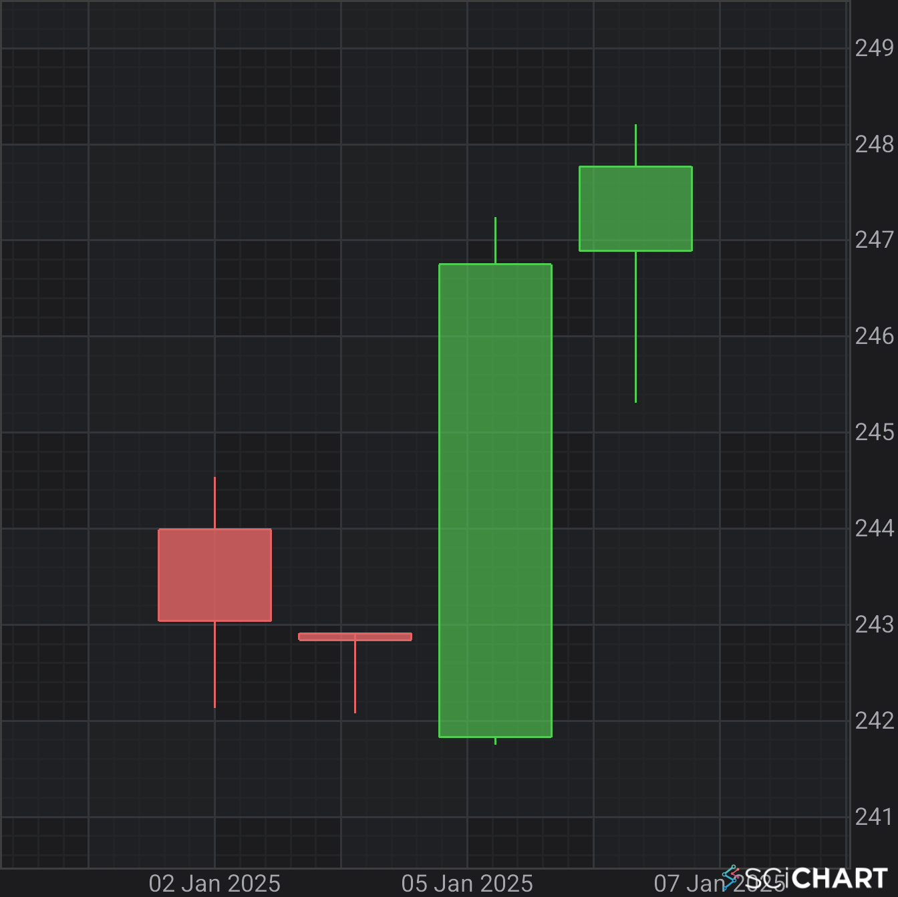
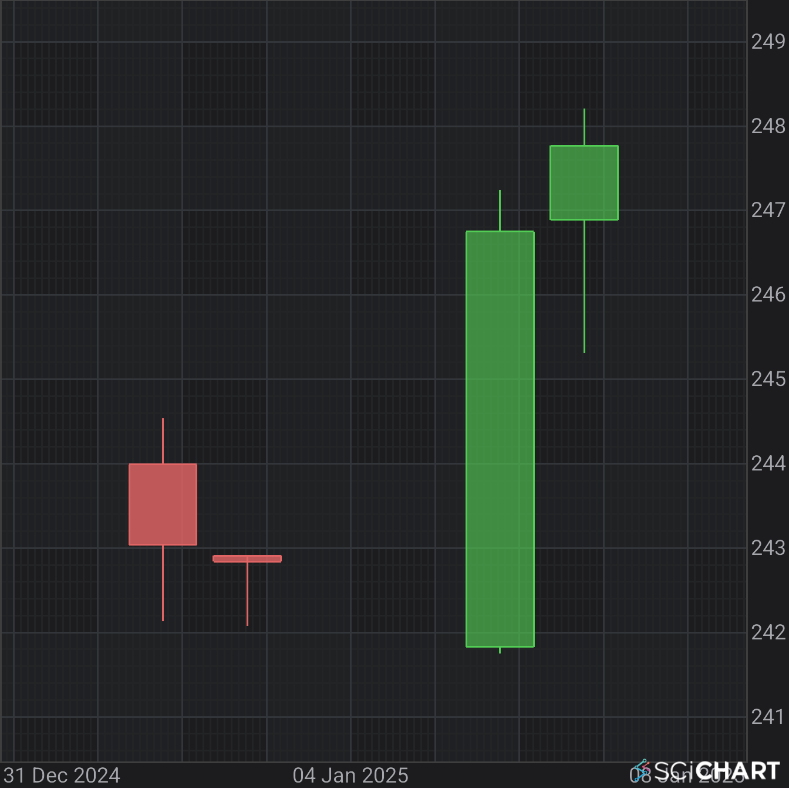

# Axis APIs - Index Date Axis

SciChart 2D Android Features several axis types which could be **Value**, **Category** or **Index Date Axis**. All inherit from <xref:com.scichart.charting.visuals.axes.AxisBase>.
So what's the difference between **Value** and **Index Date Axis** Axes? An explanation is given below.

**IndexDateAxis** is a value-based date axis capable of rendering date ticks based on indices, similar to the **CategoryDateAxis**.

Given the data:

| **Date (X-Axis)** | **Open** | **High** | **Low** | **Close** |
| ---------------- | :------: | :------: | :------: | :------: |
| 2-1-2025         | 243.99   | 244.54   | 242.13   | 243.04   |
| 3-1-2025         | 242.91   | 242.63   | 242.08   | 242.84   |
| 6-1-2025         | 241.83   | 247.24   | 241.75   | 246.75   |
| 7-1-2025         | 246.89   | 248.21   | 245.34   | 247.77   |

A Value X-Axis and Index Date X-Axis would display the data differently:

| **Index Date X-Axis**                        | **Date X-Axis**                        |
| ------------------------------------------ | --------------------------------------- |
|  |  |

Unlike the standard **DateAxis**, which uses actual date values, **IndexDateAxis** maps indices to date values, allowing for efficient rendering of date-based data where data points are evenly spaced or have a known order.

# [Java](#tab/java)
[!code-java[IndexDateAxis](../../../samples/sandbox/app/src/main/java/com/scichart/docsandbox/examples/java/axisAPIs/AxisAPIsIndexDateAxis.java#IndexDateAxis)]
# [Java with Builders API](#tab/javaBuilder)
[!code-java[CustomCalendarUnitDateFormatter](../../../samples/sandbox/app/src/main/java/com/scichart/docsandbox/examples/javaBuilder/axisAPIs/AxisAPIsIndexDateAxis.java#IndexDateAxis)]
# [Kotlin](#tab/kotlin)
[!code-swift[CustomCalendarUnitDateFormatter](../../../samples/sandbox/app/src/main/java/com/scichart/docsandbox/examples/kotlin/axisAPIs/AxisAPIsIndexDateAxis.kt#IndexDateAxis)]
***

For more information, refer to the [Axis APIs](xref:axis.AxisAPIs) article.