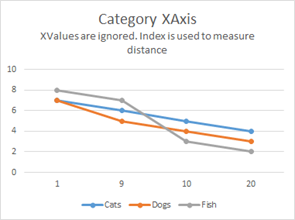
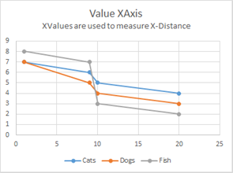

# Axis APIs - Value Axis vs. Category Axis

SciChart 2D Android Features several axis types which could be **Value** or **Category**. All inherit from <xref:com.scichart.charting.visuals.axes.AxisBase>.
So what's the difference between **Value** and **Category** Axes? An explanation is given below.

Given the data:

| **Age (X-Axis)** | **Cats** | **Dogs** | **Fish** |
| ---------------- | :------: | :------: | :------: |
| 1                | 7        | 7        | 8        |
| 9                | 6        | 5        | 7        |
| 10               | 5        | 4        | 3        |
| 20               | 4        | 3        | 2        |

A Value X-Axis and Category X-Axis would display the data differently:

| **Category X-Axis**                        | **Value X-Axis**                        |
| ------------------------------------------ | --------------------------------------- |
|  |  |

The fundamental difference is a **Value-Axis** uses the X-Value to compute distance on the XAxis, whereas a **Category-Axis** uses the X-Index. Value-Axis are primarily used in scientific software where Category–Axis are typically used in financial software (e.g. stock charts).

SciChart features both Value-Axis and Category-Axis types.

| **Axis Type**                                           | **Value or Category Axis** |
| ------------------------------------------------------- | -------------------------- |
| <xref:com.scichart.charting.visuals.axes.NumericAxis>   | Value Axis                 |
| <xref:com.scichart.charting.visuals.axes.LogarithmicNumericAxis> | Value Axis                 |
| <xref:com.scichart.charting.visuals.axes.DateAxis>      | Value Axis                 |
| <xref:com.scichart.charting.visuals.axes.CategoryDateAxis>        | Category Axis              |

For more information, refer to the [Axis APIs](xref:axis.AxisAPIs) article.