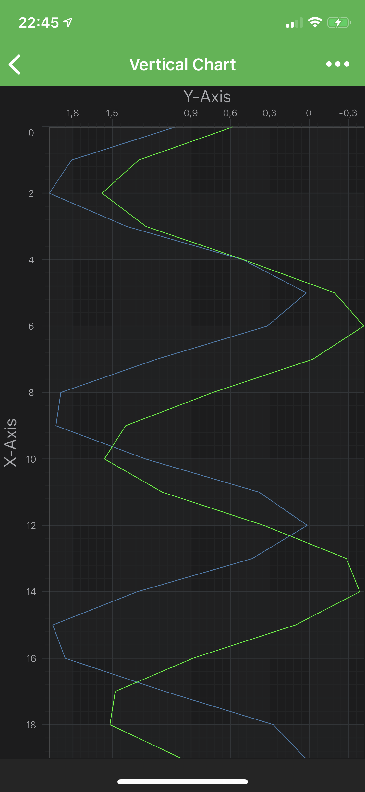
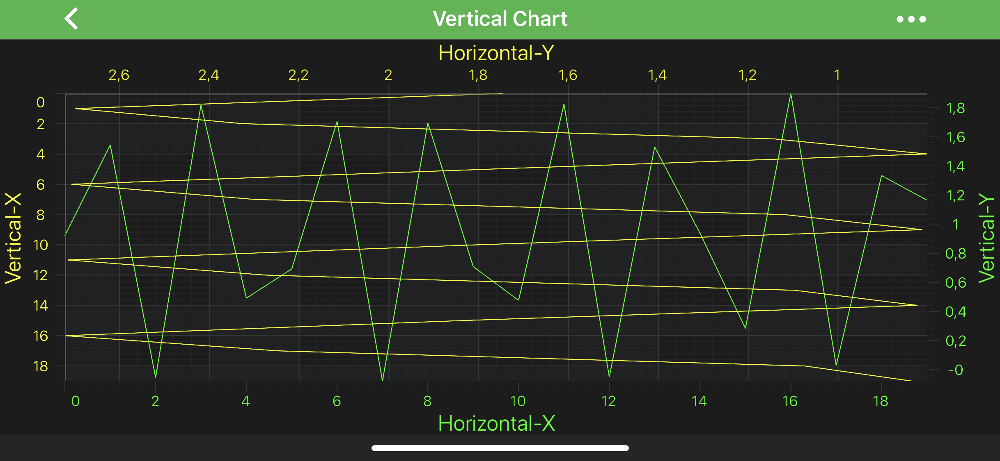

# Axis Alignment - Create a Vertical Chart
It is possible to create **Vertical (Rotated)** Charts with SciChart. To achieve this, simply set [axisAlignment](xref:com.scichart.charting.visuals.axes.IAxis.setAxisAlignment(com.scichart.charting.visuals.axes.AxisAlignment)) to Left or Right for **X Axis** and Top or Bottom for **Y Axis** using the <xref:com.scichart.charting.visuals.axes.AxisAlignment> enum. And that's it - SciChart will do everything else for you.

# [Java](#tab/java)
[!code-java[AddAxisAlignment](../../../samples/sandbox/app/src/main/java/com/scichart/docsandbox/examples/java/axisAPIs/AxisAlignmentCreateAVerticalChart.java#AddAxisAlignment)]
# [Java with Builders API](#tab/javaBuilder)
[!code-java[AddAxisAlignment](../../../samples/sandbox/app/src/main/java/com/scichart/docsandbox/examples/javaBuilder/axisAPIs/AxisAlignmentCreateAVerticalChart.java#AddAxisAlignment)]
# [Kotlin](#tab/kotlin)
[!code-swift[AddAxisAlignment](../../../samples/sandbox/app/src/main/java/com/scichart/docsandbox/examples/kotlin/axisAPIs/AxisAlignmentCreateAVerticalChart.kt#AddAxisAlignment)]
***

​

## Multiple axes support
Also, SciChart supports **unlimited, multiple X or Y axes** which can be aligned to the Right, Left, Top, Bottom sides of a chart. For more information - read [Adding an Axis](xref:axisAPIs.AddAxisToSciChartSurface#adding-an-axis) article. All that applies to [Vertical(Rotated)](#axis-alignment---create-a-vertical-chart) Charts as well, so any reasonable combination of differently aligned axes is allowed. This allows to create **mixed horizontal and vertical** charts:

# [Java](#tab/java)
[!code-java[AddMultipleAxes](../../../samples/sandbox/app/src/main/java/com/scichart/docsandbox/examples/java/axisAPIs/AxisAlignmentCreateAVerticalChart.java#AddMultipleAxes)]
# [Java with Builders API](#tab/javaBuilder)
[!code-java[AddMultipleAxes](../../../samples/sandbox/app/src/main/java/com/scichart/docsandbox/examples/javaBuilder/axisAPIs/AxisAlignmentCreateAVerticalChart.java#AddMultipleAxes)]
# [Kotlin](#tab/kotlin)
[!code-swift[AddMultipleAxes](../../../samples/sandbox/app/src/main/java/com/scichart/docsandbox/examples/kotlin/axisAPIs/AxisAlignmentCreateAVerticalChart.kt#AddMultipleAxes)]
***

> [!NOTE]
> Every **RenderableSeries** (chart types e.g. <xref:com.scichart.charting.visuals.renderableSeries.FastLineRenderableSeries>, <xref:com.scichart.charting.visuals.renderableSeries.FastCandlestickRenderableSeries> etc.), every [Annotation](xref:annotationsAPIs.AnnotationsAPIs) and some **Chart Modifiers** (e.g. <xref:com.scichart.charting.modifiers.PinchZoomModifier>, <xref:com.scichart.charting.modifiers.ZoomPanModifier>) requires to be measured against **particular axis** (in other words - **attached** to it). You **must** specify the **Axis ID** for them via the [xAxisId](xref:com.scichart.charting.visuals.renderableSeries.IRenderableSeries.setXAxisId(java.lang.String)) and [yAxisId](xref:com.scichart.charting.visuals.renderableSeries.IRenderableSeries.setYAxisId(java.lang.String)) properties.
>
> However, If you have only a **single X and Y Axis**, setting these ID properties **isn't required**. This is **required** only for the **multiple axis** cases.