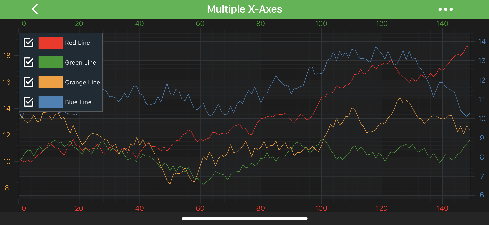

# Axis Alignment - Setting AxisAlignment
SciChart supports **unlimited, multiple X or Y** axes which can be aligned to the **Right, Left, Top, Bottom** sides of a chart. Axis may be placed by setting the [axisAlignment](xref:com.scichart.charting.visuals.axes.IAxis.setAxisAlignment(com.scichart.charting.visuals.axes.AxisAlignment)) property. Please see the code below:

# [Java](#tab/java)
[!code-java[AddAxisAlignment](../../../samples/sandbox/app/src/main/java/com/scichart/docsandbox/examples/java/axisAPIs/AxisAlignmentSettingAxisAlignment.java#AddAxisAlignment)]
# [Java with Builders API](#tab/javaBuilder)
[!code-java[AddAxisAlignment](../../../samples/sandbox/app/src/main/java/com/scichart/docsandbox/examples/javaBuilder/axisAPIs/AxisAlignmentSettingAxisAlignment.java#AddAxisAlignment)]
# [Kotlin](#tab/kotlin)
[!code-swift[AddAxisAlignment](../../../samples/sandbox/app/src/main/java/com/scichart/docsandbox/examples/kotlin/axisAPIs/AxisAlignmentSettingAxisAlignment.kt#AddAxisAlignment)]
***

The above code results in the following view. Also please see our [Multiple X-Axis Chart](https://www.scichart.com/example/android-chart-example-multiple-xaxis/). 

> [!NOTE]
> Every **RenderableSeries** (chart types e.g. <xref:com.scichart.charting.visuals.renderableSeries.FastLineRenderableSeries>, <xref:com.scichart.charting.visuals.renderableSeries.FastCandlestickRenderableSeries> etc.), every [Annotation](xref:annotationsAPIs.AnnotationsAPIs) and some **Chart Modifiers** (e.g. <xref:com.scichart.charting.modifiers.PinchZoomModifier>, <xref:com.scichart.charting.modifiers.ZoomPanModifier>) requires to be measured against **particular axis** (in other words - **attached** to it). You **must** specify the **Axis ID** for them via the [xAxisId](xref:com.scichart.charting.visuals.renderableSeries.IRenderableSeries.setXAxisId(java.lang.String)) and [yAxisId](xref:com.scichart.charting.visuals.renderableSeries.IRenderableSeries.setYAxisId(java.lang.String)) properties.
>
> However, If you have only a **single X and Y Axis**, setting these ID properties **isn't required**. This is **required** only for the **multiple axis** cases.