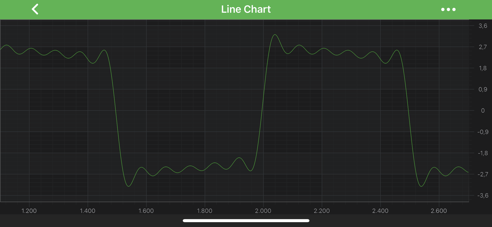
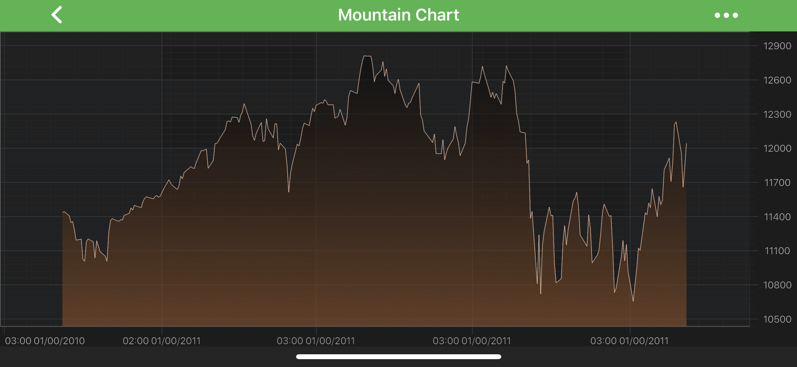

# Axis Labels - LabelProvider API
In SciChart **Axis Label** is a representation of Values on the axes. Axis labels make it easier to read teh chart data. Our API allows to edit and customize them data in many ways to meet your needs, please read on to learn how!

All Axis Types include the [labelProvider](xref:com.scichart.charting.visuals.axes.IAxisCore.setLabelProvider(com.scichart.charting.numerics.labelProviders.ILabelProvider)) property, which allows a class to be attached to an axis for complete control over axis label output.

Use a <xref:com.scichart.charting.numerics.labelProviders.LabelProviderBase> inheritors when you want to:

- Have fine grained control over Axis Text or Cursor Labels, depending on numeric (or date) values.
- Display strings on the XAxis, e.g. “Bananas”, “Oranges”, “Apples” and not “1”, “2”, “3”.
- Dynamically change the [textFormatting](xref:com.scichart.charting.visuals.axes.IAxisCore.setTextFormatting(java.lang.String)) as you zoom in or out.
- Dynamically change the [textFormatting](xref:com.scichart.charting.visuals.axes.IAxisCore.setTextFormatting(java.lang.String)) depending on Data-value.

By default each axis has a <xref:com.scichart.charting.numerics.labelProviders.ILabelProvider> created and assigned to it. The type of LabelProvider depends on the [type of Axis](xref:axis.AxisAPIs). Below is a table of the LabelProviders already defined in SciChart Android.

| **Label Provider Type**              | **Provide labels For**      |
| ------------------------------------ | --------------------------- | 
| <xref:com.scichart.charting.numerics.labelProviders.NumericLabelProvider>            | <xref:com.scichart.charting.visuals.axes.NumericAxis>             |
| <xref:com.scichart.charting.numerics.labelProviders.LogarithmicNumericLabelProvider> | <xref:com.scichart.charting.visuals.axes.LogarithmicNumericAxis>  |
| <xref:com.scichart.charting.numerics.labelProviders.DateLabelProvider>               | <xref:com.scichart.charting.visuals.axes.DateAxis>                |
| <xref:com.scichart.charting.numerics.labelProviders.TradeChartAxisLabelProvider>     | <xref:com.scichart.charting.visuals.axes.CategoryDateAxis>        |

The above label providers are inherited from <xref:com.scichart.charting.numerics.labelProviders.FormatterLabelProviderBase> which format labels using <xref:com.scichart.charting.numerics.labelProviders.ILabelFormatter> provided by inheritors. So if you want to customize the default formatting of the above - provide custom <xref:com.scichart.charting.numerics.labelProviders.ILabelFormatter> into the appropriate constructors.

## Creating custom ILabelFormatter
To create custom <xref:com.scichart.charting.numerics.labelProviders.ILabelFormatter>, you will need to implement the following methods:
- <xref:com.scichart.charting.numerics.labelProviders.ILabelFormatter.update(T)> - is called from associated <xref:com.scichart.charting.numerics.labelProviders.FormatterLabelProviderBase> to update this label formatter with values provided by axis.
- <xref:com.scichart.charting.numerics.labelProviders.LabelFormatterBase.formatLabel(double)> - is called internally for every axis tick value to get a text to show for corresponding axis label.
- <xref:com.scichart.charting.numerics.labelProviders.LabelFormatterBase.formatCursorLabel(double)> - is called to format data values for axis overlays, such as <xref:com.scichart.charting.modifiers.CursorModifier> axis labels.

Let's create custom <xref:com.scichart.charting.numerics.labelProviders.ILabelFormatter> for <xref:com.scichart.charting.visuals.axes.NumericAxis>

# [Java](#tab/java)
[!code-java[NumericLabelFormatter](../../../samples/sandbox/app/src/main/java/com/scichart/docsandbox/examples/java/axisAPIs/AxisLabelsLabelProviderAPI.java#NumericLabelFormatter)]
# [Java with Builders API](#tab/javaBuilder)
[!code-java[NumericLabelFormatter](../../../samples/sandbox/app/src/main/java/com/scichart/docsandbox/examples/javaBuilder/axisAPIs/AxisLabelsLabelProviderAPI.java#NumericLabelFormatter)]
# [Kotlin](#tab/kotlin)
[!code-swift[NumericLabelFormatter](../../../samples/sandbox/app/src/main/java/com/scichart/docsandbox/examples/kotlin/axisAPIs/AxisLabelsLabelProviderAPI.kt#NumericLabelFormatter)]
***

> [!NOTE]
> The other axis types require [different LabelProvider types](#axis-labels---labelprovider-api)

## Creating your own LabelProvider
You might want to create a your own, fully custom, **LabelProvider**.  To do so, - we simply create a class that inherits <xref:com.scichart.charting.numerics.labelProviders.LabelProviderBase> and provide the proper <xref:com.scichart.charting.visuals.axes.IAxis> interface, which should correspond to the axis which will use your label provider. From there, wou can override the following, similarly to the [Label Formatter](#creating-custom-ilabelformatter):
- <xref:com.scichart.charting.numerics.labelProviders.ILabelProvider.formatLabel(java.lang.Comparable)>
- <xref:com.scichart.charting.numerics.labelProviders.ILabelProvider.formatCursorLabel(java.lang.Comparable)>

The **first one** is called internally for every axis tick value to get a text to show for corresponding axis label. The **latter one** is called to format data values for axis overlays, such as <xref:com.scichart.charting.modifiers.CursorModifier> axis labels.

As mentioned above - the **LabelProvider** can be assigned to an axis via the [labelProvider](xref:com.scichart.charting.visuals.axes.IAxisCore.setLabelProvider(com.scichart.charting.numerics.labelProviders.ILabelProvider)) property.

Let's create custom **LabelProvider** for <xref:com.scichart.charting.visuals.axes.DateAxis>

# [Java](#tab/java)
[!code-java[DateLabelProvider](../../../samples/sandbox/app/src/main/java/com/scichart/docsandbox/examples/java/axisAPIs/AxisLabelsLabelProviderAPI.java#DateLabelProvider)]
# [Java with Builders API](#tab/javaBuilder)
[!code-java[DateLabelProvider](../../../samples/sandbox/app/src/main/java/com/scichart/docsandbox/examples/javaBuilder/axisAPIs/AxisLabelsLabelProviderAPI.java#DateLabelProvider)]
# [Kotlin](#tab/kotlin)
[!code-swift[DateLabelProvider](../../../samples/sandbox/app/src/main/java/com/scichart/docsandbox/examples/kotlin/axisAPIs/AxisLabelsLabelProviderAPI.kt#DateLabelProvider)]
***

> [!NOTE]
> dataValue parameter in - - <xref:com.scichart.charting.numerics.labelProviders.ILabelProvider.formatLabel(java.lang.Comparable)> and - <xref:com.scichart.charting.numerics.labelProviders.ILabelProvider.formatCursorLabel(java.lang.Comparable)> is always a double. It is different for different axis types:
> - For a <xref:com.scichart.charting.visuals.axes.NumericAxis> - the double-representation of the data.
> - For a <xref:com.scichart.charting.visuals.axes.DateAxis> - the [getTime()](https://developer.android.com/reference/java/util/Date#getTime())
> - For a <xref:com.scichart.charting.visuals.axes.CategoryDateAxis> - dataValue is the index to the data-series.

## More examples of LabelProvider usage
Several of the SciChart Android Chart Examples use the **LabelProvider**, including the following:
- [Android Stacked Column Chart Grouped Side by Side](https://www.scichart.com/example/android-chart-stacked-column-chart-grouped-side-by-side-example/)
- [Android Custom Chart Theme](https://www.scichart.com/example/android-chart-example-create-a-custom-theme/)

## See Also
- [Axis Labels - TextFormatting and CursorTextFormatting](xref:axisAPIs.AxisLabelsTextFormattingAndCursorTextFormatting)
