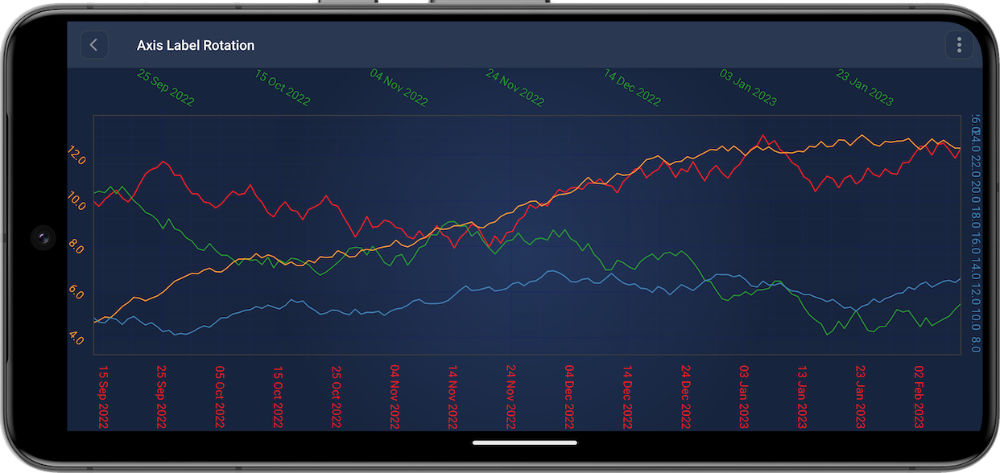
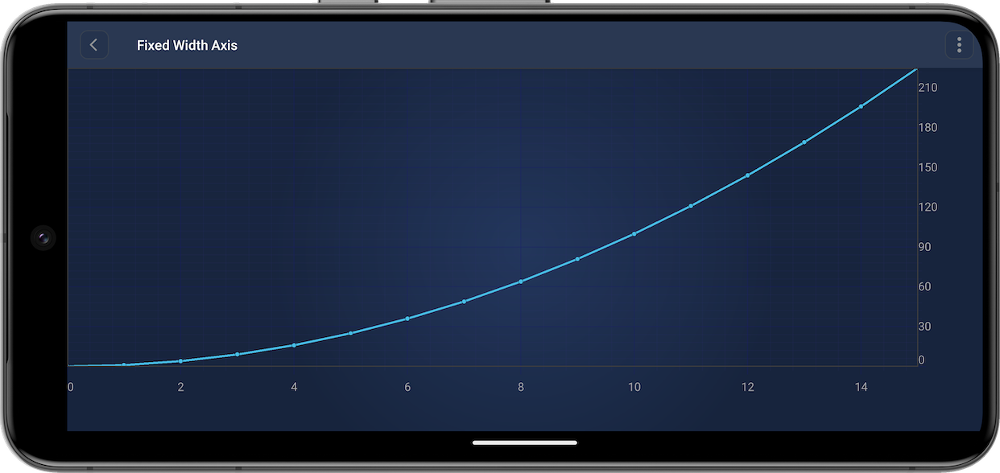

# Axis Labels - Rotation
Axis label rotation allows you to adjust the angle of the text labels on the chart axes. This is particularly useful when dealing with charts that have long labels, or when labels overlap, making it difficult to read the data points clearly. By rotating the labels, you can improve the overall aesthetics and readability of your charts.

**Axis API** allows to rotate axis label. There is the <xref:com.scichart.charting.visuals.axes.AxisBase.setAxisLabelRotation(java.lang.Integer)> property for this. Such axis label rotation can be set in code as shown below:

# [Java](#tab/java)
[!code-java[AddTextFormatting](../../../samples/sandbox/app/src/main/java/com/scichart/docsandbox/examples/java/axisAPIs/AxisLabelsTextRotationAndAxisSize.java#AddAxisLabelRotation)]
# [Java with Builders API](#tab/javaBuilder)
[!code-java[AddTextFormatting](../../../samples/sandbox/app/src/main/java/com/scichart/docsandbox/examples/javaBuilder/axisAPIs/AxisLabelsTextRotationAndAxisSize.java#AddAxisLabelRotation)]
# [Kotlin](#tab/kotlin)
[!code-swift[AddTextFormatting](../../../samples/sandbox/app/src/main/java/com/scichart/docsandbox/examples/kotlin/axisAPIs/AxisLabelsTextRotationAndAxisSize.kt#AddAxisLabelRotation)]
***

# Axis Labels - Axis size (width or height)
Adjusting the axis width gives you control over the thickness of the axis lines on your chart. This feature is useful for emphasizing certain data points, creating a more polished look, or ensuring that your chart's axes are proportionate to other graphical elements. Changing the axis width can help make your charts more visually appealing and easier to interpret.

**Axis API** allows to set axis size. There is the <xref:com.scichart.charting.visuals.axes.AxisBase.setFixedSize(java.lang.Integer)> property for this. Such axis size can be set in code as shown below:

# [Java](#tab/java)
[!code-java[AddTextFormatting](../../../samples/sandbox/app/src/main/java/com/scichart/docsandbox/examples/java/axisAPIs/AxisLabelsTextRotationAndAxisSize.java#AddAxisSize)]
# [Java with Builders API](#tab/javaBuilder)
[!code-java[AddTextFormatting](../../../samples/sandbox/app/src/main/java/com/scichart/docsandbox/examples/javaBuilder/axisAPIs/AxisLabelsTextRotationAndAxisSize.java#AddAxisSize)]
# [Kotlin](#tab/kotlin)
[!code-swift[AddTextFormatting](../../../samples/sandbox/app/src/main/java/com/scichart/docsandbox/examples/kotlin/axisAPIs/AxisLabelsTextRotationAndAxisSize.kt#AddAxisSize)]
***
