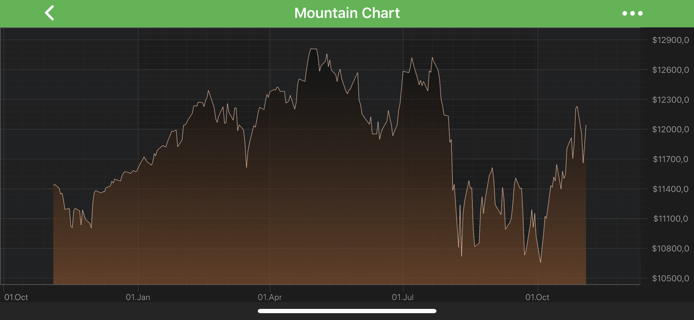
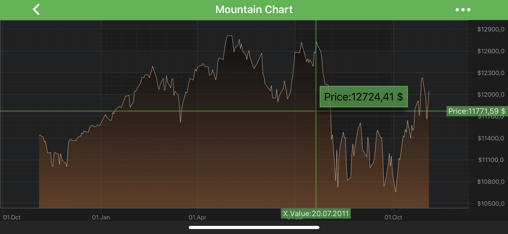
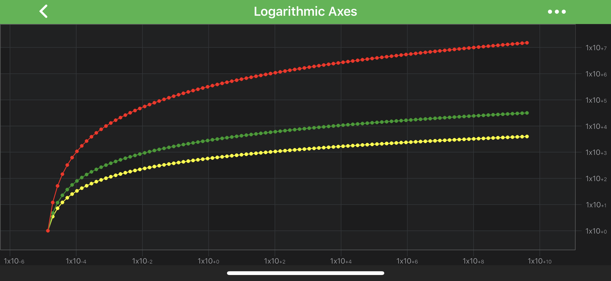

# Axis Labels - TextFormatting and CursorTextFormatting
All the axis classes obey standard Cocoa formatting strings, calling methods of the [Formatter APIs](https://developer.android.com/reference/java/util/Formatter) internally. Thus, standard [Date Formatters](https://developer.android.com/reference/java/text/DateFormat) and [Number Formatters](https://developer.android.com/reference/java/text/NumberFormat) strings patterns can be applied to format axis labels. There are the <xref:com.scichart.charting.visuals.axes.IAxisCore.setTextFormatting(java.lang.String)> and <xref:com.scichart.charting.visuals.axes.IAxisCore.setCursorTextFormatting(java.lang.String)> properties for this purpose. 

> [!NOTE]
> [DateFormat](https://developer.android.com/reference/java/text/DateFormat) and [NumberFormat](https://developer.android.com/reference/java/text/NumberFormat) relies on [Unicode Technical Standard #35](http://www.unicode.org/reports/tr35/tr35-31/tr35-numbers.html#Number_Format_Patterns)

See possible string patterns provided by [UTS#35](https://unicode.org/reports/tr35/tr35-31/)
- [Number Format Patterns](https://www.unicode.org/reports/tr35/tr35-31/tr35-numbers.html#Number_Format_Patterns)
- [Date Format Patterns](https://www.unicode.org/reports/tr35/tr35-31/tr35-dates.html#Date_Format_Patterns)

## Axis Labels Formatting
 **Axis API** allows to assign a formatting string for axis labels. There is the <xref:com.scichart.charting.visuals.axes.IAxisCore.setTextFormatting(java.lang.String)> property for this. Such formatting can be set in code as shown below:

# [Java](#tab/java)
[!code-java[AddTextFormatting](../../../samples/sandbox/app/src/main/java/com/scichart/docsandbox/examples/java/axisAPIs/AxisLabelsTextFormattingAndCursorTextFormatting.java#AddTextFormatting)]
# [Java with Builders API](#tab/javaBuilder)
[!code-java[AddTextFormatting](../../../samples/sandbox/app/src/main/java/com/scichart/docsandbox/examples/javaBuilder/axisAPIs/AxisLabelsTextFormattingAndCursorTextFormatting.java#AddTextFormatting)]
# [Kotlin](#tab/kotlin)
[!code-swift[AddTextFormatting](../../../samples/sandbox/app/src/main/java/com/scichart/docsandbox/examples/kotlin/axisAPIs/AxisLabelsTextFormattingAndCursorTextFormatting.kt#AddTextFormatting)]
***

> [!NOTE]
> Axis labels formatting is also applied to <xref:com.scichart.charting.visuals.annotations.AxisMarkerAnnotation> labels.

## Axis Cursor Text Formatting
 **Axis API** allows to assign a formatting string for axis overlays, such as <xref:com.scichart.charting.modifiers.CursorModifier> axis labels. Similarly to axis labels formatting, there is the <xref:com.scichart.charting.visuals.axes.IAxisCore.setCursorTextFormatting(java.lang.String)> property for this. Such formatting can be set in code as shown below:

# [Java](#tab/java)
[!code-java[AddCursorTextFormatting](../../../samples/sandbox/app/src/main/java/com/scichart/docsandbox/examples/java/axisAPIs/AxisLabelsTextFormattingAndCursorTextFormatting.java#AddCursorTextFormatting)]
# [Java with Builders API](#tab/javaBuilder)
[!code-java[AddCursorTextFormatting](../../../samples/sandbox/app/src/main/java/com/scichart/docsandbox/examples/javaBuilder/axisAPIs/AxisLabelsTextFormattingAndCursorTextFormatting.java#AddCursorTextFormatting)]
# [Kotlin](#tab/kotlin)
[!code-swift[AddCursorTextFormatting](../../../samples/sandbox/app/src/main/java/com/scichart/docsandbox/examples/kotlin/axisAPIs/AxisLabelsTextFormattingAndCursorTextFormatting.kt#AddCursorTextFormatting)]
***

## Numeric Axes and Scientific Notation
It is possible to render axis labels and text in tooltips in a shortened form using **scientific notation (standard form)**. This becomes an issue when working with large numbers. In this case axis size will grow to fit axis labels inside. This is a common issue when working with <xref:com.scichart.charting.visuals.axes.LogarithmicNumericAxis>.

To configure an axis to show numbers in this form, it is necessary that a [proper format string](https://developer.android.com/reference/java/util/Formatter#organization) is provided and <xref:com.scichart.charting.visuals.axes.ScientificNotation> is set to the desired value. There is a [scientificNotation](xref:com.scichart.charting.visuals.axes.INumericAxis.setScientificNotation(com.scichart.charting.visuals.axes.ScientificNotation)) property for this purpose. Possible options are listed below:
- <xref:com.scichart.charting.visuals.axes.ScientificNotation>.None - the default value.
- <xref:com.scichart.charting.visuals.axes.ScientificNotation>.Normalized - assumes 10 as base.
- <xref:com.scichart.charting.visuals.axes.ScientificNotation>.E - assumes the number E as base.
- <xref:com.scichart.charting.visuals.axes.ScientificNotation>.LogarithmicBase - used with <xref:com.scichart.charting.visuals.axes.LogarithmicNumericAxis>. Assumes the logarithmic base of the <xref:com.scichart.charting.visuals.axes.LogarithmicNumericAxis> as base.

An axis can be configured to use <xref:com.scichart.charting.visuals.axes.ScientificNotation> like follows:

# [Java](#tab/java)
[!code-java[AddScientificNotation](../../../samples/sandbox/app/src/main/java/com/scichart/docsandbox/examples/java/axisAPIs/AxisLabelsTextFormattingAndCursorTextFormatting.java#AddScientificNotation)]
# [Java with Builders API](#tab/javaBuilder)
[!code-java[AddScientificNotation](../../../samples/sandbox/app/src/main/java/com/scichart/docsandbox/examples/javaBuilder/axisAPIs/AxisLabelsTextFormattingAndCursorTextFormatting.java#AddScientificNotation)]
# [Kotlin](#tab/kotlin)
[!code-swift[AddScientificNotation](../../../samples/sandbox/app/src/main/java/com/scichart/docsandbox/examples/kotlin/axisAPIs/AxisLabelsTextFormattingAndCursorTextFormatting.kt#AddScientificNotation)]
***

## Dynamically Changing TextFormatting
For more advanced formatting scenarios, **Axis API** provides a feature called **LabelProviders**. It grants full control over text output of **every axis label**. This can be useful if required to customize textual representation of particular axis labels or replace all of them with other strings based on some logics. Please refer to the [LabelProvider API](xref:axisAPIs.AxisLabelsLabelProviderAPI) article for further details.