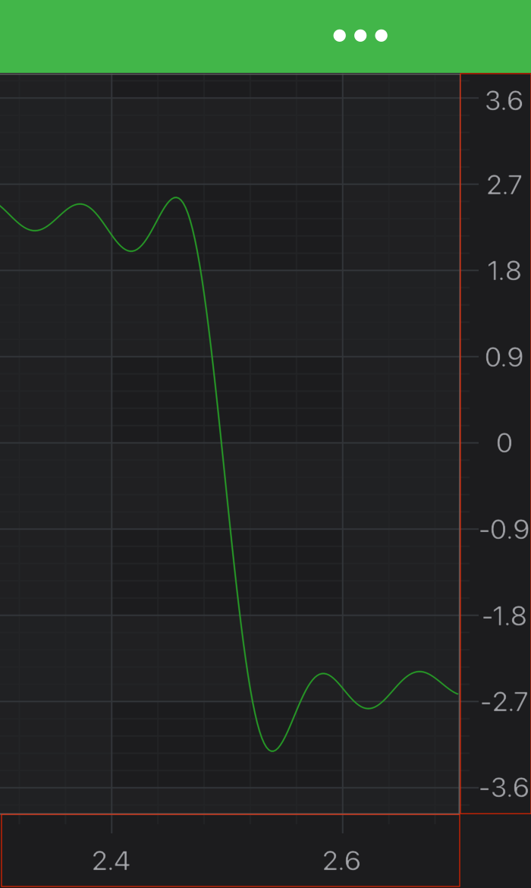
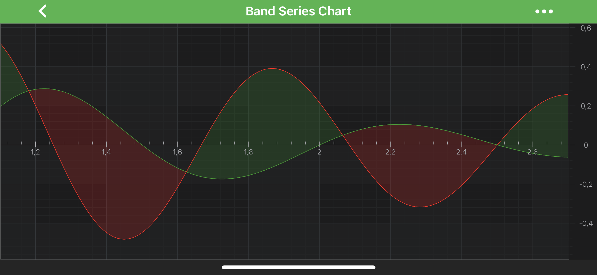
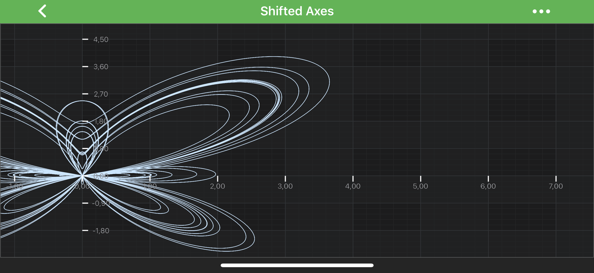

# Axis Layout - Central Axis
## Axis Placement
SciChart supports axes plaсed inside the chart area, a.k.a in the center of the chart. This behavior is controlled by [isCenterAxis](xref:com.scichart.charting.visuals.axes.IAxis.setIsCenterAxis(boolean)). By default, [isCenterAxis](xref:com.scichart.charting.visuals.axes.IAxis.setIsCenterAxis(boolean)) is set to `false`, and axes are drawing outside the chart. Here is the difference:

| **isCenterAxis == false**                                                 | **isCenterAxis == true**                                                |
| ------------------------------------------------------------------------- | ----------------------------------------------------------------------- |
|  |  |

The above cases are quite simple, whereas you can create completely custom layouts and specify the exact axis position inside the chart area. It requires changes to the layout process in <xref:com.scichart.charting.layoutManagers.ILayoutManager>. Please read on to learn how to do such an advanced layout.

## The Layout System
So let's dig into layout system a little bit. There is a Default implementation of <xref:com.scichart.charting.layoutManagers.ILayoutManager> - <xref:com.scichart.charting.layoutManagers.DefaultLayoutManager>, and it's responsible for positioning axes on a chart. 

The layout process consists of two passes for every axis, a measure pass and a layout pass. The <xref:com.scichart.charting.layoutManagers.ILayoutManager> conducts this process, doing calculations and providing all the necessary data to its <xref:com.scichart.charting.layoutManagers.IAxisLayoutStrategy> fields. Every **AxisLayoutStrategy** field handles a specific <xref:com.scichart.charting.visuals.axes.AxisAlignment> case and is responsible for placing axes with corresponding **Alignment** inside the boundaries provided by the <xref:com.scichart.charting.layoutManagers.ILayoutManager>.

The layout takes place in the <xref:com.scichart.charting.layoutManagers.ILayoutManager.onLayoutChart(int,int)> method. It orderly calls 
- <xref:com.scichart.charting.layoutManagers.IAxisLayoutStrategy.measureAxes(int,int,com.scichart.charting.layoutManagers.ChartLayoutState)>
- <xref:com.scichart.charting.layoutManagers.IAxisLayoutStrategy.layoutAxes(int,int,int,int)>

during the measure and layout passes and returns **evaluated viewport size** as the result.

The layout process is triggered by the <xref:com.scichart.charting.visuals.SciChartSurface> in response to different state changes. It is an essential part of a **render process**.

## Customizing Layout of Axes
Usually you don't need to create a custom <xref:com.scichart.charting.layoutManagers.ILayoutManager>, but rather to provide a custom <xref:com.scichart.charting.layoutManagers.IAxisLayoutStrategy> for a specific <xref:com.scichart.charting.visuals.axes.AxisAlignment> mode, _e.g. for bottom axes layout or right axes layout, or both_. It is possible to extend an existing <xref:com.scichart.charting.layoutManagers.IAxisLayoutStrategy> class and change its behavior to better serve your purposes. Please find a list of the  strategies out of the box below:
- <xref:com.scichart.charting.layoutManagers.TopAlignmentOuterAxisLayoutStrategy>
- <xref:com.scichart.charting.layoutManagers.TopAlignmentInnerAxisLayoutStrategy>
- <xref:com.scichart.charting.layoutManagers.BottomAlignmentOuterAxisLayoutStrategy> 
- <xref:com.scichart.charting.layoutManagers.BottomAlignmentInnerAxisLayoutStrategy> 
- <xref:com.scichart.charting.layoutManagers.LeftAlignmentOuterAxisLayoutStrategy> 
- <xref:com.scichart.charting.layoutManagers.LeftAlignmentInnerAxisLayoutStrategy> 
- <xref:com.scichart.charting.layoutManagers.RightAlignmentOuterAxisLayoutStrategy> 
- <xref:com.scichart.charting.layoutManagers.RightAlignmentInnerAxisLayoutStrategy> 

## Pinned Axes
You might want to have your axis exactly at the center of the chart. Let's say the **X-Axis**. To do just that, we can extend the <xref:com.scichart.charting.layoutManagers.TopAlignmentOuterAxisLayoutStrategy> class (or any suitable horizontal strategy) and make the stack of the **top-aligned X axes** to start exactly **at the center** of a chart.  Let's try to build that and apply the newly created layout strategy to a <xref:com.scichart.charting.layoutManagers.DefaultLayoutManager.topInnerAxesLayoutStrategy> and then - to the <xref:com.scichart.charting.visuals.SciChartSurface>:

# [Java](#tab/java)
[!code-java[CreateCenteredAxisLayoutStrategy](../../../samples/sandbox/app/src/main/java/com/scichart/docsandbox/examples/java/axisAPIs/AxisLayoutCentralAxis.java#CreateCenteredAxisLayoutStrategy)]
[!code-java[UseCenteredAxisLayoutStrategy](../../../samples/sandbox/app/src/main/java/com/scichart/docsandbox/examples/java/axisAPIs/AxisLayoutCentralAxis.java#UseCenteredAxisLayoutStrategy)]
# [Java with Builders API](#tab/javaBuilder)
[!code-java[CreateCenteredAxisLayoutStrategy](../../../samples/sandbox/app/src/main/java/com/scichart/docsandbox/examples/javaBuilder/axisAPIs/AxisLayoutCentralAxis.java#CreateCenteredAxisLayoutStrategy)]
[!code-java[UseCenteredAxisLayoutStrategy](../../../samples/sandbox/app/src/main/java/com/scichart/docsandbox/examples/javaBuilder/axisAPIs/AxisLayoutCentralAxis.java#UseCenteredAxisLayoutStrategy)]
# [Kotlin](#tab/kotlin)
[!code-swift[CreateCenteredAxisLayoutStrategy](../../../samples/sandbox/app/src/main/java/com/scichart/docsandbox/examples/kotlin/axisAPIs/AxisLayoutCentralAxis.kt#CreateCenteredAxisLayoutStrategy)]
[!code-swift[UseCenteredAxisLayoutStrategy](../../../samples/sandbox/app/src/main/java/com/scichart/docsandbox/examples/kotlin/axisAPIs/AxisLayoutCentralAxis.kt#UseCenteredAxisLayoutStrategy)]
***

As the result, the **X Axis** should be placed **at the center** of a chart. It should look very similar to this:

## Floating Axes
Another possible scenario, **floating axes**, can be found in the example called [Central X Axis and Y Axis](https://www.scichart.com/example/android-chart/android-chart-example-central-xaxis-and-yaxis/) from the [SciChart Android Example Suite](https://www.scichart.com/examples/Android-chart/).

In this case each axis is pinned to 0 value of the other axis. To achieve this, the pixel coordinate of the `0` data value is looked for during every layout pass, using the [Coordinate Transformation API](xref:axisAPIs.AxisAPIsConvertPixelToDataCoordinates):

# [Java](#tab/java)
[!code-java[CreateCenteredTopAlignmentInnerAxisLayoutStrategy](../../../samples/sandbox/app/src/main/java/com/scichart/docsandbox/examples/java/axisAPIs/AxisLayoutCentralAxis.java#CreateCenteredTopAlignmentInnerAxisLayoutStrategy)]
# [Java with Builders API](#tab/javaBuilder)
[!code-java[CreateCenteredTopAlignmentInnerAxisLayoutStrategy](../../../samples/sandbox/app/src/main/java/com/scichart/docsandbox/examples/javaBuilder/axisAPIs/AxisLayoutCentralAxis.java#CreateCenteredTopAlignmentInnerAxisLayoutStrategy)]
# [Kotlin](#tab/kotlin)
[!code-swift[CreateCenteredTopAlignmentInnerAxisLayoutStrategy](../../../samples/sandbox/app/src/main/java/com/scichart/docsandbox/examples/kotlin/axisAPIs/AxisLayoutCentralAxis.kt#CreateCenteredTopAlignmentInnerAxisLayoutStrategy)]
***

As it can be seen in the example, both axes are **pinned to a given data value**, not to a specific position inside the chart area. Thus they will adjust their positions accordingly to VisibleRange changes. Please refer to the [Central X Axis and Y Axis Example](https://www.scichart.com/example/android-chart/android-chart-example-central-xaxis-and-yaxis/) to find the complete code sample.

For more examples of **custom axes layouts**, please refer to the [Stack Axes Vertically or Horizontally](xref:axisAPIs.AxisLayoutStackAxesVerticallyOrHorizontally) article.

## Advanced Axes Layout Customization
For more advanced layout **customization** it is possible to override **the whole layout process**. To achieve this, a custom <xref:com.scichart.charting.layoutManagers.ILayoutManager> is required with a custom layout process implemented in the <xref:com.scichart.charting.layoutManagers.ILayoutManager.onLayoutChart(int,int)> method.
