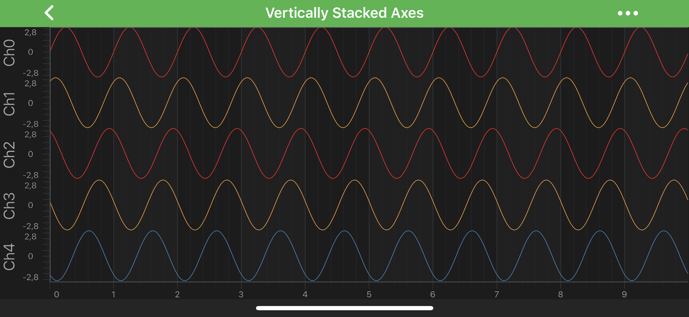

# Axis Layout - Stack Axes Vertically or Horizontally
It is possible to make **axes to stack up** vertically or horizontally with Chart. It requires customization of the default chart layout process. Please refer to the [Central Axis](xref:axisAPIs.AxisLayoutCentralAxis) article to learn more about the layout processes and ways to customize them.

## Stacking Axes Vertically 
In the code snippet below, a custom <xref:com.scichart.charting.layoutManagers.IAxisLayoutStrategy> is created for all the left-aligned axes that belong to a chart. Let's discuss the methods which needs to be implemented:
- <xref:com.scichart.charting.layoutManagers.IAxisLayoutStrategy.measureAxes(int,int,com.scichart.charting.layoutManagers.ChartLayoutState)>: override the size of the left axes area is calculated, setting the corresponding field of the <xref:com.scichart.charting.visuals.axes.AxisLayoutState> object. It provides a value feedback to the <xref:com.scichart.charting.layoutManagers.ILayoutManager> after the measure pass ends.

- <xref:com.scichart.charting.layoutManagers.IAxisLayoutStrategy.layoutAxes(int,int,int,int)>: override every axis is given a position at the top of the previous one.

Let's try implement that and apply newly created layout strategy to a <xref:com.scichart.charting.layoutManagers.DefaultLayoutManager.leftOuterAxesLayoutStrategy> and then - to the <xref:com.scichart.charting.visuals.SciChartSurface>:

# [Java](#tab/java)
[!code-java[CreateLeftAlignedOuterVerticallyStackedYAxisLayoutStrategy](../../../samples/sandbox/app/src/main/java/com/scichart/docsandbox/examples/java/axisAPIs/AxisLayoutStackAxesVerticallyOrHorizontally.java#CreateLeftAlignedOuterVerticallyStackedYAxisLayoutStrategy)]
[!code-java[UseLeftAlignedOuterVerticallyStackedYAxisLayoutStrategy](../../../samples/sandbox/app/src/main/java/com/scichart/docsandbox/examples/java/axisAPIs/AxisLayoutStackAxesVerticallyOrHorizontally.java#UseLeftAlignedOuterVerticallyStackedYAxisLayoutStrategy)]
# [Java with Builders API](#tab/javaBuilder)
[!code-java[CreateLeftAlignedOuterVerticallyStackedYAxisLayoutStrategy](../../../samples/sandbox/app/src/main/java/com/scichart/docsandbox/examples/javaBuilder/axisAPIs/AxisLayoutStackAxesVerticallyOrHorizontally.java#CreateLeftAlignedOuterVerticallyStackedYAxisLayoutStrategy)]
[!code-java[UseLeftAlignedOuterVerticallyStackedYAxisLayoutStrategy](../../../samples/sandbox/app/src/main/java/com/scichart/docsandbox/examples/javaBuilder/axisAPIs/AxisLayoutStackAxesVerticallyOrHorizontally.java#UseLeftAlignedOuterVerticallyStackedYAxisLayoutStrategy)]
# [Kotlin](#tab/kotlin)
[!code-swift[CreateLeftAlignedOuterVerticallyStackedYAxisLayoutStrategy](../../../samples/sandbox/app/src/main/java/com/scichart/docsandbox/examples/kotlin/axisAPIs/AxisLayoutStackAxesVerticallyOrHorizontally.kt#CreateLeftAlignedOuterVerticallyStackedYAxisLayoutStrategy)]
[!code-swift[UseLeftAlignedOuterVerticallyStackedYAxisLayoutStrategy](../../../samples/sandbox/app/src/main/java/com/scichart/docsandbox/examples/kotlin/axisAPIs/AxisLayoutStackAxesVerticallyOrHorizontally.kt#UseLeftAlignedOuterVerticallyStackedYAxisLayoutStrategy)]
***

Please refer to the [Vertically Stacked Y Axes](https://www.scichart.com/example/android-chart-example-vertically-stacked-yaxes/) to find the complete code sample.

For more examples of **custom axes layouts**, please refer to the [Central Axis](xref:axisAPIs.AxisLayoutCentralAxis) article.