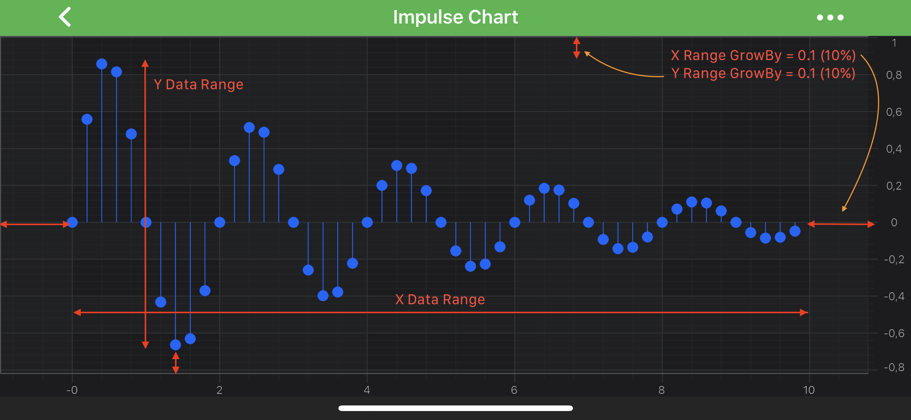

# Axis Ranging - Get or Set VisibleRange

## How to modify VisibleRange for different Axis Types
To programmatically range an axis, set the property <xref:com.scichart.charting.visuals.axes.IAxisCore.setVisibleRange(com.scichart.data.model.IRange)>.

> [!NOTE]
> The type of object that needs to be applied to the Axis VisibleRange depends on the axis type.

For more information about setting VisibleRange on particular Axis type - please see the following:
- [NumericAxis](xref:axis.AxisAPIs#numericaxis)
- [LogarithmicNumericAxis](xref:axis.AxisAPIs#logarithmicnumericaxis)
- [DateAxis](xref:axis.AxisAPIs#dateaxis)
- [CategoryDateAxis](xref:axis.AxisAPIs#categorydateaxis)

## Adding Padding or Spacing with GrowBy
Also, it is possible to **add spacing** to the VisibleRange via the <xref:com.scichart.charting.visuals.axes.IAxisCore.setGrowBy(com.scichart.data.model.IRange&lt;java.lang.Double&gt;)> property. It allows to specify two fractions which will be always applied to the [min](xref:com.scichart.data.model.IRange.setMin(T)), [max](xref:com.scichart.data.model.IRange.setMax(T)) values of the axes VisibleRange:

# [Java](#tab/java)
[!code-java[SetGrowBy](../../../samples/sandbox/app/src/main/java/com/scichart/docsandbox/examples/java/axisAPIs/AxisRangingGetOrSetVisibleRange.java#SetGrowBy)]
# [Java with Builders API](#tab/javaBuilder)
[!code-java[SetGrowBy](../../../samples/sandbox/app/src/main/java/com/scichart/docsandbox/examples/javaBuilder/axisAPIs/AxisRangingGetOrSetVisibleRange.java#SetGrowBy)]
# [Kotlin](#tab/kotlin)
[!code-swift[SetGrowBy](../../../samples/sandbox/app/src/main/java/com/scichart/docsandbox/examples/kotlin/axisAPIs/AxisRangingGetOrSetVisibleRange.kt#SetGrowBy)]
***

In the code snippet above, the GrowBy of 0.1 will be applied to the VisibleRange resulting in actual VisibleRange increased by a fraction of 0.1 (10%), i.e. `Min = -1, Max = 11`.

## Zooming to fit all the Data
Sometimes it is required to make an axis to show the **full extent of the data** associated with it. There are several ways to achieve this in code:
- set the <xref:com.scichart.charting.visuals.axes.IAxisCore.setVisibleRange(com.scichart.data.model.IRange)> to the <xref:com.scichart.charting.visuals.axes.IAxisCore.getDataRange()> value.
- configure the axis to auto adjust correspondingly to data changes. See the [AutoRange](xref:axisAPIs.AxisRangingAutoRange) article.
- call the <xref:com.scichart.charting.visuals.ISciChartController> methods from <xref:com.scichart.charting.visuals.SciChartSurface> such as <xref:com.scichart.charting.visuals.ISciChartController.zoomExtents()>.
- call the <xref:com.scichart.charting.visuals.ISciChartController> methods from <xref:com.scichart.charting.viewportManagers.IViewportManager> such as <xref:com.scichart.charting.visuals.ISciChartController.zoomExtents()>.

To change the VisibleRange by touch interaction with a chart, please read about our [ChartModifier APIs](xref:chartModifierAPIs.ChartModifierAPIs).
