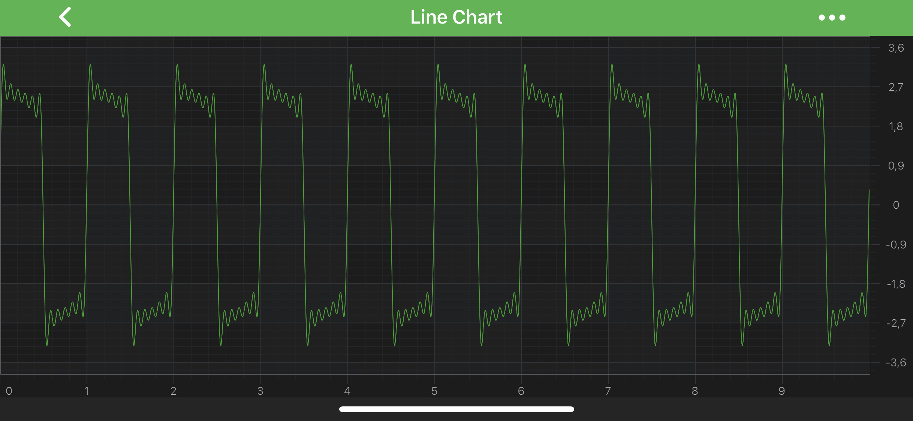
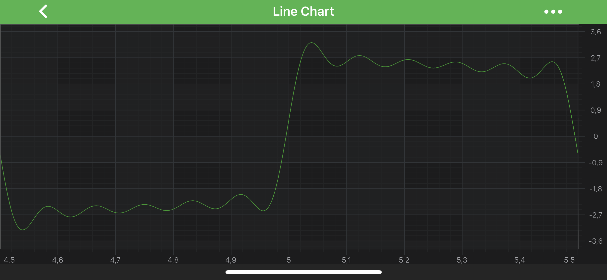

# Axis Ranging - Restricting VisibleRange

## Clipping the Axis VisibleRange on Zoom and Pan using the VisibleRangeLimit
Given a chart with data in the range of `[0, 10]`, when you zoom to extents, the axis will have a VisibleRange of `[0, 10]`. Sometimes this is not desirable, and you want to clip the <xref:com.scichart.charting.visuals.axes.IAxisCore.setVisibleRange(com.scichart.data.model.IRange)> inside the data-range.
To do this, you can use the [visibleRangeLimit](xref:com.scichart.charting.visuals.axes.IAxisCore.setVisibleRangeLimit(com.scichart.data.model.IRange)) property.

For example. Given an axis without any limits ([visibleRangeLimit](xref:com.scichart.charting.visuals.axes.IAxisCore.setVisibleRangeLimit(com.scichart.data.model.IRange)) = nil). When we perform ZoomExtents on the chart, the `XAxis` gets the visible range `[0, 10]`:

Actual XAxis.dataRange = [0, 10]; XAxis.visibleRangeLimit = nil; XAxis.visibleRange after ZoomExtents = [0, 10]

So let's set [visibleRangeLimit](xref:com.scichart.charting.visuals.axes.IAxisCore.setVisibleRangeLimit(com.scichart.data.model.IRange)) = `[4.5, 5.5]`

# [Java](#tab/java)
[!code-java[SetVisibleRangeLimit](../../../samples/sandbox/app/src/main/java/com/scichart/docsandbox/examples/java/axisAPIs/AxisRangingRestrictingVisibleRange.java#SetVisibleRangeLimit)]
# [Java with Builders API](#tab/javaBuilder)
[!code-java[SetVisibleRangeLimit](../../../samples/sandbox/app/src/main/java/com/scichart/docsandbox/examples/javaBuilder/axisAPIs/AxisRangingRestrictingVisibleRange.java#SetVisibleRangeLimit)]
# [Kotlin](#tab/kotlin)
[!code-swift[SetVisibleRangeLimit](../../../samples/sandbox/app/src/main/java/com/scichart/docsandbox/examples/kotlin/axisAPIs/AxisRangingRestrictingVisibleRange.kt#SetVisibleRangeLimit)]
***

After setting such **VisibleRangeLimit** and using ZoomExtents we now get an `XAxis.visibleRange = [4.5, 5.5]`. In other words, zooming has clipped or limited the visibleRange to `[4.5, 5.5]`

> [!NOTE]
> **VisibleRangeLimit** expects a minimum and maximum value according to the <xref:com.scichart.charting.visuals.axes.IAxisCore.setVisibleRange(com.scichart.data.model.IRange)> type.

Actual XAxis.dataRange = [0, 10]; XAxis.visibleRangeLimit = [4.5, 5.5]; XAxis.visibleRange after ZoomExtents = [4.5, 5.5]

## VisibleRangeLimit Modes
Sometimes it is required to have **one end** of VisibleRange **fixed** or restrict VisibleRange either by [min](xref:com.scichart.data.model.IRange.setMin(T)) or [max](xref:com.scichart.data.model.IRange.setMax(T)) value. For that purposes, Axis API exposes <xref:com.scichart.data.model.RangeClipMode>. It allows to specify [visibleRangeLimitMode](xref:com.scichart.charting.visuals.axes.IAxisCore.setVisibleRangeLimitMode(com.scichart.data.model.RangeClipMode)) property to choose a behavior which is best suitable for a particular scenario.

- <xref:com.scichart.data.model.RangeClipMode.MinMax> – (Default) allows clipping at Min and Max.
- <xref:com.scichart.data.model.RangeClipMode.Max> - allows clipping only at Max.
- <xref:com.scichart.data.model.RangeClipMode.Min> - allows clipping only at Min.

Use this property if you wish to ensure that one side of the chart is always clipped, while the other side is not. For instance:

# [Java](#tab/java)
[!code-java[SetVisibleRangeLimitMode](../../../samples/sandbox/app/src/main/java/com/scichart/docsandbox/examples/java/axisAPIs/AxisRangingRestrictingVisibleRange.java#SetVisibleRangeLimitMode)]
# [Java with Builders API](#tab/javaBuilder)
[!code-java[SetVisibleRangeLimitMode](../../../samples/sandbox/app/src/main/java/com/scichart/docsandbox/examples/javaBuilder/axisAPIs/AxisRangingRestrictingVisibleRange.java#SetVisibleRangeLimitMode)]
# [Kotlin](#tab/kotlin)
[!code-swift[SetVisibleRangeLimitMode](../../../samples/sandbox/app/src/main/java/com/scichart/docsandbox/examples/kotlin/axisAPIs/AxisRangingRestrictingVisibleRange.kt#SetVisibleRangeLimitMode)]
***

Results in a chart that always sets `axis.visibleRange.min = 0` when you zoom to extents.

> [!NOTE]
> VisibleRangeLimit does not clip data range when VisibleRangeLimit is greater than data range. In this case after ZoomExtents you’ll get the actual data range.

## Advanced VisibleRange Clipping
[visibleRangeLimit](xref:com.scichart.charting.visuals.axes.IAxisCore.setVisibleRangeLimit(com.scichart.data.model.IRange)) is a useful API to ensure the axis clips the visibleRange when zooming to extents. However, it will not stop a user from scrolling outside of that range. To achieve that, you will need to clip the visibleRange in code.

To clip the <xref:com.scichart.charting.visuals.axes.IAxisCore.setVisibleRange(com.scichart.data.model.IRange)> and force a certain maximum or minimum, just use the following code:

# [Java](#tab/java)
[!code-java[AdvancedVisibleRangeClipping](../../../samples/sandbox/app/src/main/java/com/scichart/docsandbox/examples/java/axisAPIs/AxisRangingRestrictingVisibleRange.java#AdvancedVisibleRangeClipping)]
# [Java with Builders API](#tab/javaBuilder)
[!code-java[AdvancedVisibleRangeClipping](../../../samples/sandbox/app/src/main/java/com/scichart/docsandbox/examples/javaBuilder/axisAPIs/AxisRangingRestrictingVisibleRange.java#AdvancedVisibleRangeClipping)]
# [Kotlin](#tab/kotlin)
[!code-swift[AdvancedVisibleRangeClipping](../../../samples/sandbox/app/src/main/java/com/scichart/docsandbox/examples/kotlin/axisAPIs/AxisRangingRestrictingVisibleRange.kt#AdvancedVisibleRangeClipping)]
***

## Minimum or Maximum Zoom Level
If you want to constrain zoom depth in your application, the [minimalZoomConstrain](xref:com.scichart.charting.visuals.axes.IAxisCore.setMinimalZoomConstrain(java.lang.Comparable)) allows you to specify the minimal difference between `Min` and `Max` values of axis VisibleRange. If the difference becomes less than MinimalZoomConstrain value - then VisibleRange will not change.

It is also possible to specify the [maximumZoomConstrain](xref:com.scichart.charting.visuals.axes.IAxisCore.setMaximumZoomConstrain(java.lang.Comparable)) which defines the maximal difference between `Min` and `Max` values of axis VisibleRange. If the difference becomes more than MaximumZoomConstrain value - then VisibleRange will not change.

Read on to learn how to apply Minimum or Maximum Zoom Level for different Axis Types.

### Specifying ZoomConstrains for NumericAxis
In the following code we are going to specify the visibleRange for <xref:com.scichart.charting.visuals.axes.NumericAxis>. It should never become `less than 10` and `greater than 100`. In other words - always be in range of `[10, 100]`.

# [Java](#tab/java)
[!code-java[ZoomConstrainsForNumericAxis](../../../samples/sandbox/app/src/main/java/com/scichart/docsandbox/examples/java/axisAPIs/AxisRangingRestrictingVisibleRange.java#ZoomConstrainsForNumericAxis)]
# [Java with Builders API](#tab/javaBuilder)
[!code-java[ZoomConstrainsForNumericAxis](../../../samples/sandbox/app/src/main/java/com/scichart/docsandbox/examples/javaBuilder/axisAPIs/AxisRangingRestrictingVisibleRange.java#ZoomConstrainsForNumericAxis)]
# [Kotlin](#tab/kotlin)
[!code-swift[ZoomConstrainsForNumericAxis](../../../samples/sandbox/app/src/main/java/com/scichart/docsandbox/examples/kotlin/axisAPIs/AxisRangingRestrictingVisibleRange.kt#ZoomConstrainsForNumericAxis)]
***

### Specifying ZoomConstrains for CategoryDateAxis
ZoomConstrains works differently if set on <xref:com.scichart.charting.visuals.axes.CategoryDateAxis>. It determines the min/max zoom level on an axis which is possible to show by the specifying the amount of data points. 

# [Java](#tab/java)
[!code-java[ZoomConstrainsForCategoryDateAxis](../../../samples/sandbox/app/src/main/java/com/scichart/docsandbox/examples/java/axisAPIs/AxisRangingRestrictingVisibleRange.java#ZoomConstrainsForCategoryDateAxis)]
# [Java with Builders API](#tab/javaBuilder)
[!code-java[ZoomConstrainsForCategoryDateAxis](../../../samples/sandbox/app/src/main/java/com/scichart/docsandbox/examples/javaBuilder/axisAPIs/AxisRangingRestrictingVisibleRange.java#ZoomConstrainsForCategoryDateAxis)]
# [Kotlin](#tab/kotlin)
[!code-swift[ZoomConstrainsForCategoryDateAxis](../../../samples/sandbox/app/src/main/java/com/scichart/docsandbox/examples/kotlin/axisAPIs/AxisRangingRestrictingVisibleRange.kt#ZoomConstrainsForCategoryDateAxis)]
***

In the code above, VisibleRange should show `no less than 10` data points as well as `no more that 100` data points.

### Specifying ZoomConstrains for DateAxis
<xref:com.scichart.charting.visuals.axes.DateAxis> has its specifics as well. It's VisibleRange is of <xref:com.scichart.data.model.DateRange> type, so the Zoom Constraints is designed to specify the difference between two dates in seconds. Setting Zoom Constraints on a DateRange, you ensure that your `axis.visibleRange.diff` will never become less than the [minimalZoomConstrain](xref:com.scichart.charting.visuals.axes.IAxisCore.setMinimalZoomConstrain(java.lang.Comparable)) value and more than [maximumZoomConstrain](xref:com.scichart.charting.visuals.axes.IAxisCore.setMaximumZoomConstrain(java.lang.Comparable)).

> [!NOTE]
> For convenience, SciChart provides a bunch of helper methods in the <xref:com.scichart.core.utility.DateIntervalUtil> class:

# [Java](#tab/java)
[!code-java[ZoomConstrainsForDateAxis](../../../samples/sandbox/app/src/main/java/com/scichart/docsandbox/examples/java/axisAPIs/AxisRangingRestrictingVisibleRange.java#ZoomConstrainsForDateAxis)]
# [Java with Builders API](#tab/javaBuilder)
[!code-java[ZoomConstrainsForDateAxis](../../../samples/sandbox/app/src/main/java/com/scichart/docsandbox/examples/javaBuilder/axisAPIs/AxisRangingRestrictingVisibleRange.java#ZoomConstrainsForDateAxis)]
# [Kotlin](#tab/kotlin)
[!code-swift[ZoomConstrainsForDateAxis](../../../samples/sandbox/app/src/main/java/com/scichart/docsandbox/examples/kotlin/axisAPIs/AxisRangingRestrictingVisibleRange.kt#ZoomConstrainsForDateAxis)]
***

In the code above, the VisibleRange will satisfy the  following equation: `2 months < VisibleRange < 10 month`

## See Also
- [Axis Types in SciChart](xref:axis.AxisAPIs)
- [Axis Ranging - AutoRange](xref:axisAPIs.AxisRangingAutoRange)
- [Axis Ranging - Get or Set VisibleRange](xref:axisAPIs.AxisRangingGetOrSetVisibleRange)
- [Axis Ranging - How to listen to VisibleRange Changes](xref:axisAPIs.AxisRangingHowToListenToVisibleRangeChanges)
- [Axis Ranging - VisibleRange and DataRange](xref:axisAPIs.AxisRangingVisibleRangeAndDataRange)
