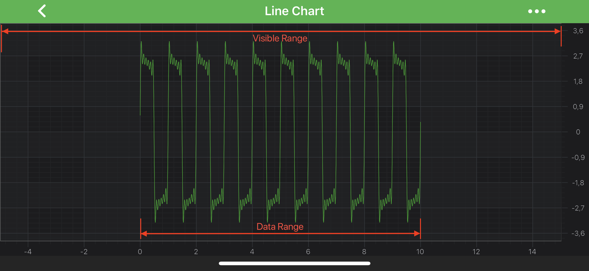
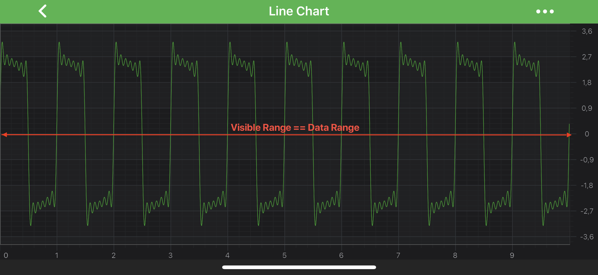

# Axis Ranging - VisibleRange and DataRange
Every axis type can work with a **specific range type** that conforms to the <xref:com.scichart.data.model.IRange> protocol. It depends on the data type that the axis can work with. Please review the article on [axis types](xref:axis.AxisAPIs) to learn more.

## Range Types in SciChart
The most important range types are:

- <xref:com.scichart.data.model.DoubleRange> - used on Numeric Axis types.
- <xref:com.scichart.data.model.DateRange> - used by Date Axis types.

SciChart introduces the concepts of a `VisibleRange` and the `DataRange` of an axis, which are instances of the Range types listed above and other inheritors of <xref:com.scichart.data.model.IRange>.

## What is DataRange?
[dataRange](xref:com.scichart.charting.visuals.axes.IAxisCore.getDataRange()) is a property exposed by the axis, which tells you the range (Max, Min) of the DataSeries associated with that axis.

DataRange completely depends on the chart data and doesn't change without data changes. The DataRange can be accessed via the [dataRange](xref:com.scichart.charting.visuals.axes.IAxisCore.getDataRange()) property.

## What is VisibleRange?
<xref:com.scichart.charting.visuals.axes.IAxisCore.setVisibleRange(com.scichart.data.model.IRange)> is an actual axis range, measured in chart units. This is a part of a chart that is currently visible in a viewport. So when `DataRange` completely depends on chart data and doesn't change without data changes, `VisibleRange` can be modified to provide a different viewpoint to a chart. The `VisibleRange` of an axis can be accessed by the <xref:com.scichart.charting.visuals.axes.IAxisCore.setVisibleRange(com.scichart.data.model.IRange)> property.

When `VisibleRange == DataRange`, we say the chart is zoomed to its data extents, or zoomed to fit. This can be illustrated in the image below.

The type of the Range depends on the type of the axis. For more information, see Axis Ranging - Setting and Getting VisibleRange.

## See Also
- [Axis Types in SciChart](xref:axis.AxisAPIs)
- [Axis Ranging - AutoRange](xref:axisAPIs.AxisRangingAutoRange)
- [Axis Ranging - Get or Set VisibleRange](xref:axisAPIs.AxisRangingGetOrSetVisibleRange)
- [Axis Ranging - How to listen to VisibleRange Changes](xref:axisAPIs.AxisRangingHowToListenToVisibleRangeChanges)
- [Axis Ranging - Restricting VisibleRange](xref:axisAPIs.AxisRangingRestrictingVisibleRange)
